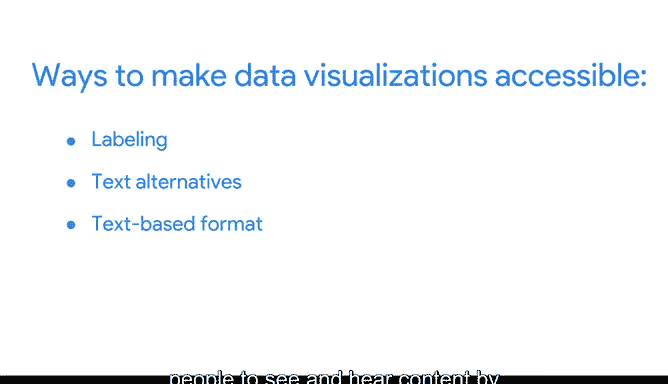
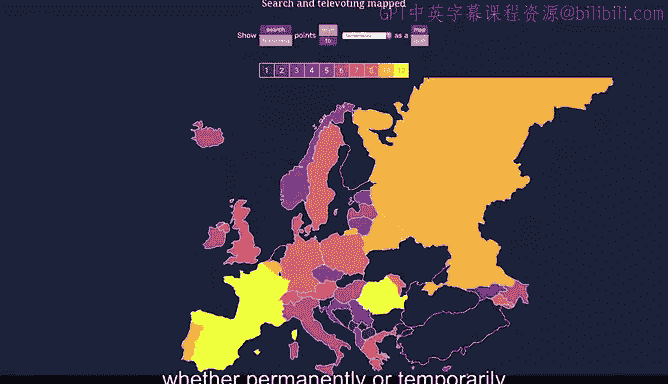
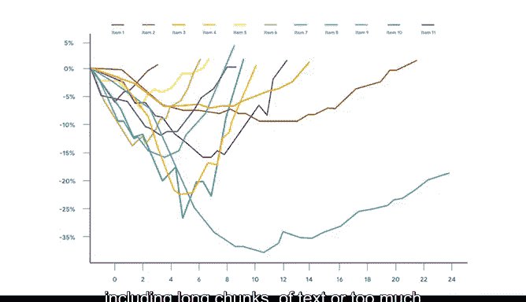

# 010：通过数据可视化分享数据 📊


## 第十讲：无障碍数据可视化 ♿

在本节课中，我们将学习如何创建对所有人（包括残障人士）都易于访问和理解的数据可视化。我们将探讨一些关键原则和实用技巧，确保您的图表不仅美观，而且具有包容性。

---

全球有超过10亿人患有某种形式的残疾。这个数字超过了美国、加拿大、法国、意大利、日本、墨西哥和巴西的人口总和。因此，在设计数据可视化之前，牢记这一事实至关重要。并非每个人都拥有相同的能力，人们接收信息的方式也多种多样。

您的观众中可能有失聪或听力障碍者，他们依赖字幕；也可能有色盲人士，需要依赖特定的标签来获取更多描述信息。我们已经学习了许多使数据可视化既美观又信息丰富的方法，现在是时候运用这些知识，让包括残障人士在内的所有人都能理解您的图表。

### 什么是无障碍设计？

无障碍设计可以从多种不同方式来定义。从一开始，您就可以通过几种方法将无障碍性融入您的数据可视化中。这只需要您换一种思维方式。

以下是几种提升可视化无障碍性的核心方法：

**1. 直接标注数据**
与其完全依赖需要观众解读颜色和付出更多理解精力的图例，不如直接在数据上添加标签。这也能让所有人（无论是否有残疾）更快地读取信息。

请看这个柱状图示例。其使用的颜色使得阅读变得困难，图例也令人困惑。
```示例
[图表A：使用复杂颜色和图例，难以阅读]
```
现在，如果我们移除图例并直接添加数据标签，就能得到一个清晰的展示。
```示例
[图表B：移除图例，在柱子上直接标注数值，清晰易懂]
```

**2. 提供文本替代方案**
为您的可视化提供文本替代方案，使其能够转换为人们所需的其他形式，例如大号字体、盲文或语音。替代文本为非文本内容提供了文本替代，使得图像的内容和功能对于有视觉或某些认知障碍的人士是可访问的。

这是一个展示附加文本描述图表的例子。

**3. 提供可导出的文本格式**
您可以通过将数据导出到表格（如Google Sheets或Excel）中，使图表和图形的数据以基于文本的格式提供。





**4. 增强视觉对比**
通过区分前景和背景，让人们更容易看到和听到内容。使用与背景形成对比的明亮颜色，可以帮助视力不佳（无论是永久性还是暂时性）的人清晰地看到所传达的信息。

**5. 避免仅依赖颜色传递信息**
不要仅仅依靠颜色来传达信息，可以尝试使用不同的纹理和形状进行区分。
```示例
[图表C：使用不同图案（斜线、点、网格）而非仅靠颜色区分数据系列]
```

### 保持简洁明了



另一个通用规则是避免过度复杂化数据可视化。过于复杂的数据可视化会让大多数观众失去兴趣，因为他们无法弄清楚应该关注哪里、关注什么。这就是为什么将数据分解为简单的可视化是关键。

一个常见的错误是在单个图表中包含过多信息，或者在图形和图表中加入过长的文本块或过多数据点。这可能会违背您可视化的初衷，让人一眼无法理解。
```示例
[图表D：一个包含过多数据系列、标签和装饰的混乱图表，难以理解]
```

### 总结与展望

最终，以无障碍思维进行设计意味着提前考虑您的受众，专注于简单、易于理解的视觉元素，并且最重要的是，为您的受众创建访问和与您的数据交互的替代方式。当您关注这些细节时，我们就能找到让数据可视化对每个人都更有效的解决方案。

至此，您已经完成了对数据可视化的第一次深入探索。您发现了创建数据可视化时，在关注目标的同时迎合受众的重要性。您学习了构思和规划可视化的不同方法，以及如何选择最佳图表来实现目标。您还学习了如何将科学、艺术甚至哲学的元素融入您的可视化中。

接下来，我们将学习如何将这些知识应用到Tableau中。您将看到这个数据可视化工具如何使您的数据可视化工作更高效、更有效。

我们下次课再见。