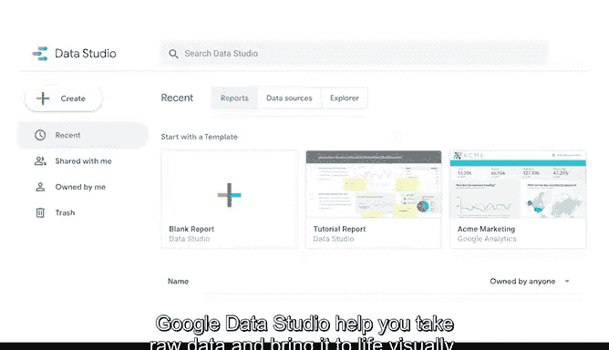

# 013：通过数据可视化分享数据 📊

## 第十三课：Tableau Public 与其他在线工具

在本节课中，我们将学习 Tableau 这一强大的数据可视化工具，并简要了解其他类似的在线工具。掌握这些工具能帮助你更有效地展示数据、发现规律，并支持决策制定。

---

欢迎回来。掌握像 Tableau 这样的在线工具，能让你的受众更容易理解复杂概念，或从数据中发现新规律。例如，你需要帮助一家新闻机构展示区域市场房地产价格的变化，或者协助非营利组织更好地利用数据以优化运营，又或者探索过去几十年电子游戏销售的趋势。Tableau 目前正被各类公司用于完成这些任务及更多其他工作。这意味着在你的职业生涯中，很可能有机会使用到它。

但先让我们回到基础。首先，我们来谈谈 Tableau 究竟是什么。

你可能记得之前学过，Tableau 是一个商业智能与分析平台，可以在线使用，帮助人们查看、理解数据并基于数据做出决策。但它并非只用于商业场景。

以 Tableau 爱好者 Eve Thomas 创建的这张可视化图表为例，它记录了美国各地的大脚怪目击事件。这张图表可在 Tableau Public 上找到，我们将在本课程的实践活动中一起使用这个平台。

Tableau 能帮助你利用数据制作并轻松分享交互式仪表板、地图和图表。无需编写代码，你就可以连接多种格式的数据，如 Excel、CSV 和 Google Sheets。

你也可能遇到使用其他工具的公司，例如 Looker 或 Google Data Studio。与 Tableau 类似，Looker 和 Google Data Studio 也能帮助你将原始数据转化为生动的可视化图表。

但每种工具的实现方式各有不同。例如，Tableau 提供多种使用格式，包括浏览器版和桌面版，而 Looker 和 Google Data Studio 则完全基于浏览器。不过有个好消息：一旦掌握了 Tableau 的基础，你会发现这些技能很容易迁移到其他可视化工具上。

准备好开始使用 Tableau 了吗？那么，接下来让我们正式认识 Tableau。

---

本节课中，我们一起学习了 Tableau 的基本概念及其在数据可视化中的应用，同时简要了解了 Looker 和 Google Data Studio 等其他在线工具。掌握 Tableau 不仅能提升你的数据展示能力，还能为学习其他类似工具打下坚实基础。