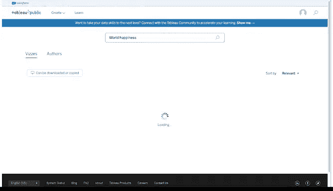

# 014：认识Tableau

在本节课中，我们将学习如何使用Tableau这一强大的数据可视化平台，将原始数据转化为动态、交互式的图表，从而讲述引人入胜的数据故事。

## 🎨 欢迎来到分析与艺术的交汇点

这里是像我这样的数据分析师释放数据真正潜力的地方，也是未来的数据分析师学习如何实现这一目标的地方。

欢迎来到Tableau。它是众多可视化平台之一，能帮助你更好地利用数据。

当你将数据转化为可视化图表时，你将亲眼目睹它转变为一个有意义的故事，一个人们能够产生共鸣并关心的故事。

Tableau中的可视化是动态的，而非静态的。简单回顾一下，动态可视化是交互式的或随时间变化的。这些图形的交互特性意味着你的观众对他们所看到的内容有一定控制权，而你在创建它们时也拥有极大的灵活性。

## 🚀 开始使用Tableau Public

现在，让我们使用Tableau Public上一个预加载的数据表来创建我们自己的可视化图表。

需要注意的是，在Tableau中有多种创建可视化的方法。Tableau提供了几种不同的产品，但在本课程中，我们使用的是浏览器中的Tableau Public，它是免费的。Tableau Public的一个很酷的功能是它的公共画廊，里面汇集了来自网络的各种数据可视化示例。

目前，你将使用画廊中的一个示例。你将把数据工作簿复制到你自己的个人资料中，以便开始创建和发布可视化图表。

要开始使用，请登录你的Tableau Public账户。你可以查看之前的阅读材料以获取更多详细信息。然后，要访问工作簿，请点击本视频和之前阅读材料中提供的链接，打开Tableau Public上的谷歌职业证书页面。

这将打开一个仍然链接到你账户的新标签页。以下是该页面应有的样子。

页面上加载了几个包含不同数据集的工作簿，你可以将它们保存到自己的个人资料中。这些是创建你自己可视化图表的绝佳起点。

本视频之后还会有一个资源，介绍如何下载Tableau并加载你自己的数据。但现在，让我们以这个画廊作为起点。

## 📝 创建你的第一个可视化图表

现在，点击查看名为“World happiness”的工作簿。这会调出我们用来帮助创建世界幸福数据可视化的数据表。

接下来，转到右上角的菜单，点击“make a copy”。此时，Tableau会将此工作簿的副本保存到你自己的个人资料中，以便你创建自己的可视化图表。

现在你正在自己的副本中工作，创建一个新的工作表，以便从头开始构建数据可视化。你需要点击顶部菜单中的“Worksheet”，然后点击“new worksheet”。

要开始构建你的数据可视化，请将“country”作为详细信息添加到标记卡中。你可以通过将“country”字段拖到“detail”图标上来实现。这会将你的可视化设置为世界地图，以表示表中的数据。

接下来，将“happiness score”添加到标记卡的颜色上。这为可视化应用了一个配色方案，在本例中是蓝色调。这种颜色范围对比度不高，尤其对于有色觉缺陷的人。因此，为了调整颜色，请点击颜色菜单，然后点击“Edit Colors”。接着将配色方案更改为“green-blue diverging”，并勾选“stepped colors”复选框，这能更清晰地显示最高和最低幸福分数之间的差异。

*   **深蓝色**表示较高的幸福分数。
*   **深绿色**表示较低的幸福分数。

你可以在比例尺中看到这种分解。因此，仅通过几个步骤，我们就得到了一个有趣的可视化图表，以一种易于理解的方式展示了幸福数据。地图上的国家和颜色清晰可读，并提供了一些很好的见解。

## 🔧 探索更多Tableau功能以优化可视化

但我们继续探索，以便了解更多Tableau功能来完善你的数据可视化。

因为我们使用的表中有三年的数据，你可以过滤数据，只包含2016年的数据。根据你的目标，使用多年数据也可能很有用。无论如何，你有很多过滤选项。所以我们将在这里添加到过滤器卡。

然后我们选择按年份过滤，并选择2016。

让我们将可视化聚焦在一个区域——欧洲地区。为此，将光标移动到视图工具栏。使用此工具栏中的工具平移并放大到欧洲区域。这需要一些时间和练习。

一旦你对欧洲及其周边地区有了一个相当好的视图，请使用同一工具栏中的形状工具，尽可能多地选择欧洲地区。由于我们正在练习，如果你不确定要包括哪些国家，请做出最佳猜测。如果你正在处理一个将要与他人分享的可视化图表，你会想要仔细检查其准确性。

将光标悬停在一个国家上，它会显示该特定国家以及你已在该区域选择的所有国家的数据。

然后使用套索选择工具仅选择几个国家，像这样。点击“Keep Only”。这应用了另一个过滤器，这次是针对你包含在可视化中的国家。

你会注意到这些国家的配色方案已更新。这反映了颜色范围现在仅应用于这些国家。与世界其他地区相比，该地区的国家可能原本处于相同的颜色范围部分，但现在它们处于不同的部分，因为测量的数据特定于该区域。

## 🏷️ 添加标签和交互式过滤器

为了让你的可视化图表更好，请在地图上添加幸福分数作为标签。现在你可以在地图上看到每个国家的幸福分数。这为可视化增加了一层额外的细节，有助于与实际数据建立联系。

有一个选项可以将幸福分数的数据类型从小数更改为整数。但当你这样做时，你会失去带有小数的值所提供的对比度。所以将其改回以小数形式显示幸福分数。

现在，为了让它更具交互性，让我们添加一个带有滑块的过滤器。这将允许你的观众按幸福分数进行过滤，以便他们可以关注更少的国家。

但首先，让我们显示更多我们开始时地图的区域。为此，将鼠标悬停在地图上，并选择工具栏中的“Zoom home”图标，以在地图上显示更多国家。

接下来，我们将把“happiness score”添加到过滤器卡。我们将选择所有值并点击“next”。然后对于值范围，我们将点击“OK”接受默认设置。

在过滤器卡中，点击下拉菜单打开幸福分数的菜单，并选择“show filter”。如果我们再次选择菜单的下拉菜单，可以确认“show filter”旁边有一个复选标记。你可以切换复选标记来显示或不显示过滤器。当“show filter”被标记时，地图右侧会显示一个滑块。

现在，尝试过滤以显示幸福分数为6.0或以下的国家。这样，你就完成了。我们第一个基于从外部来源引入的数据的可视化图表。非常强大，对吧？

## 💾 保存与分享

我们将保存我们的可视化图表，以便随时欣赏它，甚至可能用它来练习使用Tableau工具。保存你的工作总是很重要，但要确保不要在文件名中包含任何个人信息。

在Tableau Public中创建的所有数据可视化图表对公众都是可见的。你也可以将你的可视化图表设为隐藏。你会在你的可视化图表上看到一个带斜杠的眼睛图标，并且该可视化图表将保持隐藏状态。这取决于你，但许多像你这样的用户创建的数据可视化图表都是可查看的。

事实上，你可以通过在Tableau Public上搜索轻松查看它们。然后你可以搜索任何类型的数据可视化，包括世界幸福可视化图表。你会遇到各种类型的数据可视化，其中许多具有高级设置。你在画廊中找到的一些示例比其他示例更出色。

## 📚 总结

在本节课中，我们一起学习了如何使用Tableau Public平台。我们从登录和访问示例工作簿开始，逐步创建了一个基于世界幸福数据的地图可视化。我们学习了如何设置地图、应用和调整配色方案、按年份和地区过滤数据、添加数据标签以及创建交互式滑块过滤器。最后，我们还了解了保存和分享可视化图表的注意事项。

通过这个过程，你将数据转化为一个动态、交互式的故事，使其更易于理解和产生共鸣。接下来，我们将讨论有效的数据可视化以及一些可以使你的数据可视化作品更出色的方法。