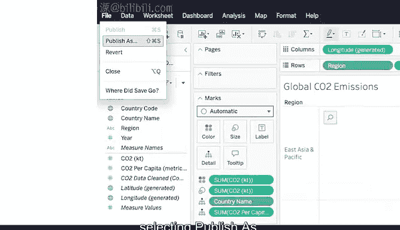

# 015：在Tableau中创建数据可视化

在本节课中，我们将学习如何使用Tableau软件来创建数据可视化图表。数据可视化是向他人分享数据洞察的有效方式。我们将通过一个具体的碳排放数据集，逐步演示如何从导入数据到生成并自定义图表。

---

## 🚀 开始之前：准备数据

首先，你需要下载本活动将使用的数据集。

以下是操作步骤：
*   点击链接创建数据副本并下载。
*   如果你没有谷歌账户，请直接从附件中下载数据。

在接下来的步骤中，你可以将本视频置于屏幕一侧，在另一个窗口中跟随操作。请注意，你的Tableau界面可能与视频中略有不同，因为软件可能已更新，但核心步骤基本一致。

---

## 🔐 第一步：登录并创建可视化

首先，登录Tableau Public。如果你尚未创建账户，请回顾关于登录Tableau Public的阅读材料。

登录后，请按以下步骤操作：
1.  点击右上角的圆形图标，选择“我的个人资料”。
2.  在个人资料页面，选择“创建可视化”。

这将打开Tableau Public的主界面。

---

## 📂 第二步：连接并上传数据

在“连接到数据”窗口中，进入“文件”选项卡，上传我们之前下载的CO2数据文件。

或者，你也可以：
1.  导航至Tableau Public界面顶部的“数据”选项卡。
2.  在下拉菜单中，点击“新建数据源”。
3.  然后打开CO2数据文件。

数据上传后，屏幕将显示数据源界面。

---

## 🧹 第三步：加载数据

在“连接”下方，双击名为“CO2_data_cleaned”的工作表，将其数据加载到屏幕主区域。

你也可以将该工作表拖放到显示“将表拖到此处”的区域。

点击“立即更新”按钮，即可在屏幕底部预览已打开的数据。每一行对应一个数据点，每一列代表一个不同的特征。

---

## 🔍 第四步：理解数据类型

Tableau会自动解释每列数据的类型，并用图标表示：
*   **`#`** 符号代表数值型数据。
*   **`Abc`** 代表字符串型数据。
*   **`🌐`** 代表地理数据。

在我们的数据中，Tableau将前两列解释为地理数据，第三列为字符串数据，最后三列为数值数据。

---

## 🗺️ 第五步：创建第一个可视化图表

现在，让我们创建一个展示各国二氧化碳排放量的数据可视化图表。

操作步骤如下：
1.  选择“Sheet1”选项卡。
2.  在屏幕最左侧，灰色横线上方是列名横幅，这些是数据的**维度**。横线下方是可跟踪的**度量**。
3.  要创建按国家显示CO2排放量的图表，首先双击“国家名称”维度。
4.  主显示区将出现一张世界地图，圆点表示数据中包含的国家。目前所有圆点大小相同，因为尚未选择度量，Tableau默认对所有国家进行同等缩放。

---

## ⚖️ 第六步：添加度量以缩放数据

为了根据CO2排放量缩放圆点大小，我们需要添加一个具体的度量。

请执行以下操作之一：
*   双击“CO2_kilotons”度量。
*   或将“CO2_kilotons”度量拖放到图表中。

此时，地图上的圆点大小将变得与各国的CO2排放量成比例。

---

## 🎨 第七步：自定义图表外观

Tableau提供了丰富的选项来描绘特定维度的度量，这些选项大多位于主显示区和维度/度量列之间的中间栏。

我们可以通过将度量拖放到“标记”卡中的“颜色”、“大小”、“标签”等框内，来改变图表上度量的可视化外观。

例如，要改变CO2度量的颜色：
1.  将“CO2_kilotons”度量拖到标有“颜色”的框内。
2.  然后点击该颜色框，会弹出一个颜色选项列表。

你可以随时暂停视频，尝试不同的选项，发挥创意。如果你对图表所做的任何更改不满意，只需使用左上角的“返回”箭头即可撤销。

---

## 🔄 第八步：更改维度和度量

上一节我们创建了按国家显示CO2排放量的地图，本节我们来看看如何改变分析的维度。

如果我们不想按国家，而是想按地区查看人均CO2排放量呢？

操作如下：
1.  双击“地区”维度。
2.  接着双击“人均CO2”度量。
这将构建出一个全新的图表。

我们可以通过将光标悬停在标题框上，点击出现的箭头调出下拉菜单，然后选择“编辑标题”来修改图表标题。例如，将其命名为“全球CO2排放量”。

---

## 🗑️ 第九步：清除或删除图表

如果你想删除一个图表，可以点击工具栏中的“清除工作表”按钮。这将清空图表，让你回到一个空白的工作表。

如果不小心执行了此操作或改变了主意，之前介绍的“返回”按钮可以将图表恢复。

若要完全删除一个工作表，请右键单击工作表选项卡并选择“删除”。如果该工作表是文件中唯一的工作表，则无法删除。

请注意：与清除工作表不同，完全删除工作表是无法撤销的操作，请谨慎操作。

---

## 💾 第十步：保存你的工作

请务必保存你的进度。将鼠标悬停在“文件”选项卡上，然后选择“发布为…”。

恭喜！现在你已经准备好开始可视化你的数据了。但这远不是终点，很快你将探索Tableau中更高级的工具。

---

## 📝 总结

本节课中，我们一起学习了在Tableau中创建数据可视化的完整流程。我们从准备和导入数据开始，理解了维度和度量的概念，并创建了第一个按国家显示CO2排放量的地图。随后，我们通过添加度量、自定义颜色和大小来增强图表的表达力。我们还学习了如何通过更改维度和度量（例如，切换到按地区的人均CO2）来构建新的分析视角，以及如何管理（清除、删除、重命名）我们的工作表。最后，我们强调了保存工作的重要性。掌握这些基础操作，是你利用Tableau进行有效数据沟通的第一步。