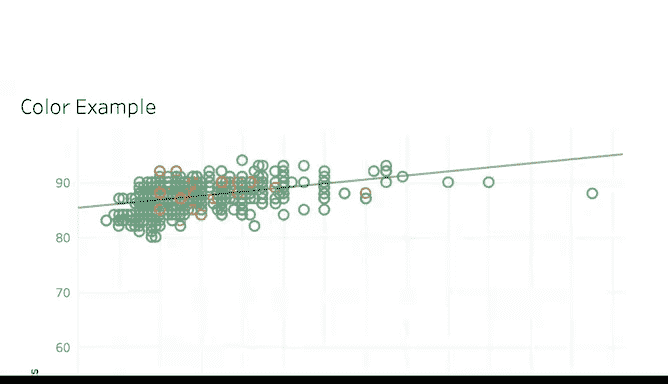

# 016：优化数据可视化调色板

在本节课中，我们将深入探讨如何利用Tableau创建有效和无效的数据可视化。我们将学习如何运用颜色、标签和交互功能来清晰、有效地传达数据故事，并避免常见的可视化误区。

---

## 有效与无效的可视化对比

上一节我们介绍了数据可视化的基本目标。本节中，我们来看看一个衡量可视化好坏的关键原则：**5秒法则**。

一个好的数据可视化，应该在展示给观众的5秒内，让他们理解你想传达的信息。这意味着可视化必须是清晰、有效且具有说服力的。在开始使用Tableau创建任何图表前，牢记这一经验法则，将帮助你走上创建优秀可视化的正确道路。

---

## 有效案例：使用发散色板

让我们来看一个有效使用**发散色板**的例子。

发散色板通过颜色的强度来显示数值的大小，并通过实际的颜色来表明数值所属的范围。这是一种展示数值间差异的好方法。

以下是发散色板的核心概念：
*   **颜色强度**：表示数值的**大小**。
*   **实际颜色**：表示数值所属的**范围**。

在下面的例子中，绿色与较高的数值相关联，红色与较低的数值相关联。

你可能会在商业指标和关键绩效指标中遇到类似的表格。你所选择的颜色应符合受众的普遍预期。虽然在全球范围内不一定总是如此，但许多人将绿色与积极（正面）关联，红色与消极（负面）关联。这使得信息传达得清晰明了。

---

## 无效案例：颜色与标签的误区

现在，我们来看一个无效的数据可视化例子。

这张图表有很多地方效果不佳。首先，这些颜色很难辨认。该图表使用了绿色和橙色，并且数据点非常接近。这些颜色无法清晰地区分低数据点和高数据点。

数据可视化让我们能够分享关于数据的有意义的故事。但如果我们分享的图表让观众难以理解，我们就无法做到这一点。使用不符合受众预期的颜色搭配，会增加一层不必要的复杂性。

但这还不是全部。还有一种方法会让无效的数据可视化变得更糟：**添加过多的标签**。

如果你添加了太多标签，最终会得到一个让人难以理解的数据可视化。这样做会使可视化显得过于杂乱，占用太多空间，并且导致标签无法清晰显示。如果还在不同的标签上使用不同的字体，情况会变得更糟。我们在这里看到的是，好的数据因为糟糕的可视化而变得无效。

---

## 交互式可视化的责任

拥有交互式可视化对观众和你作为分析师都可能很有用。但就像其他任何事情一样，能力越大，责任越大。一旦忽视了优秀可视化的品质，你就可能失去对数据所要讲述的故事的控制。

---

## 总结与预告

本节课中，我们一起学习了如何利用视觉增强功能来优化数据可视化。我们探讨了有效的发散色板应用，并分析了因颜色选择不当和标签过载导致的无效可视化案例。记住，清晰和符合受众预期是成功的关键。

现在你已经学会了如何利用视觉增强功能。接下来，我们将探索如何更富创意地运用它们。敬请期待。

