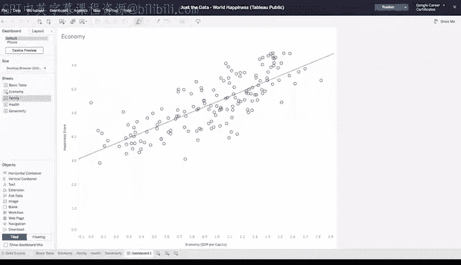
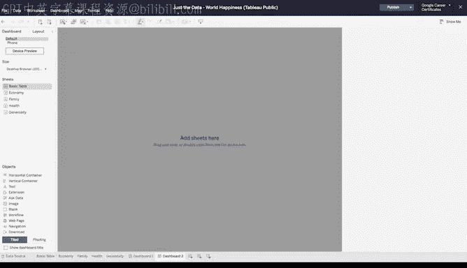
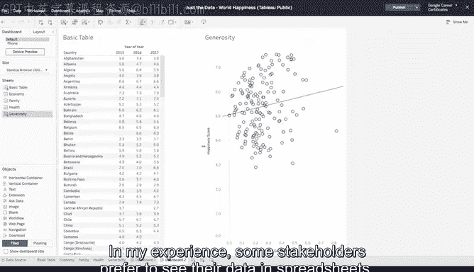

# 017：通过数据可视化分享数据 📊

## 发挥创意 🎨

在本节课中，我们将学习如何运用创意来优化数据可视化，使其更清晰、更有效，并探索如何在单一仪表板中整合多个视图。

数据可视化是艺术与分析的结合。本节将引导你发挥创意，从优化混乱的图表到让可视化对色觉障碍人士更友好，帮助你从数据中获得最大价值。

---

### 开始探索：分析幸福指数的影响因素

上一节我们介绍了数据可视化的基础，本节中我们来看看如何具体分析数据关系。我们将使用世界幸福指数数据，探究哪些因素对一个国家的幸福指数贡献最大。

首先，登录你的 Tableau 账户。我们将使用 Google Career Certificates 页面中的世界幸福指数数据。点击视频中的链接打开图库，然后查看名为 “Just the data, World Happiness” 的工作簿。这个工作簿在之前关于 Tableau 入门的视频中也使用过。

点击此处开始。假设我们想利用此数据表找出影响国家幸福指数的最主要因素。我们将从探究幸福指数与其他国家指标之间的关系入手。

---

### 创建新的可视化工作表

要构建自己的数据可视化，首先需要创建一个新的工作表。

以下是具体步骤：
1.  点击 “Worksheet”，然后选择 “New worksheet”。
2.  由于我们的数据包含三年的值，我们先筛选到 2016 年。将 “Year” 字段添加到筛选器架，并选择 2016。
3.  将 “Happiness Score” 添加到行架。
4.  将 “Economy (GDP per capita)” 添加到列架。
5.  接下来，将 “Country” 字段拖放到 “Details” 区域。这将为每个国家创建一个独立的数据点（圆圈）。

你可能会注意到，经济得分较高的地方，幸福指数也往往较高。为了让这种趋势更明显，我们可以添加一条趋势线。

---

### 复制并比较不同因素

为了保持格式一致，我们可以复制这个工作表。在复制的工作表中，用另一个衡量指标（例如 “Family”）替换 “Economy (GDP per capita)”。

操作如下：
1.  将 “Family” 字段拖到列架，替换 “Economy”。
2.  将原始工作表标签重命名为 “Economy”，将新工作表标签重命名为 “Family”。这样便于识别和查找。
3.  你可以尝试对更多衡量指标重复此过程，进行比较。

---

### 构建综合仪表板

现在，让我们看看如何将多个可视化放在一个仪表板上，以便更轻松地查看它们之间的关系。

操作步骤如下：
1.  将你的可视化工作表（现在列在左侧的表格栏中）逐一拖放到仪表板区域。
2.  它们可以用不同的方式排列。

请注意哪些趋势线的倾斜度最陡。这些指标与幸福指数的关系最为密切。每个图表都应具有易于理解的目的，并能立即让你的受众清楚其含义。当前的仪表板就做到了这一点。

---

### 添加辅助数据表

为了满足不同受众的偏好，你还可以添加一个配套数据表，以不同的方式展示相同的数据。

根据我的经验，一些利益相关者更倾向于在电子表格中查看数据。我们一直在使用一个数据源，但作为分析师，你很可能需要同时处理多个数据集。

---

### 后续学习方向

接下来，你将有机会学习如何在 Tableau 中合并多个数据源。目前就到这里。

---

### 总结

本节课中，我们一起学习了如何运用创意进行数据可视化。我们从创建分析幸福指数影响因素的图表开始，学会了复制工作表以比较不同指标，并最终将多个视图整合到一个清晰的仪表板中。我们还了解到，添加表格视图可以满足不同受众的需求，为后续处理多数据源的分析工作打下了基础。