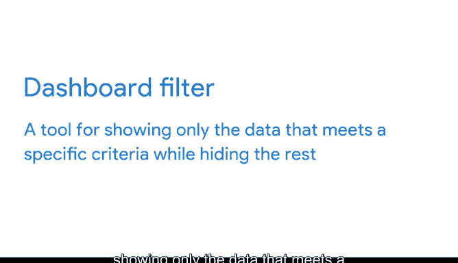

# 018：谷歌数据分析师第六课《通过数据可视化分享数据》 📊

## 课程概述

在本节课中，我们将要学习如何利用数据可视化来讲述引人入胜的故事。你将了解到故事讲述在人类沟通中的核心地位，以及如何将数据转化为能够激励他人、并促使其采取行动的有效叙事。我们还将初步接触仪表盘和仪表盘过滤器这两个强大的工具。

***

## 用数据讲述故事 📖

故事讲述是最古老的教学形式。数万年来，人类一直通过故事分享知识。

在那个电视和电脑屏幕还是洞穴墙壁的时代，情况便是如此。事实上，科学家已经证实，洞穴壁画是由早期人类创作的，他们用自己的艺术来传达想象中的故事。

时至今日，故事讲述仍然是最自然的教育形式。

这是因为故事通过帮助我们处理和记忆信息，让学习变得更容易。每个人都在讲述故事，即使我们只是和朋友分享一天的经历。

许多专家认为，人类大脑会自动将事件组织成有开头、中间和结尾的结构。以这种方式，像故事一样思考事物，帮助我们理解过去、现在和未来。

除此之外，故事还能帮助我们与他人建立联系，创造重要的人际纽带。

难怪人们如此着迷于故事。在历史进程中，许多重要的发明改变了故事的讲述方式。

以下是几个关键发明的例子：
*   **印刷机的发明** 催生了报纸、杂志和书籍。
*   **电影摄影机的发明** 使电影成为可能。
*   **随后**，我们有了电视、视频点播和流媒体服务，让我们随时随地享受各种故事。

数据可视化工具的发明再次改变了人们讲故事的方式。

正如你已经学到的，**数据可视化**是为了帮助理解而对数据进行**表示和呈现**。

接下来，你将发现如何利用数据可视化，将数据转化为人们能够产生共鸣并关心的、有意义的故事。

***

## 引入仪表盘与过滤器

上一节我们回顾了故事讲述的力量，本节中我们来看看数据分析中的两个实用工具：仪表盘和过滤器。

**仪表盘**是一种组织信息的工具，它通常将来自多个数据集的信息整合到一个中心位置，通过图表、图形和地图进行跟踪、分析和简单的可视化。

与电子表格和查询中的过滤器类似，**仪表盘过滤器**是一种工具，用于仅显示符合特定标准的数据，同时隐藏其余部分。

很快，你将学会如何使用这些工具来讲述故事，激励并说服人们根据你呈现的数据采取行动。

最后，你将理解数据驱动故事的关键属性，以及在各种商业情境中有效传达这些故事的方法。

***

## 课程总结

本节课中我们一起学习了数据可视化在故事讲述中的核心作用。我们了解到，人类天生通过故事来组织和理解信息，而数据可视化是将冰冷数据转化为动人叙事的关键桥梁。我们还初步认识了**仪表盘**和**仪表盘过滤器**这两个在未来数据分析工作中不可或缺的工具。准备好成为一名专家级的故事讲述者了吗？那么，让我们开启你数据分析故事的下一个篇章。