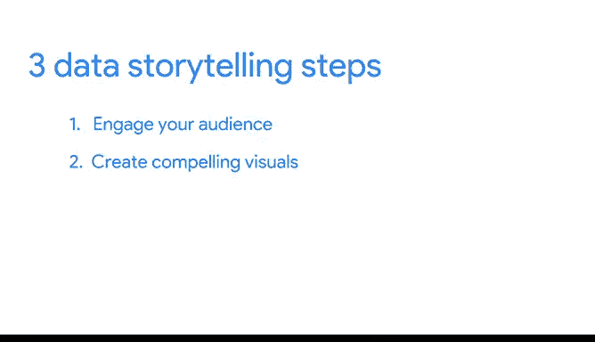

# 019：将想法变为现实

在本节课中，我们将学习如何将数据转化为引人入胜的故事。数据本身是静态的，但通过有效的叙事和可视化，我们可以赋予其生命，使其对受众产生深远影响。我们将重点探讨数据叙事的三个核心步骤。

---

数据可视化领域的创新者、作家、教师和专家斯蒂芬·费曾说过，数字本身蕴含着重要的故事，它们依赖于我们为其赋予清晰且有说服力的声音。

在商业世界中，事实和数字固然重要，但它们很少能留下持久的印象。为了创造出能引发思考并说服人们采取行动的强大沟通，你需要数据叙事。

数据叙事是指通过为特定受众定制的视觉元素和叙述来传达数据集的意义。“叙述”是“故事”的另一种说法。

在本视频中，你将学习数据叙事的步骤。这些步骤包括：吸引你的受众、创建引人注目的视觉元素，以及以有趣的方式讲述故事。

以下是来自音乐流媒体行业的一个例子。一些公司会向客户发送“年度回顾”电子邮件，突出显示用户听得最多的歌曲，有时还会祝贺他们成为某位艺术家的顶级粉丝。这是一种比仅仅打印客户活动记录更令人兴奋的分享数据的方式。它还能提醒听众他们享受该服务的时间有多长，这是建立客户忠诚度的好方法。

以下是另一个例子。一些共享出行公司正在使用数据叙事来向客户展示他们行驶了多少英里，以及这等同于节省了多少汽油费、减少了多少碳排放，并节省了原本可能花费在交通拥堵上的时间。通过简单有趣的视觉呈现，让客户能清晰地看到服务的价值。

像这样的数据故事能让客户保持参与感，并让他们觉得自己的选择很重要，因为公司花时间为他们创造了专属内容。重要的是，这些故事很有趣。懂得如何以这种方式触达人们是数据叙事的重要组成部分。

图像可以在潜意识层面吸引我们。这就是通过数据可视化吸引人们的概念。

到目前为止，你一直在学习关注受众的重要性。接下来，你将在此基础上继续深入。你会发现数据叙事有三个步骤，第一步是知道如何吸引你的受众。

“吸引”是指捕捉并保持某人的兴趣和注意力。当你的受众被吸引时，你更有可能与他们建立联系，并说服他们看到你所看到的同一个故事。每个数据故事都应该从吸引受众开始。

所有成功的讲故事者都会首先考虑听众是谁。例如，当幼儿园老师为班级选择书籍时，他们会挑选适合五岁儿童的书籍。如果他们选择高中水平的小说，复杂的内容可能会让孩子们感到困惑，他们会感到无聊并走神。

第二步是创建引人注目的视觉元素。换句话说，你希望展示数据的故事，而不仅仅是讲述它。

视觉元素应该带领你的受众踏上数据随时间变化的旅程，或者突出数字背后的含义。

这里有一个例子。假设一家化妆品公司跟踪记录购买其产品的商店以及它们的购买量。你可以像这样在电子表格中向他人传达数据。

或者，你可以创建一个彩色的视觉元素，比如这个饼图。这使得很容易看出哪些商店作为商业伙伴最有利可图，哪些最不利可图。这是一种更清晰、视觉上更有趣的方法。

现在，第三步也是最后一步，是以有趣的叙述方式讲述故事。

一个叙述有开头、中间和结尾。它应该将你收集的数据与项目目标联系起来，并清晰地解释你分析中的重要见解。

要做到这一点，重要的是你的数据叙事要有条理且简洁。很快，你将学习如何在会议讨论和正式演示中使用幻灯片来实现这一点。我们将讨论你的信息内容、视觉元素和语气如何根据你的沟通方式而变化。

说到商业沟通，公司使用可视化来讲述数据故事的方式之一是词云。

词云是一种非常简单的数据可视化形式。这些单词根据它们在数据集中出现的频率以不同的大小呈现。

这是一种吸引某人注意力并从大段文本中发掘故事的好方法，其中每个单独的单词可能永远不会被注意到。

词云可以用于各种方式。在社交媒体上，它们可以显示哪些话题出现和发布最频繁。或者，你可以在博客中使用它们来突出读者最感兴趣的想法。

这个词云是使用本课程大纲的文本创建的。它讲述了一个相当吸引人的故事，其中数据、分析、分析、SQL和电子表格毫不意外地成为了一些主角。

好了，让我们继续翻阅你的数据分析故事。接下来还有很多行动和冒险。

---

**本节课总结**

在本节课中，我们一起学习了数据叙事的核心步骤。首先，我们了解到**吸引受众**是成功沟通的起点，需要根据受众特点定制内容。其次，我们探讨了如何**创建引人注目的视觉元素**，例如使用饼图来直观展示数据关系，而不仅仅是罗列数字。最后，我们学习了如何**构建一个有趣、有条理的叙述**，将数据与目标联系起来，清晰地传达分析见解。我们还看到了词云等可视化工具在实际商业沟通中的应用。掌握这些步骤，你将能够有效地将数据转化为有影响力的故事，推动决策和行动。