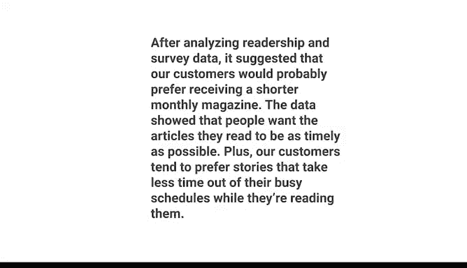

# 020：通过数据可视化分享数据 📊

## 第20讲：与受众对话 🗣️

在本节课中，我们将学习如何通过故事与受众有效沟通，确保数据洞察能够触动人心并引发共鸣。我们将探讨了解受众、选择核心信息以及使用聚焦技巧来提炼关键洞察的方法。

---

上一节我们介绍了数据故事讲述的三个步骤，本节中我们来看看如何与受众对话，确保你的信息能够被有效接收。

当你想向他人传达信息时，一个精彩的故事可以帮助你触及人们的心灵与思想，使他们更愿意接受你的观点。故事能让人产生共鸣。

正如之前所学，数据故事讲述的第一步告诉我们：要让故事成功，必须关注听众是谁。数据分析师通过确保与受众互动来实现这一点。

首先，你需要了解你的受众。

回想一下，如果你对一个已经听过很多遍的笑话再次讲述，并期望对方在笑点处发笑，这不太可能发生。为了获得期望的回应，你必须理解受众的视角。

这意味着思考你的数据项目可能如何影响他们。以下是一些有助于思考的问题：

*   受众扮演什么角色？
*   他们在这个项目中的利益是什么？
*   他们希望从我提供的数据洞察中获得什么？

假设你正在分析客户的读者数据，以帮助一家杂志出版商决定是否应从季刊改为月刊。

如果你的利益相关者受众包括印刷公司的人员，他们会关心这个变化，因为这意味着他们需要更频繁地订购纸张和油墨。他们可能还需要为该项目分配更多员工。

或者，如果你的利益相关者包括杂志作者和编辑，你需要记住，你的建议可能会改变他们的工作方式。例如，他们可能需要以比习惯更快的速度撰写和编辑文章。

一旦你考虑了这些问题的答案，就该选择你的核心信息了。

你故事的每一个部分都源于这一个关键点。因此，它必须清晰且直接。

考虑到这一点，让我们思考一下关于我们假设杂志的数据项目的关键信息。

也许来自客户的读者数据显示，近期印刷杂志的订阅量一直在下降。你在调查数据中发现，这主要是因为读者觉得信息过时了。

因此，这一发现表明，读者可能会喜欢一个能更频繁地将信息送到他们手中的出版周期，但这还不是全部。你的读者调查数据还显示，读者更喜欢带有快速要点的简短文章。

数据产生了许多可能的决策点。你面前信息的数量和种类可能让人感到挑战。因此，要获得关键信息，你需要退后几步，只找出最有用的部分，并非每一块数据都与你试图回答的问题相关。

作为数据分析师，很大一部分工作是知道如何剔除不太重要的细节。实现这一点的一种方法是使用所谓的“聚焦法”。

聚焦法是快速扫描数据以识别最重要的洞察。聚焦的方法有很多，但许多数据分析师喜欢在白板上使用便利贴，有点像考古学家理解他们在挖掘中发现的文物。

具体操作如下：将分析中的每个洞察写在一张纸上，将它们展开并展示在白板上。然后进行检查。

重要的是不要陷入每一个微小的细节中。相反，要寻找广泛的、普遍性的想法和信息。尝试找到反复出现多次的想法或概念，或者经常重复的数字和词语。也许你会发现看起来相互关联或形成模式的事物。

在白板上高亮这些项目或将它们分组。接下来，探索你的发现。

找到数字背后的意义。目的是确定哪些洞察最有可能帮助解决你的业务问题或提供你一直在寻找的答案。这就是聚焦法如何引导你找到核心信息的方式。

请记住，保持你的核心信息清晰简洁，因为像屏幕上显示的这样过长的信息，传达最重要结论的机会较小。

这是一个清晰、简洁的信息，更有可能吸引你的受众，因为它简短扼要。

当然，无论你投入多少时间和精力来研究你的受众，都无法精确预测他们会对你的建议作何反应。但如果你遵循我们正在讨论的步骤，你更有可能取得良好的结果。

在接下来的视频中，你将学习如何处理未完全按计划进行的情况。这没关系，我们都会遇到这种情况。

---

本节课中，我们一起学习了与受众有效对话的关键步骤：了解受众的背景与利益，从复杂数据中提炼出清晰、直接的核心信息，并运用聚焦法来识别最重要的洞察。记住，一个简洁有力的核心信息是成功沟通的基石。