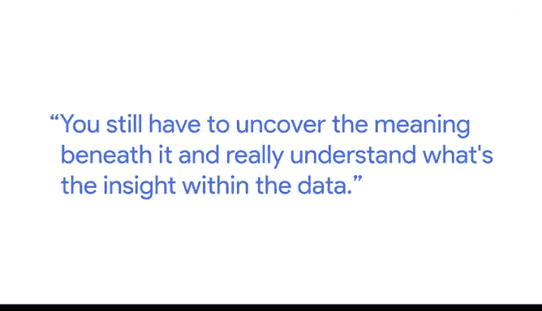
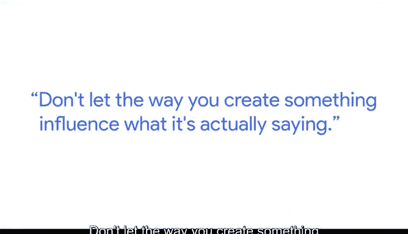

# 021：谷歌数据分析师第六课《通过数据可视化分享数据》📊

## 课程概述

在本节课中，我们将跟随谷歌的测量主管卡罗琳，学习如何像数据新闻工作者一样，从数据中提取关键信息，并以清晰、引人入胜的方式进行传达。我们将探讨数据新闻学的核心思想，以及如何将这种思维方式应用于数据分析工作中。

---

我叫卡罗琳，是谷歌的一名测量主管。这意味着我负责衡量客户的广告投资，并找出未来能为其带来更好表现的方法。

在我的职业生涯中，我曾在四个截然不同的领域工作过。但将所有这些经历联系在一起的，是我理解数据、从中获取所需信息，并以简单且引人注目的方式传达信息的能力。

## 数据新闻学的起源：一个经典案例

上一节我们提到了从数据中提取和传达信息的能力，本节中我们来看看一个数据新闻学的早期典范。

一个非常早期的例子来自一位名叫约翰·斯诺的人。他是19世纪50年代伦敦的一名医生，当时正生活在霍乱爆发期间。当时的理论认为霍乱是通过空气传播的，或者说人们并不真正知道病因。但他认为，病因是饮用了来自泰晤士河的严重污染的水。

因此，他外出采访了生病的人，询问他们从哪里取水。通过将数据绘制在地图上，他发现他们都从同一个水泵取水。于是他向当局提出要求，拆除了那个水泵。他们取下了水泵手柄，疫情便结束了。

这开启了一个非常坚实的流行病学领域，同时也是数据新闻学的一个绝佳范例。

## 数据新闻学的本质：讲述故事

在加入谷歌之前，我最近的一份工作是数据新闻记者，即利用数据来讲述故事。我在《芝加哥论坛报》工作了三年，围绕选举季和奥运会等重大事件进行了大量工作。这些时刻产生了大量有趣的数据，也需要人们去理解它们。

数据新闻学领域随着时间的推移发生了很大变化，但可能没有你想象的那么大。我们现在能接触到更多的数据，以及一些我们以前从未真正追踪过的数据。但数据新闻记者的工作仍然是真正理解这些数据的含义。

随着我们拥有越来越多的数据，仅仅给读者一个数据库链接并没有太大帮助。你仍然需要揭示数据背后的含义，真正理解数据中的洞察。

以下是数据新闻工作的核心步骤：
1.  **获取数据**：收集相关数据集。
2.  **分析数据**：深入探究，寻找模式、异常和关联。
3.  **咨询专家**：与领域专家交流，验证发现并获取背景知识。
4.  **提炼洞察**：从复杂数据中提取核心信息和故事线。
5.  **清晰传达**：将发现以简单、直观、引人入胜的方式呈现给受众。

## 从新闻到商业分析：技能的共通性

记者用来理解事物的工具，例如咨询专家、深入挖掘故事，与我在谷歌真正理解媒体投资并为客户未来行动提出清晰建议所需的工具非常相似。

我的建议是，理解你可用的工具并知道它们如何工作，但绝不要让这些工具淹没你的故事。我绝不希望看到一份报告时，只想到“哦，这是用Data Studio或Microsoft Excel做的”。我想知道数据说明了什么，以及数据新闻记者在这个故事背后的观点是什么。

不要让你的创作方式影响它实际要表达的内容。

## 核心原则：关注洞察而非工具

人们只想知道你从所有辛勤工作中提炼出了什么，以及你发现了什么新信息。

我热爱数据新闻学领域，因为它符合我的思维方式。我总是那种会在页边空白处涂鸦或快速绘制图表来真正理解底层数据的人。这迫使我形成一个观点，并与他人分享。我热爱通过数据与广大受众沟通，并真正帮助他们理解周围的世界。

---

## 课程总结

本节课中，我们一起学习了数据新闻学的核心思想及其在数据分析中的应用。我们回顾了约翰·斯诺利用地图数据解决霍乱疫情的经典案例，理解了数据新闻的本质是从数据中提炼故事和洞察，而非仅仅呈现数字。卡罗琳分享了她从新闻业到商业分析领域的经验，强调了无论使用何种工具，核心目标都是清晰、准确地传达数据的含义。关键在于**让数据说话，让洞察引领**，而不是让复杂的工具或图表本身成为焦点。记住，最终目的是帮助他人理解世界。