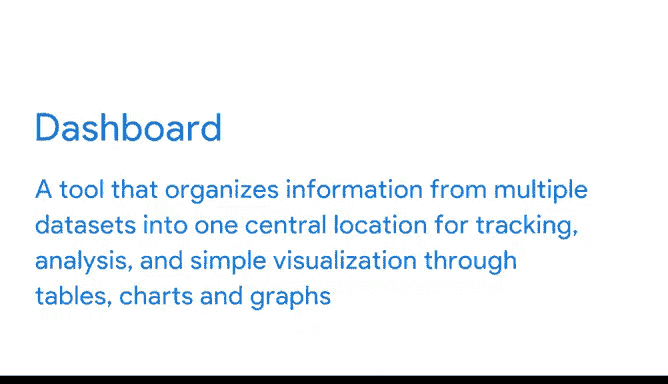

# 022：通过数据可视化分享数据 📊

## 第22讲：Tableau仪表板基础

在本节课中，我们将要学习数据仪表板的基础知识。仪表板是一种强大的工具，它能将来自多个数据集的信息整合到一个中心位置，通过表格、图表和图形进行跟踪、分析和可视化。我们将探讨仪表板的设计原则、布局选项以及分享仪表板时的注意事项。

---

你是否曾在驾驶汽车时，仪表盘上的某个警告灯突然亮起？

也许油量表开始闪烁，因为燃油即将耗尽。

这个警报就在你眼前，非常方便。

它清晰地显示你需要关注油量。

你能想象如果汽车没有仪表盘会怎样吗？我们将永远不知道是否即将耗尽燃油。

我们不会知道轮胎气压是否过低，或者是否该更换机油了。

没有仪表盘，如果汽车出现异常，我们将不得不取出用户手册。

翻阅其中的所有信息。

并尝试自己找出问题所在。

汽车仪表板使驾驶员能够轻松理解和应对车辆的任何问题，因为它们持续跟踪和分析汽车状态。

但正如你一直在学习的，仪表板不仅适用于汽车。

公司也使用它们来共享信息，让人们参与业务计划和目标。

并发现潜在问题。就像汽车的仪表板一样。

数据分析仪表板接收大量信息，并以清晰、视觉有趣的方式将其呈现出来。

这在用数据讲故事时极其重要。

这就是为什么它是我们数据讲故事三个步骤中第二步的重要组成部分。

你已经了解到，仪表板是一种工具，它将来自多个数据集的信息组织到一个中心位置，通过表格、图表和图形进行跟踪、分析和简单可视化。

仪表板通过持续监控实时传入的数据来实现这一点。

正如我们一直在讨论的，你可以制作专门为与利益相关者沟通而设计的仪表板。

你可以考虑谁将查看数据，他们需要从中获得什么，以及他们使用它的频率。

然后，你可以为他们制作一个包含完美信息的仪表板。

这很有帮助，因为当人们面对太多数据时，可能会感到困惑和分心。

仪表板使一切保持整洁、易于理解。在设计仪表板时，最好从最重要的数据点开始，保持简单。

如果后来发现缺少某些内容，你随时可以返回调整仪表板或创建一个新的仪表板。

仪表板设计的一个重要部分是图表、图形和其他视觉元素的放置或布局。

这些元素需要具有凝聚力。

这意味着它们是平衡的，并且充分利用了仪表板上的空间。

在你决定了仪表板上应包含哪些信息之后。

你可能需要调整其大小并重新组织，以使其更适合你的用户。

Tableau中的一个选项是在垂直布局和水平布局之间进行选择。

垂直布局调整高度。

水平布局调整其所包含视图和对象的宽度。

此外，正如你在这里看到的，在布局中均匀分布项目有助于创建清晰、有条理的数据可视化。

你可以选择平铺布局或浮动布局。

平铺项目是单层网格的一部分，会根据仪表板的整体大小自动调整大小。

浮动项目可以层叠在其他对象之上。

在这个例子中，地图和散点图是平铺的。它们不重叠。

这确实有助于清晰地展示数据的全部内容。

这很有价值，因为世界上大多数人是视觉学习者。

他们根据所看到的信息进行处理。

这就是为什么与利益相关者分享你的仪表板是一种非常有价值的做法。

现在，关于这一点，有一些重要事项需要记住。

与他人分享仪表板很可能意味着你将失去对叙述的控制。

换句话说，你将无法在那里讲述你的数据故事并分享你的关键信息。

仪表板将讲故事的力量交到了查看者手中。

这意味着他们将构建自己的叙述并得出自己的结论。

但不要因此害怕协作和开放。

只需了解分享仪表板所带来的风险。

毕竟，共享信息和资源意味着将有更多的人共同解决一个大问题或构思下一个大创意。

这会带来更多的联系，从而可能产生真正令人兴奋的新实践和创新。