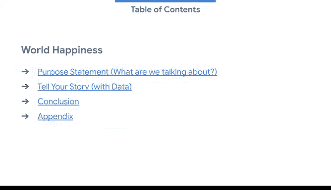
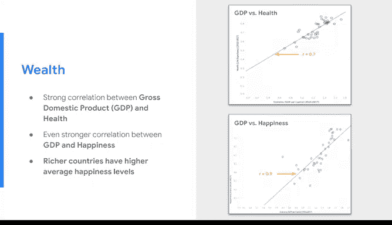
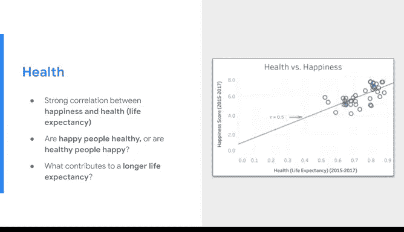

# 024：分享叙事

在本节课中，我们将学习如何构建一个专业、清晰且引人入胜的数据故事演示文稿。我们将重点探讨如何选择主题、设计幻灯片、整合文本与视觉元素，以及如何有效地在演示中复制、链接或嵌入可视化图表。

欢迎回来。现在你已经知道如何准备数据故事的关键部分——角色设定、情节、核心揭示和顿悟时刻——是时候思考视觉效果以及你的幻灯片应如何呈现了。

请始终记住，你的演示文稿反映了你的专业水准。如果它杂乱无章、组织混乱或充斥着与故事无关的图片，你的听众很容易对你的结果和建议失去信心。反之，如果你的幻灯片看起来专业且吸引人，你就有更好的机会抓住听众的注意力，并让他们专注于你的主要观点。

## 🎨 主题与标题设计

上一节我们提到了演示文稿整体印象的重要性，本节中我们来看看如何通过主题和标题来塑造这种印象。

主题是实现这一目标的绝佳工具。它们控制着颜色、字体类型和大小、格式以及文本和视觉元素的位置。有些主题有趣或富有创意，而另一些则看起来更专业。通过选择与你所传达信息的基调和内容相匹配的主题，你的演示文稿将具有一致的外观，并能支持你试图提出的论点。

接下来是标题。最好包含一个描述你即将展示内容的标题和副标题。你还应该包含演示的日期，特别是当你包含的数据可能随时间变化时。指定一个日期，例如创建日期或最后更新日期，能为任何查看你演示文稿的人提供重要的背景信息。

## ✍️ 文本内容设计

一个优秀的幻灯片引导听众了解你的主要沟通要点，但它不会重复你说的每一个字或提供大量书面信息。

你的部分工作是选择要包含哪些信息。这可能包括对视觉内容中所示内容的描述、流程的第一步、一组指示，或者你希望听众理解并记住的重要信息。

同时，务必调整字体大小，以便听众能轻松阅读你所写的内容。一个好的原则是每张幻灯片的文本控制在**少于5行和25个单词**。基本上，你希望听众专注于你所说的内容，而不是忙于阅读幻灯片。

此外，请谨慎选择用词。避免使用俚语、人们可能不知道的缩写以及特定于某一地区的词语或短语总是明智的。

## 📈 视觉元素运用

现在，让我们讨论视觉元素。视觉元素帮助听众快速理解每张幻灯片的内容。它们可以帮助你以一种仅靠文字可能无法实现的方式阐明观点。

优秀的视觉元素没有留下解释的余地，因为其含义能被瞬间理解。

当你在幻灯片中包含视觉元素时，尽量不要一次分享太多细节。只选择那些支持你观点，特别是关键信息的数据点。我喜欢问自己：“我希望听众从我的分析中学到的最重要的一件事是什么？”这有助于我决定哪些视觉元素最有可能传达要点。

如果你有几个需要包含的重要事项，不要把它们都塞在一张幻灯片上。相反，为每个要点创建一个新的视觉元素。然后添加一个箭头、标注或其他清晰标记的元素，以引导听众的注意力看向你想让他们看的地方。

最后，当你进行核心揭示和展示顿悟时刻时，你的视觉元素必须清晰且充满激情地传达这些信息。这些是你分析中最有力的发现。要让它们给人这种感觉。

## 🔗 视觉元素的整合方式

在你离开之前，我想分享最后一件事。这是一个关于何时在幻灯片中复制粘贴、链接或嵌入视觉元素的快速提示。这对新的数据分析师来说可能具有挑战性，但有一些简单的要点需要记住。

以下是三种主要的整合方式及其特点：

*   **复制粘贴**：当你将视觉元素复制粘贴到演示文稿中时，你可以直接在幻灯片中编辑它。如果你的视觉元素或其数据点存在于其他地方（例如 Tableau 仪表板），你所做的任何更改都不会影响它们。这也意味着如果原始数据集发生变化，你的视觉元素将不会更新。这意味着你的视觉元素可能无法反映最新信息。
*   **链接**：如果你在演示文稿中链接视觉元素，该视觉元素存在于其原始文件中，幻灯片通过视觉元素的 URL 连接到它。因为两个文件现在已链接，所以当你对原始文件（例如电子表格）进行更改时，这些更改将自动出现在你的演示文稿中。如果数据可能随时间变化，这会很有用。你的幻灯片将始终保持最新状态。
*   **嵌入**：嵌入的对象也存在于原始源文件中，但区别在于，如果源文件发生变化，它不会自动更新。嵌入的副本是完全独立的。同样，你可以在演示文稿中对其进行更改，而不会影响原始源文件中的视觉元素或数据点。

因此，粘贴、链接和嵌入对象之间的主要区别在于它们的存储位置以及将它们放入幻灯片后如何更新。

## 🧪 动手实践

现在你已经开始了解如何制作出色的幻灯片，花几分钟时间练习你所学到的知识。

创建一个新的幻灯片演示文稿并选择一个合适的主题。添加你的文本、视觉元素，并在最后设计一个激动人心的揭示环节。尝试从不同来源粘贴、链接和嵌入视觉元素，看看它们的行为有何不同。

你可以设计一个关于任何你感兴趣的数据集的演示文稿。它不需要很长或包含大量信息。只需迈出第一步，享受讲述你自己的数据故事的乐趣。

---

本节课中，我们一起学习了如何构建一个专业的数据故事演示文稿。我们探讨了如何通过主题和标题建立专业形象，如何精炼文本内容以突出重点，如何有效运用视觉元素来强化叙事，特别是如何根据需求选择复制、链接或嵌入图表。最后，我们鼓励你通过动手实践来巩固这些技能，开始创作属于你自己的数据故事。