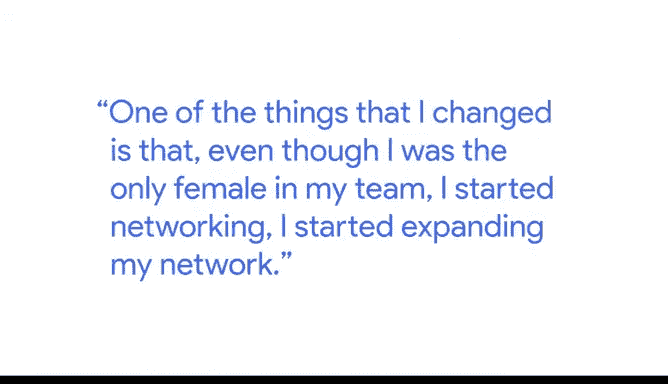

# 025：如何应对冒名顶替综合征 👩💼

在本节课中，我们将跟随谷歌分析团队负责人桑达斯，学习如何识别并应对在职业生涯中常见的“冒名顶替综合征”。这是一种感觉自己不配获得成功、担心被他人视为“骗子”的心理现象。桑达斯将结合她的个人经历，分享实用的应对策略。

桑达斯是谷歌的一名分析团队负责人，她的职责是将数据转化为有影响力的故事，以指导商业决策。她的背景并不传统，高中和大学之间有六年的间隔。当她决定重新开始时，首先进入了一所社区学院，这成为了她接触在线学习的开端。这种方式非常适合她，因为她需要同时照顾家中的孩子。

在谷歌，我们经常讨论“冒名顶替综合征”。桑达斯个人对此深有感触。作为家族中第一位大学毕业的女性，同时也是一名移民，她经常身处周围人群与自己截然不同的环境中。

例如，有一次她需要向部门的高级领导做汇报。她感到非常紧张，心想：“我肯定会搞砸，他们会发现我完全是个冒牌货。”

为了改变这种状态，尽管她是团队中唯一的女性，她开始积极拓展人际网络。

她遇到了许多来自自己祖国的女性。她们同样是移民，也曾为英语而挣扎，外表与她相似，但都在职业生涯中取得了出色的成就。

看到她们的成功，桑达斯想：“如果她们能做到，那么我也能。”这对她而言是巨大的信心提升，帮助她克服了那种冒名顶替的感觉。但她坦言，这种感受至今仍会不时出现，例如站在大家面前分享时，她也会怀疑自己是否配得上讲述自己的经历和技能。

桑达斯强调，这种感觉是完全正常的。她分享了几种自己常用的应对方法。

以下是桑达斯应对冒名顶替综合征的两个核心方法：

1.  **进行积极的自我对话**：她认为自我鼓励非常有效。简单地告诉自己“你完全值得”、“这是你应得的”，对她个人产生了奇妙的作用。
2.  **记录成功与失败**：她喜欢记录自己的成功和失败。当情绪低落或感觉自己不属于这里时，她会回顾记录中自己取得的所有成就。这很好地提醒了她所付出的努力，让她明白自己能走到今天并非因为运气，而是努力工作的结果。

她的家庭为她感到无比自豪。在看到她带着两个孩子完成学业并毕业后，她的弟弟也带着两个孩子重返校园并完成了硕士课程。她的弟媳同样有两个孩子，在看到桑达斯的榜样后，也回到学校并完成了她的学位。

桑达斯总结道，作为家族中的第一人非常艰难，因为前方没有可参照的榜样。但现在，她成为了家族中其他人，特别是女孩们，可以仰望的对象。她们可以坚信，只要下定决心，就能追求并实现任何目标。

**本节课总结**：我们一起学习了“冒名顶替综合征”的概念，并通过桑达斯的真实经历，了解了两种有效的应对策略：**积极的自我对话**和**记录成就日志**。记住，这种感觉是普遍的，你的成就源于自身的努力与价值。