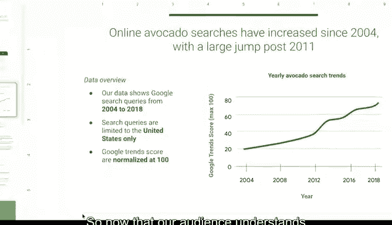

# 027：通过数据可视化分享数据 📊

## 第27讲：使用框架进行演示

在本节课中，我们将学习如何运用策略性框架来组织演示内容，帮助听众清晰理解数据分析的核心发现与业务关联。

---

### 概述：为何需要演示框架？

在之前的课程中，我们学习了在沟通数据发现时需时刻考虑受众。通过明确受众身份及其需求，你能更有效地讲述数据故事。

本节我们将探讨如何运用一个策略性框架，帮助听众把握你演示中最关键的要点。

---

### 框架的核心作用

为使你的数据发现易于被听众理解，你需要一个框架来引导整个演示。这有助于建立逻辑联系，并始终扣回业务任务和指标。

作为快速回顾，**业务任务**是你的数据分析所要回答的问题或解决的难题。你选择的框架为听众提供了理解数据的背景。此外，它还能帮助你在演示过程中专注于最重要的信息。

---

### 从业务任务出发

演示框架始于你对业务任务的理解。原始数据对大多数人而言意义不大。但如果你将数据置于业务任务的背景下呈现，听众将更容易与之产生共鸣。这使你的演示信息量更大，并有助于赋能听众，增长其知识。

因此，早期理解业务任务至关重要。

以下是一个例子：

假设我们与一家连锁杂货店合作。他们要求我们识别牛油果在线搜索的趋势，以帮助他们做出季节性库存决策。在我们的演示中，我们需要确保始终围绕此任务展开，并用它来构建信息框架。

让我们看看这个示例幻灯片演示。我们可以从用业务任务构建框架来开始演示。

在第二张幻灯片中，我添加了本次讨论的目标：
*   **分享历史牛油果在线搜索概况**：其下是更详细的解释。
*   **分析牛油果搜索量的逐年增长及其业务意义**。
*   **利用历史数据研究牛油果在线搜索的季节性趋势**：理解季节性趋势有助于预测库存需求和规划。
*   **探讨任何潜在的进一步研究领域**：这里我们将阐述演示的后续步骤。

这清晰地勾勒了演示轮廓，让听众知道能期待什么。同时也让他们了解我们将分享的信息如何与业务任务相关联。

---

### 构建数据叙事

你可能记得我们之前讨论过用数据讲故事。你可以将此视为构建叙事大纲。我们的数据可视化示例也可以做同样处理。

例如，如果我们展示这张关于牛油果年度搜索量的可视化图表：

我们可以这样构建其解读框架：“此图表显示了去年牛油果在线搜索量最高的月份。因此我们可以预期，今年牛油果的关注度将在相同月份达到高峰。”

这甚至可以写入幻灯片的演讲者备注中。这是提前添加你希望在演示中记住的要点的好地方。这些备注在演示模式下对听众不可见，因此是你可以参考的绝佳提醒。此外，你甚至可以提前分享带有演讲者备注的演示文稿，使内容对听众更易理解。

利用这些数据，杂货店可以预测需求，并制定计划储备足够数量的牛油果以满足客户兴趣。这只是我们利用业务任务构建数据框架、使其更易于理解的一种方式。

---

### 关联业务指标

你还需要确保通过展示所使用的业务指标来勾勒并建立与业务指标的连接。这能帮助听众理解你发现的影响。

回想一下我们在牛油果演示中使用的指标。我们追踪了数年间不同月份牛油果的在线搜索次数，以预测需求趋势。通过在演示中解释这一点，听众很容易理解我们是如何使用数据的。单独看这些数据点（日期或搜索次数）对听众并无用处。但当我们解释它们如何作为指标组合时，我们分享的数据就变得有意义得多。

以下是另一个我们可能想使用的数据可视化示例：

我们可以通过包含一些指标来为听众构建解读框架：
*   **数据覆盖的时间范围**：我们的数据显示了2004年至2018年的谷歌搜索查询。
*   **数据来源与范围**：搜索查询仅限于美国。
*   **趋势测量方式的简要说明**：谷歌趋势分数以100为基准进行标准化。

现在，既然听众理解了用于组织这些数据的指标，他们将能更清晰地理解图表。

---

### 总结

使用策略性框架来引导你的演示，可以帮助听众理解你的发现，而这正是数据分析过程中“分享”阶段的核心所在。

接下来，我们将进一步学习如何将数据更巧妙地编织进你的演示中。

---

