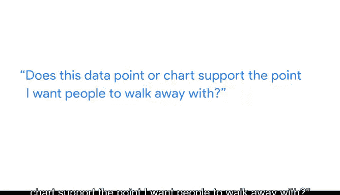

# 028：谷歌数据分析师第六课《通过数据可视化分享数据》 📊

## 课程概述

在本节课中，我们将学习如何将数据有效地融入演示文稿，以帮助听众更好地理解和解读你的发现。我们将介绍一个名为“Mcanus方法”的结构化框架，并学习如何通过清晰的步骤来展示数据可视化。

---

## 将数据融入演示

上一节我们介绍了如何利用业务任务和指标来构建演示框架。本节中，我们来看看如何将数据本身融入演示，以帮助听众更好地理解和解读你的发现。

首先，让听众了解数据收集期间有哪些可用数据是有帮助的。你还可以告诉他们是否有任何新的相关数据出现，或者你是否发现需要不同的数据。

在我们的分析中，我们使用了多年来关于牛油果在线搜索的数据。我们收集的数据包含所有带有“牛油果”一词的搜索，因此它包含了许多不同类型的搜索。这有助于我们的听众理解他们实际看到的是什么数据，以及他们可以期望用这些数据回答什么问题。

通过我们收集的包含“牛油果”一词的搜索数据，我们可以回答关于牛油果总体兴趣的问题。但如果我们想了解更多具体信息，比如鳄梨酱，我们可能需要收集不同的数据来更好地理解搜索数据的这一部分。

---

## 建立初始假设

接下来，你需要建立初始假设。你的初始假设是你试图用数据证明或反驳的理论。

在这个例子中，我们的业务任务是编制月度平均价格。我们的假设是，这将显示出清晰的趋势，可以帮助连锁杂货店为来年的牛油果需求做计划。

你希望在演示的早期就确立你的假设。这样，当你展示数据时，你的听众就有了正确的背景来理解它。

---

## 使用示例和可视化解释解决方案

接下来，你需要使用示例和可视化来解释业务任务的解决方案。

一个好的例子是我们上次使用的图表，它清晰地可视化了“牛油果”一词逐年变化的搜索趋势得分。原始数据可能需要时间才能被理解，但一个好的例子或可视化可以让你的听众在演示过程中更容易理解你。

请记住，有效地展示你的可视化与内容本身同等重要，甚至更重要。这就是我们之前学到的Mcanus方法可以发挥作用的地方。

因此，让我们来讨论一下这个方法的步骤，然后将它们应用到我们自己的数据可视化中。

---

## 应用 Mcanus 方法

Mcanus方法遵循从一般到具体的顺序，就像在建造一座金字塔。

**第一步：介绍图表名称**

你从最基本的信息开始，通过名称介绍你正在展示的图表。这可以引导听众的注意力。

让我们打开之前处理的幻灯片。我们有两个数据可视化示例，其中包含了我们上次探讨的框架。根据Mcanus方法，我们需要通过名称介绍我们的图表。这个图表的名称“年度牛油果搜索趋势”清晰地写在这里。当我们展示它时，我们一定会与听众分享这个标题，这样他们就知道该关注哪里以及图表是关于什么的。

**第二步：预先回答听众可能有的明显问题**

从高层次信息开始，逐步深入到对听众有用的最详细层面。这样，你的听众就不会因为试图理解一些在图表介绍时本可以轻松解答的问题而分心。

我们添加了关于数据收集时间、地点和方式的信息来构建这个数据可视化。但它也回答了利益相关者会问的第一个问题：这些数据来自哪里，涵盖了哪些内容。

回到我们演示中的第二个图表，让我们想想听众第一次看到这个图表时可能会有的一些明显问题。这个日期图非常有趣，但可能一眼难以理解。因此，我们的听众可能会对如何阅读它有疑问。了解到这一点，我们可以在演讲者备注中添加解释，以便在图表一出现时就回答这些问题。

> 这显示了时间以循环方式运行，冬季月份在顶部，夏季在底部。元素离中心越远，表示在该时间段内关于牛油果的查询就越多。

现在，这些问题的部分答案已经内置在我们的演示文稿中。

**第三步：陈述数据可视化提供的见解**

在进入支持性细节之前，让每个人达成共识非常重要。我们可以在这张幻灯片上写下一些关键要点，以帮助听众理解图表中最重要的见解。

在这里，我们让听众知道，这些数据显示了年复一年一致的季节性趋势。我们还可以看到，从十月到十二月，牛油果的在线兴趣度较低。这是一个重要的见解，我们绝对希望分享。

> 尽管牛油果是夏季时令水果，但搜索量在一月和二月达到顶峰。对于美国的许多人来说，观看超级碗比赛并吃薯片配鳄梨酱在每年的这个时候很流行。

现在，我们的听众在继续之前知道了我们希望他们获得哪些要点。

**第四步：指出支持该见解的数据**

这是你真正让听众惊叹的机会。所以尽可能多地提供例子。

对于我们的牛油果图表，可能值得指出具体的例子。在我们的月度趋势图中，我们可以指出这里记录的特定周次。

> 在2018年11月25日那一周，搜索得分约为49。但在2月4日那一周，搜索得分为90。

这借助我们图表中一些非常酷的数据，展示了在线搜索兴趣的上升和下降。

**第五步：告诉听众这为什么重要**

这是“那又怎样”的时刻。为什么这个见解对他们来说有趣或重要？

这是展示解决方案可能带来的业务影响以及利益相关者可以采取的明确行动的好时机。你可能还记得，我们在演示开始时在框架中概述了这一点。

因此，让我们解释一下这些数据如何帮助我们的杂货店利益相关者。

以下是他们可以采取的行动：
*   **应对低兴趣期**：他们可以考虑到十月至十二月期间牛油果兴趣较低的情况。
*   **准备需求高峰**：他们也可以为一月下旬、二月初的超级碗热潮和牛油果兴趣激增做好准备。
*   **优化库存策略**：他们将能够考虑如何在夏季和春季优化库存管理。

每一点下面都有更多细节，但这是影响的基本分解。

这就是我们如何使用Mcanus方法在演示中引入数据可视化。

---

## 最后的建议

我还有一条建议。花点时间自我检查，问问自己：这个数据点或图表是否支持我希望人们记住的观点？

这是一个很好的提醒，每次向演示中添加数据时都要考虑你的听众。

---

## 课程总结

本节课中，我们一起学习了如何利用框架来展示数据，如何将数据融入演示以服务听众，并且学习了用于数据展示的Mcanus方法。接下来，我们将学习一些实际创建演示文稿的最佳实践。