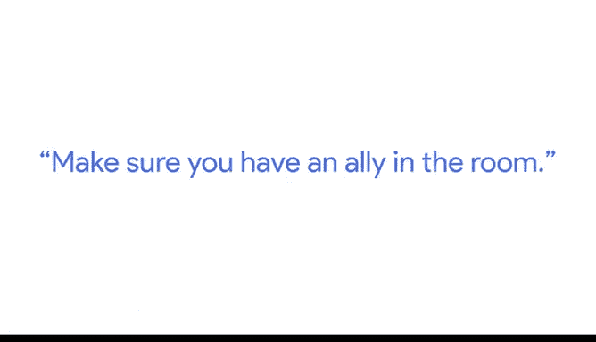

# 029：通过数据可视化分享数据 📊

## 第29讲：新晋数据分析师的演示技巧 🎤

在本节课中，我们将学习谷歌数据分析师布列塔尼·本分享的实用演示技巧。这些技巧旨在帮助你更清晰、更有效地向不同背景的听众展示数据分析结果，并最终推动决策。

---

### 保持内容简单明了

上一节我们介绍了课程概述，本节中我们来看看第一个核心技巧：简化内容。

我的建议是尝试保持内容像幼儿园教学一样简单。这意味着尽可能将你呈现的概念保持简单和直接。

当你进入一个演示场合时，房间里的人会有不同的兴趣水平、不同的知识水平，以及不同的专业领域专长。没有人愿意对着眼神呆滞的听众做演示。

---

### 避免使用“视觉污染”图表

在简化概念之后，视觉呈现的清晰度同样关键。以下是关于图表设计的一个重要提醒。

我对某些数据演示的一个反感之处是，它们经常包含我称之为“视觉污染”的图表。这种图表包含过多数据、使用过多颜色，看起来非常杂乱，让人根本无法理解演示者到底想表达什么。

**核心图表原则**：`图表信息量 ≤ 观众理解力`

---

### 增加演示的趣味性

清晰的数据展示是基础，但让听众保持参与同样重要。接下来我们探讨如何让演示过程更有趣。

我的另一个建议是让你的演示变得有趣。没有人愿意在一个房间里呆整整一小时，只听到你一个人的声音。我尝试用来打破这种局面的一个方法是，设计一些有趣的小游戏或问答，或者播放一段视频，或者向观众提问，以确保他们完全投入并与我互动。

---

### 运用讲故事的技巧

在调动起听众兴趣后，如何让信息更深入人心？讲故事是一个强大的工具。

我尝试融入演示的另一个技巧是讲故事。每个人都喜欢一个好故事。当你做得好时，你能够与听众建立联系，并以一种不讲故事可能无法实现的方式让他们参与进来。

**故事结构公式**：`背景 → 冲突/问题 → 数据分析 → 解决方案 → 结果`

---

### 在房间里找到支持者

即使准备充分，现场也可能出现意外挑战。最后一个技巧是关于如何提前建立支持网络。

我最后一个建议是确保你在房间里有一个支持者。通常，在我进行一个非常重要的数据演示之前，我会找一两个我知道会在场的人，提前把我的内容演示给他们看。这样做不仅能让我获得反馈，还能确保有其他人会点头赞同我即将展示的数据。

我无法告诉你有多少次，在这些盟友真的帮了我大忙，当房间里的人提出很多问题或试图找出分析中的漏洞时，这些盟友会站出来发言，他们真的会支持你，并为你所呈现的内容增加可信度。

**建立支持网络**：
1.  **提前沟通**：在正式演示前向关键人物预览内容。
2.  **获取认同**：确保他们对数据和结论表示赞同。
3.  **寻求反馈**：优化演示的逻辑和表达方式。

---

### 应对工作中的挑战

掌握了上述技巧，我们来看看数据分析师工作中一个常见的挑战。

我工作中最具挑战性的部分是，我的职责是说服人们去做一些他们可能并不完全确信应该做的事情。很多时候，这需要多次对话、多轮说服，才能让某人真正理解我试图阐述的观点或接受我的建议。

当你花了可能六个月或一年的时间构建分析、构思故事和叙述，为了让某人将其应用到他们的策略中，而他们最终理解并照做了，这使得所有的挑战都是值得的。

---

### 总结

本节课中，我们一起学习了谷歌数据分析师布列塔尼·本分享的五项核心演示技巧：
1.  **简化内容**：将复杂概念以简单直接的方式呈现。
2.  **优化图表**：避免信息过载，创建清晰易懂的视觉展示。
3.  **增加互动**：通过提问、游戏等方式提升听众参与度。
4.  **善用故事**：通过叙事结构连接数据与听众，增强说服力。
5.  **寻找盟友**：提前与关键听众沟通，建立现场支持网络。

这些技巧的共同目标是**清晰传达信息**、**有效吸引听众**并**最终推动决策**。记住，一次成功的数据演示，不仅是展示数字，更是关于沟通、理解和影响。