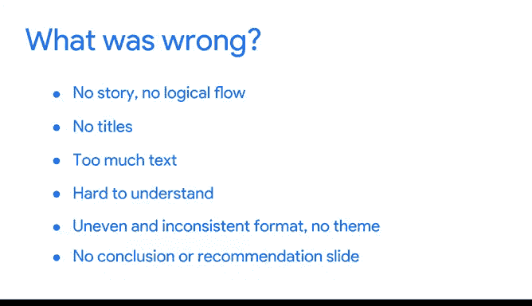

# 030：混乱的数据演示示例分析

在本节课中，我们将通过一个具体的“混乱”数据演示案例，分析其存在的问题，并理解为何这样的演示无法有效传达分析结果。我们将逐一拆解每个幻灯片，探讨如何改进数据演示的结构与设计。

---

## 概述

我们将深入分析一个特意构建的“混乱”数据演示示例。通过逐页检视整个演示文稿，我们将理解为何它在解释特定分析时效果不佳。

---

## 幻灯片问题分析

上一节我们概述了本课目标，本节中我们来看看这个混乱演示的具体问题。

### 标题页问题

首先看到的是标题页：“全球健康与幸福的关系”。

*   页面使用了一张非常通用的世界图片。
*   标题文字冗长。
*   观众虽然能知道主题，但演示文稿本身缺乏吸引力。

演示的第一页就向观众展示了大量数据和文字。观众此刻并不清楚自己要看什么。演示没有目的陈述，没有介绍页，观众不知道演讲者是谁，也不知道为何要听这个演示。关于“我们要讨论什么、为何讨论、观众应获得什么收获”这些信息一概缺失，而是直接进入了具体的数据可视化图表。

### 内容页问题

现在，我们来看演示的内容页。每张幻灯片的一个重要方面是拥有标题。标题和副标题能帮助观众准确理解本页将要讨论的内容，让他们在你讲解时知道需要理解什么。

观众看到这页时会感到困惑。他们会试图阅读幻灯片上的内容，并努力解读可视化图表的含义。确保页面上信息不过载非常重要。

接下来看第二张幻灯片。这里的可视化图表看起来好一些，更容易理解，并且没有放置多个图表。我们有一张地图，用颜色代表数值。但同样，观众很难真正理解其含义。此时，你可以在演讲者备注中解释，但页面上再次出现了大量文字，且没有标题。观众究竟要从这页获取什么信息？

一个好的演示还应具备一致的主题。现在，可视化和文字的位置调换了。这并非不可行，但在整个演示中，你真正要做的是建立一种熟悉感，尤其是在数据分析中。你要让观众熟悉你展示的图表和数据。到演示结束时，他们应该像你一样理解这些数据或概念。

### 结论页问题

最后，我们来看结论页。这一页确实有一个标题：“笑是最好的良药”。我们再次明白了在看什么，但整个演示缺乏到达此结论的逻辑流程。这个演示整体有说服力吗？我们只放了两页内容，文字过多，没有真正解释任何内容。此外，幻灯片上所有元素的摆放位置也很别扭。

---

## 核心设计原则

在思考如何构建演示时，你应该从观众的角度出发。他们脑海中唯一的想法是：我的注意力应该放在哪里？在我试图倾听和理解时，我应该看哪里？如果你使用了我们刚才展示的那种幻灯片，观众会不知道看哪里，或者他们会花时间阅读并试图理解，而同时你也在讲解。因此，引导观众的视线和注意力至关重要，要让他们确切知道应该听什么、理解什么，并由你引导他们最终得出结论。

---

## 问题总结

本节课我们一起分析了混乱演示的案例，现在来总结这个演示文稿整体存在的问题。问题不仅在于你要讲的内容或试图得出的结论，更在于数据可视化图表的选择和整体布局。

以下是主要问题：

*   **缺乏故事线和逻辑流程**：你以一堆散点图和大量文字开始，然后转到幸福得分的分色地图。但整个演示没有清晰的概念或试图得出的结论作为引导。
*   **没有标题**：幻灯片缺少标题，观众难以快速把握每页核心。
*   **文字过多**：页面信息过载，理解困难。
*   **布局不均衡且不一致**：视觉元素和文本的摆放显得杂乱。
*   **结论页引导不足**：即使每张幻灯片都有很好的解释，你也可能失去观众，因为他们一直在试图理解幻灯片本身想告诉他们什么。最后，任何数据分析演示中最重要的部分是**建议或结论页**。你虽然有这一页，但没有明确的标题，观众不知道这是演示的结尾，也不知道应该在这里将所有信息拼凑起来。

---

## 下节预告

接下来，我们将讨论如何改进这个演示，并深入探讨在解释健康与幸福如何相关时，一个有效的演示文稿应该是什么样子。

---

**本节课中，我们一起学习了如何识别一个混乱数据演示的典型问题，包括缺乏逻辑、信息过载、设计不一致以及结论引导不足。理解这些问题是创建清晰、有力数据演示的第一步。**