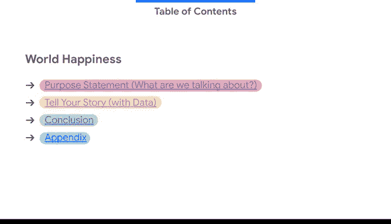
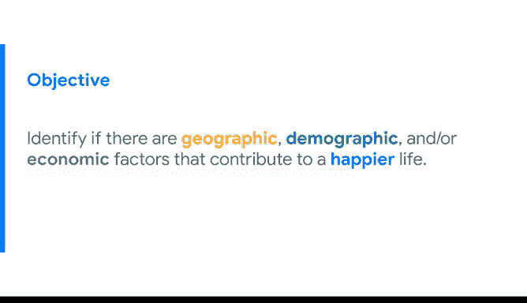
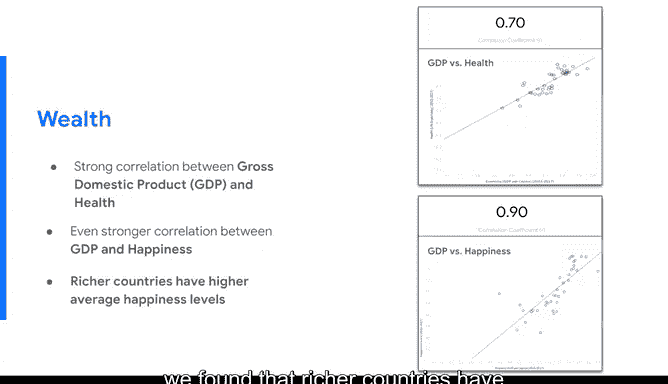
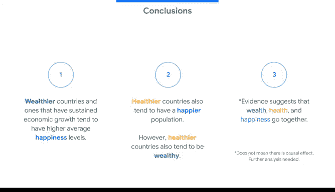

# 031：优秀的数据演示示例

在本节课中，我们将学习如何构建一个清晰、有效的数据演示。我们将通过一个具体的示例，了解从标题页到结论页的完整流程，并掌握使用动画、注释和逻辑过渡来引导观众注意力的关键技巧。

---

## 🏁 标题页与日期的重要性

上一节我们了解了应避免的演示错误，本节中我们来看看如何构建一个优秀的演示。

首先，标题页应保持简洁。它包含演示标题、演示者信息以及演示发生的日期。

底部的日期是一个不应忘记包含的重要因素。你可能会在数月甚至一年后回顾此演示，或者它可能会在公司内部分发。了解分析发生的时间、原因以及当时的背景情况至关重要。而公司当时所处的环境是此背景的重要组成部分。

---

## 📋 演示结构概览

接下来的一页幻灯片旨在让所有人了解你将演示的内容和顺序。

以下是演示的标准结构：
*   **目的陈述**：首先讨论我们将要谈论什么。
*   **故事叙述**：接下来是实际讲述故事的部分。一个重要概念是，整个演示是一个用数据讲述的故事。
*   **结论与附录**：最后是你的结论页。你需要明确这是结论部分，如果是在商业背景下，你将在此处添加建议。然后，你可以设置一个附录，用于存放数据图表的额外信息以及可能不适合放在主流程中的演示整体背景信息。

---

## 🎯 明确演示目的

我们的过渡页要回答：我们在谈论什么？

这是你让观众知道我们将要讨论什么内容的地方。我们试图告诉他们什么？此页之后的所有幻灯片将共同导向什么目标？

当我们看这张幻灯片时，我试图确定是否存在地理、人口统计和/或经济因素会影响生活的幸福感。

这就是整个演示的目的。现在房间里的每个人都知道了这一点，并且在你展示所有数据时，他们将围绕这一点进行思考。

---

## 📊 呈现数据：第一部分

我们目录的下一部分是呈现数据。

需要提及的是，在构建时这些部分可能会有不同的标题，但这是我们即将进入的主题。你会从之前杂乱的幻灯片中认出这个图表。

但它有不同的颜色背景。这并不重要。重要的是，当你到达这一页时，幻灯片上有一个标题和一个图表，但没有文字。这是一个重要的方面，我们试图做的是引导并向观众介绍你将使用的整体数据。

这是第一张包含任何形式内容的幻灯片，因此向他们介绍基础数据很重要。鉴于数据都是关于每个国家的地理、人口统计和经济数据点，图表体现这一点很重要。

如果我是这张幻灯片的演示者，我会从解释我们正在查看的过程和数据开始。

> 我们分析了一个数据集，其中包含2015年至2017年间从欧洲国家居民收集的数据。该数据包含每个国家内个人的人口统计和经济数据，包括人口、GDP（国内生产总值）以及人均幸福指数。

现在我已经向他们介绍了数据集。仍然没有文字，所以他们知道应该看图并听我讲解。

---

## ✨ 使用动画与注释引导注意力

下一个方面可能被过度使用，但我也见过使用不足的情况，那就是在演示中使用动画。

动画可以用作在你讲话时引导观众注意力的一种方式，可以说：“看这里，我正在谈论幻灯片的这个区域。” 它还能防止他们在你引入新概念时感到过于困惑或分心，因为请记住，当你引入数据时，技术成分对许多人来说可能是新的。

最后，另一种方法是使用图表上的注释，作为另一种引导他们视线和整体注意力的形式。

将这两者结合起来，我们可以在你讨论时让注释出现。例如，如果我们试图解释图表显示的内容，可以弹出一个注释，写着“幸福指数”，并指向特定国家的分数，这样我们就可以准确解释图表显示的内容。

通过这种方式，我们可以这样说：
> 我们首先创建了每个国家幸福指数的热力图，其中每个国家内的数字代表总体分数，颜色代表分数在量表上的高低。国家颜色越深蓝，该国的数字幸福指数越高；国家颜色越深红，幸福指数和总体数值越低。

这样，在屏幕上出现任何文字之前，我们已经解释了图表，解释了他们在整个演示过程中将要查看的整体数据，以便他们现在能够理解我们深入进行的具体分析。

---

## 💬 简洁的文本与逐步揭示

重要的是，你只在屏幕上以简短、简洁的方式使用文本来突出你正在讨论的要点。

在我介绍了图表之后，我现在可以深入分析。所以我们有了第一个要点：**幸福水平因国家而异**。

随着这个要点的出现，我的演讲备注可以是：
> 然而，由于高分和低分在地图上零星分布，我们发现地理位置与幸福感之间的相关性很小。最后，我们得出结论，仅地理位置本身并不是幸福感的强有力指标。

正如你所看到的，当我在讨论并解释我们在数据中查看的内容时，屏幕上的整体文字只在我开始讨论时才出现。这样，观众就能确切地知道在我讲话时应该看哪里、听什么。

---

## 🔄 幻灯片之间的流畅过渡

整个演示流程的一个非常重要的方面是幻灯片之间的过渡。

当我在讨论这一点时，你可以使用要点，也可以使用你的演讲备注，但无论如何，幻灯片之间应该有一些过渡，以便观众知道这部分结束了，并且知道接下来是什么。

对于这张幻灯片，我使用了我的演讲备注来进行过渡解释，例如：
> 我们的下一步是识别较高和较低幸福感国家之间的人口统计和经济差异，以分离出它们之间相关的特征。

然后我们进入下一张幻灯片。这是一个非常常见的主题。它可能是一个不同的图表，但整体标题和文字将出现的位置将在同一位置。这样，我们在三张幻灯片内让他们熟悉了演示的整体主题。

---

## 📈 呈现数据：第二部分（人口与幸福）

现在，标题立即告诉我们将要讨论的内容。上一张是关于地理的，这一张完全是基于人口的。

在我们浏览这张幻灯片时，正如你在杂乱示例中看到的，我们使用了大量的散点图。散点图在演示中可能并不总是最佳选择，因为人们很难跟上。但如果你向他们解释一次，让他们理解，你就可以在整个演示中使用它们，因为你已经让他们熟悉了它。

因为这是它第一次出现，所以深入解释图表以及你将在整个演示后面讨论的所有特征是很重要的。

我们再次使用动画。我们讨论散点图的坐标轴是什么。
> 我们创建了一个散点图，根据国家的幸福指数和人口来绘制国家，以查看两者之间是否存在相关性。散点图上位置越高的点，代表该国越幸福。国家绘制的位置越靠右，代表人口越多。连接两点之间的线正在测试相关性，或者说这两个不同的点是否彼此相关。

这些注释和动画是为了阐明图表在绘制什么。现在的总体目的是，我们试图确定国家的人口规模与整体幸福指数之间是否存在关系。

现在你已经解释了这个图表是什么，你可以深入探讨它的结果。

这张幻灯片本身有一个要点。它是你可以仅基于数据图表找到的整体分析结果：**根据我们运行的分析，我们发现幸福与人口之间几乎没有相关性**。

因此，所有对图表的深入讨论和解释都保留在演讲备注中，除了整体注释。同样，过渡到下一张幻灯片非常重要。

所以你可以这样说：
> 接下来，我们深入研究了每个国家的具体人口统计数据，看看是否能识别出与国家的整体幸福感分离或相关的特征。

---

## 🩺 呈现数据：第三部分（健康与幸福）

同样的事情。我们有标题，我们知道现在要讨论什么，现在是每个国家的健康状况以及它如何与幸福感相关联。

我们再次看到一个散点图，但好消息是你已经介绍了散点图是什么以及你在上面比较什么。现在观众已经熟悉了数据集。你不必详细解释图表代表什么，可以直接深入你将在本幻灯片上呈现的整体差异或分析。

你可以有一些解释说明：**我们发现幸福与健康（或国家的整体预期寿命）之间存在正相关关系**。

我们发现这一点是因为两个不同因素（幸福与健康）之间的相关系数为 **0.50**。

现在，你刚刚引入了一个新概念，这就是你现在必须解释这个新概念的地方，否则你可能会让房间里的人感到困惑。这是你整体分析的一个技术组成部分，并且是一个重要的组成部分，因此解释它是什么至关重要，但要以简化的方式让每个人都理解。

所以你可以这样说：
> 相关系数是衡量两个变量之间线性关系强度和方向的指标。换句话说，数字越接近 **1**，它们的正相关性就越强，这意味着当一个变量上升时，另一个也会上升。数字越接近 **-1**，它们的负相关性就越强，这意味着当一个变量（如幸福）上升时，另一个变量（如健康）会下降。越接近 **0**，意味着它们根本不相关，这就是我们在人口和幸福之间看到的情况，意味着它们之间没有关系。

现在我们已经解释了我们在本张幻灯片上用作分析的具体内容。同样重要的是，我们讨论了过渡到下一张幻灯片。

所以我们确实发现幸福与健康之间存在正相关关系，但问题仍然存在：是幸福的人健康，还是健康的人幸福？我们知道它们是相关的，但我们不知道是什么导致了另一个。最后，是什么促成了更长的预期寿命？如果我们知道更长的预期寿命与幸福相关，那么在一个国家内，是什么有助于创造更长的预期寿命？

现在，在演示结束前，我们需要回答这两个问题。同样，我们在整个演示过程中创建了一个逻辑流程。

---

## 💰 呈现数据：第四部分（财富与健康/幸福）

现在我们正在看一个新概念：每个国家的财富。

既然你使用的图表（如散点图）已经为观众所熟悉，那么现在添加额外的图表是可以的。

所以你可以这样说：
> 然后我们分析了GDP（国家的整体经济状况）如何与国家的整体健康相关，因为如果我们知道GDP与健康相关，并且我们知道健康与幸福相关，那么我们可以通过这一点推断出额外的信息。

我们发现国内生产总值与特定国家的整体健康状况之间存在很强的相关性，相关系数为 **0.7**，高于健康与幸福之间的整体相关系数。

接下来，我们发现GDP与幸福之间存在更强的相关性。因此，我们首先查看了健康与幸福，然后是GDP与健康，现在我们正在查看GDP与幸福，并发现它在所有这三个比较中具有最高的相关系数。

因此，仅在这张幻灯片中我们就得出了一个结论：**我们发现较富裕的国家具有较高的平均幸福水平**。

---

## 🎬 演示结论与未来方向

这是一个很好的过渡，可以引出你整个演示的总体结论。同样，你通过仅呈现你希望他们查看的文本来引导你的观众。

你的整个演示的第一个结论：
*   **较富裕且经济持续增长的国家往往具有较高的平均幸福水平。**

你的第二个结论：
*   **较健康的国家也往往拥有更幸福的人口。然而，较健康的国家也往往更富裕。**

最后，这是你总结的地方：
*   **因此，我们的证据表明，财富、健康和幸福是相辅相成的。**

同样重要的是讨论任何注意事项或需要进行的未来分析，以回答基于此分析可能产生的问题。

所以我们说过，证据表明财富、健康和幸福是相辅相成的。但这并不意味着一个会导致另一个。因此，需要进行未来的分析以了解它们之间的任何因果关系。

---

## ❓ 问答环节与个人风格

然后，你有你的最后一页幻灯片，这是提问环节。

重要的是要记住，数据讲故事是一门艺术。我们为你提供的是一些高层次的概述、不应做什么的例子以及一个改进的版本，但不要害怕将你自己融入其中。整体的演示风格将来自你在数据分析方面的个性和技能。你可以使用我们使用的工具来帮助你构建演示的布局，但真正投入大量你自己的东西，以及大量你自己的技能来帮助人们理解你所进行的整体分析，这取决于你。

---

## 📝 本节课总结

在本节课中，我们一起学习了如何构建一个优秀的数据演示。我们从**标题页**的简洁性开始，强调了日期的重要性。然后，我们探讨了演示的**标准结构**：目的陈述、故事叙述和结论附录。

我们深入了解了如何通过**过渡页**明确演示目的，并通过**图表、动画和注释**有效地呈现数据，逐步引导观众的注意力。关键技巧包括：**先解释图表再显示文字**、**使用动画聚焦重点**、以及**用简洁的文本概括核心发现**。

我们还学习了如何在幻灯片之间进行**流畅的逻辑过渡**，确保观众始终跟上节奏。最后，我们看到了如何得出**清晰的结论**，并坦诚地讨论**分析的局限性及未来方向**，最终以**问答环节**结束。

记住，优秀的演示不仅仅是展示数据，更是讲述一个引人入胜的故事，并将你的个人分析与沟通技巧融入其中。