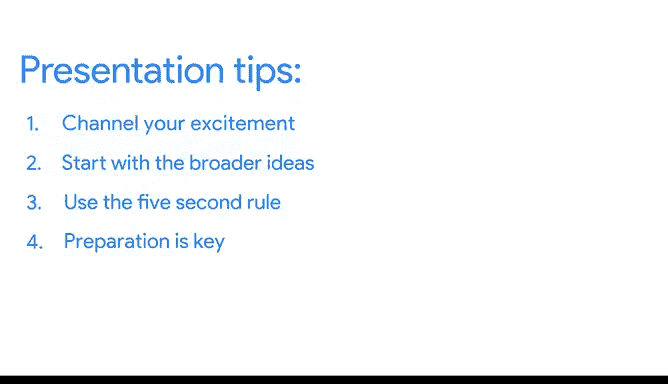

# 032：经证实的演示技巧

在本节课中，我们将学习为什么演示技巧对数据分析师至关重要，并掌握一些简单实用的演示技巧，帮助你更有效地向观众传达分析结果。

---

上一节我们介绍了使用框架引导观众以及如何融入数据。本节中，我们来看看为什么这些演示技巧如此重要，并学习一些可在自己演示中使用的简单技巧。

作为数据分析师，你承担着两项关键职责：

1.  分析数据
2.  有效呈现你的发现

分析数据这一点显而易见，毕竟“数据分析师”这个头衔本身就说明了这一点。但数据分析的核心在于将原始信息转化为知识。如果你无法有效沟通分析过程中的发现，那么这些知识就无法帮助任何人。

数据分析师有多种沟通方式：电子邮件、备忘录、仪表板，当然还有演示。有效的演示始于我们已经讨论过的内容，例如创建有效的可视化和组织幻灯片。然而，你的呈现方式会极大地影响观众的理解程度。你需要确保观众在离开时，能够掌握知识并准备好根据你的分析做出决策。这就是为什么强大的演示技巧对数据分析师如此重要。

如果做演示的想法让你感到紧张，不用担心，很多人都有同感。但这里有个秘诀：**练习越多，就会越容易**。

现在，让我们看看在做演示时可以使用的一些技巧。稍后我们会讨论一些更高级的技巧，但现在让我们从基础开始。

---

在做演示前感到肾上腺素水平上升是很自然的，这只是因为你对此感到兴奋。😊 为了帮助控制这种兴奋感，可以尝试进行**深度的、有控制的呼吸**来让身体平静下来。这样做还有一个好处，它能帮助你将所有兴奋转化为一种能展现你对所做工作热情的演示风格。

你可能还记得，我们之前讨论过使用 **MECE 方法** 来呈现数据可视化。实际上，这也是演示的一个很好的通用准则。从更宏观的想法开始：观众可能有的明显问题，以及他们需要理解什么才能将你的发现置于背景中。然后，你可以更具体地介绍你的分析和发现的见解。

让我们回到牛油果的例子，想象一下我们将如何开始那个演示。

在自我介绍和演示标题之后，我们有一张幻灯片列出了本次讨论的目标。我们从最普遍的目标开始，然后逐渐具体化。

我们可能会说：“今天的目标是，首先向大家介绍全球在线牛油果搜索的现状。😊 然后，我们将审视在线牛油果搜索季节性趋势带来的机遇和风险。接着，我们将提出可操作的后续步骤，帮助大家开始利用这些机遇并降低风险。最后，我们希望第三部分能与大家讨论一下对这些后续步骤的看法。”

这里需要注意，我们的演示在深入探讨对利益相关者的具体意义之前，首先关注的是网上对牛油果的普遍兴趣。

---

我们还学习了 **5 秒规则** 作为快速回顾。每当你引入一个数据可视化时，都应该使用 5 秒规则并问两个问题：

1.  展示数据可视化后，等待 **5 秒**，让观众处理信息。
2.  然后询问他们是否理解。如果不理解，花时间解释一下。
3.  接着，在告诉他们你希望他们理解的结论之前，再给观众 **5 秒** 时间消化。

尽量不要匆忙略过数据可视化。这对你的一些观众来说可能是第一次接触你的数据，值得在你的演示中为他们留出时间。

以下是我们牛油果演示中的第一个数据。当我们讲到这张幻灯片时，我们希望介绍年度牛油果搜索趋势图，并解释这里包含的基本背景信息。😊 等待 5 秒后，我们可以问：“对这个图表有什么问题吗？”假设我们的一位利益相关者问：“你能解释一下谷歌搜索趋势吗？”很好。解释完后，我们再等待 5 秒。然后我们可以告诉他们我们的结论。😊 “对牛油果的搜索量每年都在增加。”

你将在后续课程中了解更多关于这些概念的内容。但这些是入门的一些绝佳技巧。

---

最后，在呈现数据方面，**准备是关键**。😊 对一些人来说，这意味着进行彩排。对另一些人来说，这意味着写出讲稿并在脑海中重复。还有一些人发现，想象自己正在进行演示会有所帮助。尝试找到适合你的方法。最重要的是要记住：**准备越充分，表现就越好**。

灯光已经亮起，轮到你上场了。接下来，我们将介绍更多演示的最佳实践，并看一些例子。期待与你继续学习。

---

本节课中，我们一起学习了演示技巧对数据分析师沟通价值的重要性，掌握了通过深呼吸管理状态、运用 MECE 方法组织内容、遵循 5 秒规则讲解图表以及充分进行准备等核心技巧，为进行清晰、有效的演示打下了基础。