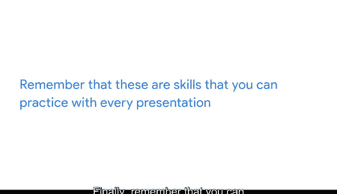

# 033：通过数据可视化分享数据 📊

## 第33讲：像专家一样演示 🎯

在本节课中，我们将学习如何像专家一样进行数据演示。我们将探讨如何专注于听众需求，优化演示内容与表达方式，并持续提升演示技能。

---

你已经学习了在演示中组织和整合数据的一些方法。你也了解了为什么有效的演示技能对数据分析师如此重要。现在，你已准备好开始像专家一样进行演示。接下来，我将与你分享一些专业技巧和最佳实践。让我们开始吧。

我们之前讨论过听众在整个分析过程中的重要性，这在演示环节尤为关键。同样重要的是要记住，并非每个人都能以相同的方式体验你的演示。通过电子邮件分享演示文稿，并在演示前预先考虑数据可视化的可访问性，有助于确保你的工作易于访问和理解。

但在实际演示过程中，我们很容易专注于自己最感兴趣和兴奋的内容，而不是听众真正需要听到的信息。有时，即使是最好的听众也可能走神或分心。

以下是你在最终演示中可以做的几件事，以帮助你专注于听众并保持他们的参与度。

首先，请记住，听众并不总是能理解你得出结论所采取的步骤。你的工作对你来说有意义，因为是你完成的。这被称为“知识的诅咒”。基本上，这意味着因为你了解某些事情，所以很难想象你的听众不了解它。重要的是要记住，你的听众没有与你相同的背景。因此，请专注于他们需要哪些信息才能得出与你相同的结论。

之前，我们介绍了一些可以添加到演示文稿中以帮助解决此问题的有用内容。以下是具体要点：

*   **数据来源与范围**：回答关于数据来源和覆盖范围的基本问题。数据是如何收集的？它是否专注于特定的时间或地点？
*   **分析目标与假设**：包含你的指导性假设和驱动分析的目标。添加你用于得出结论的任何假设或方法也很有用。例如，在我们的牛油果演示中，我们按季节对月份进行分组并查看了整体趋势。
*   **结论与推导过程**：最后，解释你的结论以及你是如何得出该结论的。

你的听众脑子里已经有很多事情了。😊 他们可能在想自己的工作项目或午餐想吃什么。他们并非有意无礼，也不意味着他们不感兴趣。他们只是有很多事情要忙的忙碌的人。因此，请尽量让你的演示重点突出、切中要害，以防止他们走神。

尽量避免讲述那些会将听众引向无关思路的故事。也尽量不要深入讨论与听众无关的细节。你可能发现了一个非常令人兴奋的新SQL数据库，但除非你的演示是关于数据库的，否则你很可能可以省略这部分内容。

你的听众也容易被演示中的信息分散注意力。例如，你在图表中包含的内容越多，听众需要探索的内容就越多。因此，尽量避免在演示中包含你认为无助于与听众进行富有成效讨论的信息。分享适量的内容，以保持听众的专注并准备好采取行动。

同样值得注意的是，你呈现信息的方式与你呈现的内容同等重要。以下是一些进行演示的最佳实践：

*   **注意表达方式**：保持句子简短。能用短词的地方就不要用长词。有意识地加入停顿，给听众时间思考你刚刚说的话。尽量保持句子音调平稳，以免你的陈述被误认为是问题。
*   **留意紧张习惯**：也要注意你可能有的任何紧张习惯。也许你说话更快，紧张时会轻敲脚趾或摸头发。这完全正常，每个人都会这样。但这些习惯可能会分散听众的注意力。演示时，尽量保持静止，有目的地移动。保持良好的姿势，并与听众进行积极的眼神交流。

最后，请记住，你可以通过每一次演示来练习和提高这些技能。接受并向你信任的人寻求反馈。反馈是一份礼物，也是一个成长的机会。

---

本节课中，我们一起学习了如何专注于听众需求、优化演示内容与表达方式，以及持续提升演示技能。你在这里学到的演示技巧——例如使用框架、将数据融入演示以及在实际演示中可以应用的最佳实践——将帮助你有效地向听众传达你的发现。