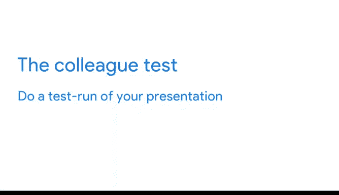
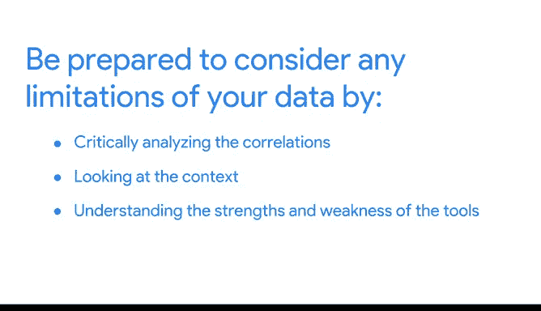

# 034：预见问答环节问题

在本节课中，我们将学习如何在数据演示的问答环节前做好充分准备。通过预见潜在问题，你可以更自信、更专业地应对听众的提问。

---

## 🎯 理解利益相关者期望

上一节我们讨论了数据演示的结构，本节中我们来看看如何为问答环节做准备。理解利益相关者的期望是预测他们可能提出问题的关键。

正如之前所讨论的，在项目早期设定利益相关者的期望非常重要。在规划演示和问答环节时，请始终牢记他们的期望。

确保你清楚地理解项目的目标以及利益相关者请你承担此项目时的初衷。

对于“世界健康与幸福”这个项目，我们的利益相关者感兴趣的是全球范围内哪些因素促成了更幸福的生活。我们的目标是识别是否存在地理、人口统计或经济因素对幸福生活有贡献。

了解这些后，我们就可以开始思考他们可能围绕该目标提出的潜在问题。归根结底，如果你误解了利益相关者的期望或项目目标，你将无法正确预见他们的问题。

因此，在规划问答环节时，要尽早并经常思考这些事项。

---

## 🔍 识别潜在问题的方法

一旦你确信自己完全理解了利益相关者的期望和项目目标，就可以开始识别可能的问题了。

识别听众问题的一个好方法是进行演示的试运行。我喜欢称之为“同事测试”。

以下是进行“同事测试”的步骤：
1.  向一位对你的工作一无所知的同事展示你的演示文稿或数据可视化。
2.  记录他们提出的问题。
3.  他们的问题可能与真实听众的问题相同。

我们曾将反馈视为礼物。因此，不要害怕寻求反馈，主动征求同事的意见。

---

## 🛠️ 根据反馈调整演示

假设我们与一位同事一起演练了演示。我们向他们展示了数据可视化，然后询问他们有什么问题。

他们告诉我们，不确定我们在这张幻灯片中是如何用数据衡量健康和幸福的。这是一个很好的问题。我们完全可以将这些信息融入到演示中。

有时，同事测试中提出的问题能帮助我们修改演示文稿。其他时候，这些问题能帮助我们预见演示过程中可能出现的问题，即使我们最初并未打算将这些信息构建到演示文稿本身中。

因此，做好准备详细解释你的流程是有帮助的，但前提是有人问起。无论如何，他们的反馈都能帮助你的演示更上一层楼。

---

## ❌ 从零假设开始

接下来，从零假设开始是有益的。不要假设你的听众已经熟悉行话、缩写、过往事件或其他必要的背景信息。

尝试在演示中解释这些内容，并准备好在被问及时进一步解释。

当我们向同事展示演示文稿时，我们无意中假设他们已经知道如何衡量健康和幸福，并将此信息排除在原始演示文稿之外。

现在，让我们看看我们的第二个数据可视化。这张图显示了健康、财富和幸福之间的关系，但包含了GDP来衡量经济。

我们不想假设听众知道这意味着什么。因此，在演示过程中，我们将需要包含GDP的定义。

在我们的演讲者备注中，我们添加了：**国内生产总值（GDP）**，指一个国家在特定时期内在其境内生产的所有最终商品和服务的总货币或市场价值。

我们将在图表出现时立即充分解释GDP的含义。这样，听众中就不会有人对这个缩写感到困惑。

---

## 🤝 与团队协作预见问题

与你的团队合作预见问题并起草回应是有帮助的。通过协作，你们可以整合他们的观点并协调答案，确保团队中的每个人都做好准备，随时准备与利益相关者分享他们独特的见解。

与你一起从事“世界幸福”项目的团队可能对数据有很多深刻的见解，例如数据是如何收集的，或者可能缺少什么数据。

与他们保持沟通，这样你就不会错过他们的视角。

---

## ⚠️ 准备讨论数据局限性

最后，准备好考虑并向你的利益相关者描述你数据中的任何局限性。

你可以通过批判性地分析数据中发现的模式以确保其完整性来做到这一点。例如，发现的关联是否可以被解释为巧合？

除此之外，利用你对分析中所用工具优缺点的理解，来找出它们可能引入的任何局限性。

---

## 📝 总结与回顾

虽然你可能无法预测未来，但通过做一些关键的事情，你可以非常接近地预测利益相关者和听众的问题。

请记住以下几点：
*   专注于利益相关者的期望和项目目标。
*   与你的团队一起识别可能的问题。
*   以零假设的心态审视你的演示。
*   考虑你数据的局限性。

然而，有时你的听众可能会在演示前后对数据提出异议。接下来，我们将讨论他们可能提出的异议类型以及你如何回应。

---

本节课中，我们一起学习了如何通过理解期望、进行测试、消除假设和团队协作来有效预见问答环节的问题，从而为数据演示做好更充分的准备。