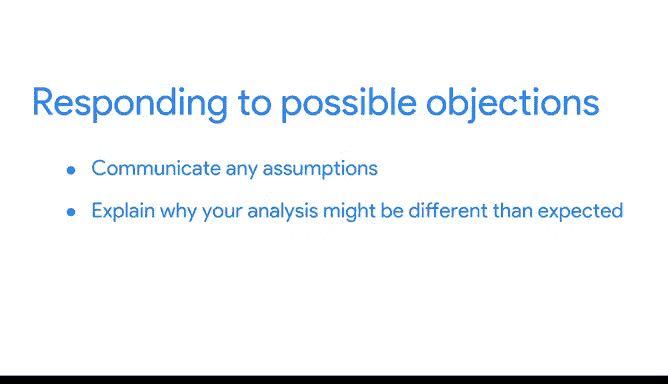

# 035：处理异议 📊

在本节课中，我们将学习如何在数据演示中有效处理利益相关者可能提出的异议。理解并妥善回应这些异议，能增强演示的说服力，并建立您作为数据分析师的专业信誉。

上一节我们探讨了如何构建演示文稿，本节中我们来看看当听众对数据、分析或结论提出疑问时，应如何应对。

## 异议的类型

利益相关者可能在演示过程中或结束后提出异议。这些异议通常围绕数据、分析过程或最终发现展开。

以下是几种常见的异议类型：

### 关于数据的异议

关于数据的异议可能涉及多个方面。有时，利益相关者会询问数据的来源和获取系统。他们也可能想了解在您处理数据之前，数据经历了哪些转换，或者数据的时效性与准确性如何。

**应对策略**：
您可以在演示的开头部分就包含所有这些信息，以建立数据背景。此外，在附录中提供更详细的分解说明，以备回答更深入的问题。在讨论数据清洗时，我们学过**保持一份详细的数据转换日志非常有用**。这份日志可以帮助您回答此处讨论的各类问题。如果您将其放在演示文稿的附录中，在问答环节中，若有利益相关者需要更多细节，您便能轻松引用。

### 关于分析过程的异议

您的听众可能对您的分析过程有疑问或异议。他们可能想知道您的分析是否具有可复现性。

**应对策略**：
因此，**保留一份记录您所采取步骤的变更日志会很有帮助**。这样，其他人可以遵循并复现您的流程。如果您认为有必要，甚至可以在演示文稿的附录部分创建一张幻灯片来解释这些步骤。如果您使用像 SQL 或 R 这样的编程语言（我们将在后续课程中学习），保留一份干净的脚本副本也很有用。同时，准备好回答诸如“在此过程中您从谁那里获得了反馈？”这类问题。当您的分析结果与听众对数据的直觉感受相悖时，这一点尤其重要。确保在整个分析过程中纳入多方视角，将有助于您在演示时为您的发现提供支持。

### 关于分析结果的异议

最后，您可能会面临对发现本身的异议。很多时候，这些问题会是：“这些发现在之前的时间段是否存在？”或“您是否控制了数据中的差异？”

**应对策略**：
您的听众希望确保您的最终结果考虑到了任何可能的不一致性，并且结果是准确和有用的。

## 如何回应异议

现在，您已经了解听众可能提出的几种异议类型，接下来我们谈谈如何构思回应。

以下是几种有效的回应方法：

1.  **沟通假设**：首先，沟通关于数据、分析或发现的任何假设，这可能有助于回答他们的问题。例如，您的团队是否在分析前清洗和格式化了数据？告知听众这一点可以消除他们可能存在的疑虑。
2.  **解释差异**：其次，解释为什么您的分析可能与预期不同。引导听众了解那些改变结果的变量，帮助他们理解您是如何得出结论的。
3.  **承认有效异议**：第三，有些异议是有道理的，特别是当它们提出了您之前未曾想到的问题时。如果确实如此，您可以承认这些异议是有效的，并采取措施进行进一步调查。事后跟进并提供更多细节也是一个很好的做法。

现在您已经了解了一些可能遇到的基本异议。理解您的听众可能对您的数据、分析或发现提出疑问，可以帮助您提前准备好回应。引导听众了解关于数据的任何假设或解释意外结果，都是回应的好方法。

😊 接下来，我们将进一步探讨在问答环节中回应问题的更多最佳实践。

本节课中，我们一起学习了如何处理数据演示中可能出现的三类主要异议：关于数据、分析过程和结果的异议，并掌握了沟通假设、解释差异和承认有效异议等关键回应策略。提前准备和保持透明是有效管理异议、建立信任的核心。