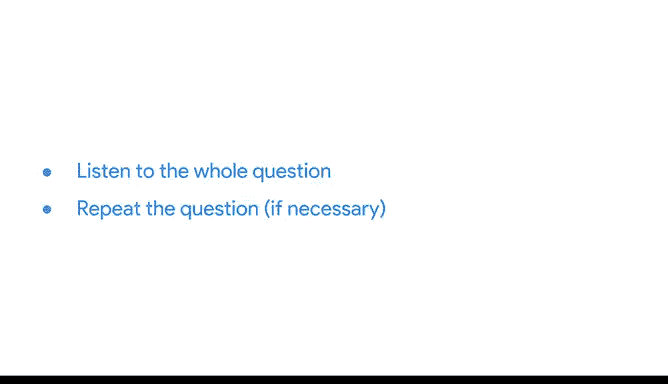
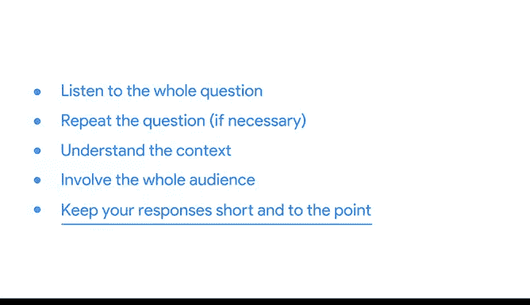

# 036：问答环节最佳实践 📊

在本节课中，我们将学习如何在演示的问答环节中有效回应听众的问题。我们将探讨一系列最佳实践，帮助你清晰、专业地回答问题，确保沟通顺畅。

上一节我们讨论了如何在演示期间或之后应对反对意见。本节中，我们来看看问答环节的具体操作技巧。

## 有效回答问题的步骤 🗣️

以下是确保有效回答问题的几个关键方法。

### 1. 倾听完整问题
这听起来理所当然，但人们常常在对方尚未问完时就开始思考答案。务必听完整个问题，再开始回应。

### 2. 复述问题
复述问题有几个好处：确保你正确理解了问题；给提问者纠正的机会；让未听清问题的听众了解内容；同时给自己时间组织思路。

例如，在演示的第11页概述结论后，一位利益相关者问：“这个项目中幸福感是如何测量的？” 听完并复述问题后，你可以解释：“不同国家的参与者填写了一份调查问卷，要求他们对自己的幸福感进行评分。”

### 3. 利用附录提供详细信息
附录是存放演示中非必需但有助于回答问题的额外信息的好地方。例如，关于调查数据的详细信息可以放在这里，便于参考。

### 4. 理解问题背景
始终考虑听众是谁，他们可能有什么顾虑或背景。记住项目目标及利益相关者的兴趣点，使回答与具体背景相关。

例如，如果你向医疗保健行业的利益相关者展示包含“预期寿命作为健康指标”数据的幻灯片，他们可能更关注医疗数据及整体健康与幸福感的关系。你可以据此调整回答重点。

### 5. 面向全体听众回答
你不是在与提问者进行一对一对话，而是在向可能抱有相同问题或需要知道答案的群体展示。避免无意中排除其他听众。如果听众或团队中有人能提供见解，可以邀请他们分享想法。

### 6. 回答简洁扼要
首先给出标题式回应，提供基本答案。如果对方有更多疑问，再深入细节。数据分析师可能掌握大量背景信息，但应避免冗长复杂的回答导致听众困惑。专注于问题本身，尽可能直接、简洁地回答。

例如，当被问及幸福感数据如何收集时，可以先说：“我们使用了一份调查问卷来测量个人幸福感。” 仅当对方表现出进一步兴趣时，再提供更多细节。

## 总结与提醒 ✅

在演示问答环节回答问题时，请记住：倾听完整问题；必要时复述问题；理解背景；面向全体听众；保持回答简洁。此外，并非所有问题都需要当场回答。如果遇到需要额外分析或研究的难题，可以告知听众你将后续跟进，并记得及时反馈。

这些技巧将使回答问题更容易，并让你显得准备充分、专业可靠。

本节课中我们一起学习了问答环节的最佳实践，包括倾听、复述、利用附录、理解背景、面向全体回答以及保持简洁。掌握这些方法将帮助你在未来的演示中更自信、有效地与听众沟通。

演示准备就绪后，即可圆满结束。我们涵盖了许多内容，包括如何预先考虑问题、处理不同类型的反对意见，以及可在下次演示中使用的实用技巧。

本节内容到此结束。我们下个视频再见。