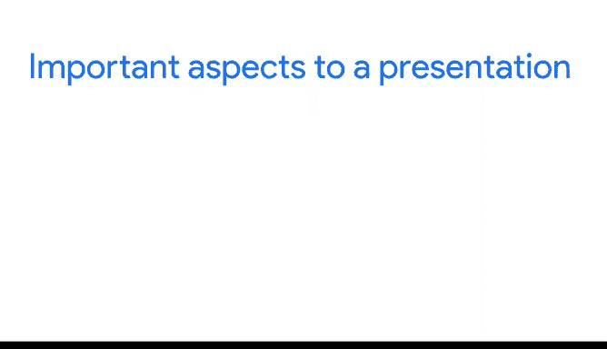
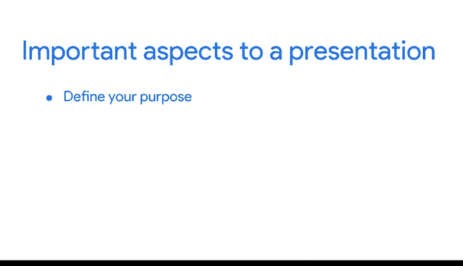
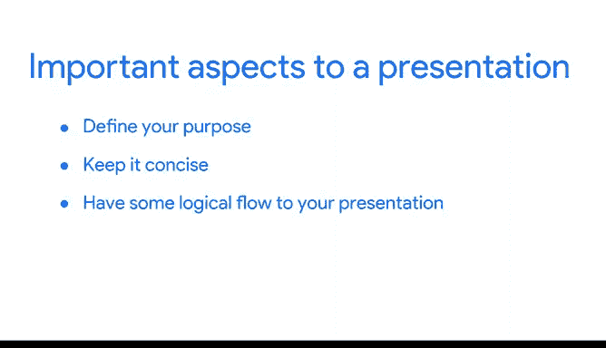
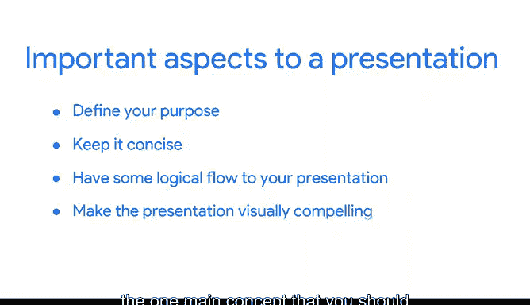
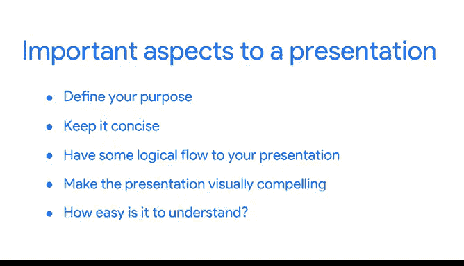

# 037：谷歌数据分析师第六课《通过数据可视化分享数据》📊

## 课程概述

在本节课中，我们将学习如何成为一名专业的数据翻译者。数据分析师的核心价值不仅在于处理数据，更在于将复杂的技术分析结果，清晰、有效地传达给不具备技术背景的业务决策者。我们将探讨成功进行数据演示的关键要素。

---

在我的职业生涯中，随着你在数据分析领域不断深入，你会发现，对公司真正重要的并非数据本身，而是对数据的理解以及数据能产生的影响。

然而，许多业务领导者不具备理解原始数据形式的技术专长。

因此，你作为分析师，就是数据的翻译者。所以，数据最重要的部分，是分析师为业务领导者所做的数据翻译工作。

根据我的职业经验，展示数据可能是数据分析师工作中最重要的环节。因为无论你的分析多么有说服力或多么精确，如果人们无法理解它，那么它就无法为业务或任何人提供价值。

我投入了大量时间，并且我当前工作的一个重要部分，就是帮助业务领导者理解他们的数据，将非常技术性的内容简化，让人们理解其含义以及如何利用它来影响业务。这是一门艺术，也是一种技能，能够将高度技术性的内容简化，让房间里的每个人都明白它在说什么以及如何使用它。

因此，很多时候，当我审视他人的演示文稿或自己构建演示文稿时，一个非常重要的方面是**定义你的目的**。

**定义你将要谈论的确切内容及其重要性。** 明确房间里每个人为何在此，以及他们将从这次演示中获得什么。

一个优秀演示的下一个方面是**保持简洁**。

你不希望内容过于冗长。你不希望屏幕上出现大量文字，也不希望演示时间过长。这并不是说每个人都太忙而无法专注，而是你确实需要确保在阐述观点的同时，不分散每个人的注意力。

下一个方面是确保你的演示具有**逻辑性**。

你不希望在你试图阐明观点时，每个人的注意力在不同的想法之间跳跃。你需要一个非常简洁和合乎逻辑的流程，让他们知道接下来会发生什么以及你当前在谈论什么。

下一个需要考虑的方面是使演示文稿**具有视觉吸引力**。

你希望人们知道他们正在看什么并理解它。因此，你选择的视觉效果、整个演示文稿的主题应该是吸引人的，并且能够吸引人们，让他们确切地知道能从演示中获得什么。

所有这些都归结为构建演示文稿时应考虑的一个主要概念，即**易于理解的程度**。

你正在尝试将非常技术性的数据分析简化，使得无论听众的技术背景甚至业务背景如何，他们都能理解你试图向他们解释的内容。

---

## 课程总结

本节课中，我们一起学习了成为专业数据翻译者的核心思想。关键在于将复杂的数据分析转化为易于理解的见解。我们探讨了成功数据演示的四个关键要素：**明确目的**、**保持简洁**、**逻辑清晰**以及**视觉吸引**，所有这些最终都服务于一个核心目标——**确保演示内容易于理解**，从而让分析结果真正为业务创造价值。