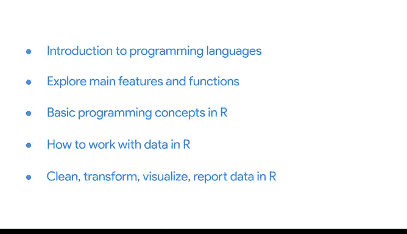

# 001：使用R编程进行数据分析 🚀

在本节课中，我们将学习编程的基本概念，并重点介绍R编程语言如何应用于数据分析的各个阶段。我们将从编程语言的基础知识开始，逐步探索R的核心功能，并学习如何利用R来提升数据处理、分析和可视化的能力。

---

## 编程世界介绍 💻

你已经走过了漫长的学习旅程。回顾一下你掌握的技能：你学会了使用结构化思维定义问题、提出正确问题，使用电子表格、数据库和SQL等工具来组织和转换数据，在分析前确保数据的完整性，创建有影响力的可视化图表，并向利益相关者传达见解。这些技能令人印象深刻，但我们的学习尚未结束。

你的技能即将进一步扩展。在本课程中，你将学习一个名为“编程”的新概念，以及如何使用R编程语言来分析数据。

数据分析过程包含六个阶段：提问、准备、处理、分析、共享和行动。我们将学习R编程语言，并了解它如何助力每个阶段。

课程结束后，你将有机会参与一个可选的案例研究。该案例研究将让你运用本课程中学到的所有技能来解决一个数据分析问题。稍后你会了解更多关于这个项目的信息。

---

## 什么是计算机编程？ 🤔

计算机编程指的是向计算机发出指令以执行一个或一系列操作。你可以使用不同的编程语言来编写这些指令。具体语言的选择可能基于你想要进行的项目或想要解决的问题。

R编程语言在组织、清理和分析数据方面非常有用。如果你是第一次接触计算机编程，欢迎你。当我开始学习数据分析时，我也没有编程背景。事实上，在我爱上数据之前，我是一名受过训练的歌唱家。我也有很多朋友从艺术领域转行而来，在职业生涯后期才学习编程。R是一个很好的起点。

初次学习R可能具有挑战性，但也更能赋予你能力。你在本课程中学到的许多技能将帮助你理解基本的编程概念。请一步一步来，按照自己的节奏学习。就像之前的课程一样，我们将从基础开始，逐步深入。你之前已经应对过艰难的挑战，并且总能成功。这次你也一定能行。

---

## 讲师介绍与R学习经历 👩‍💼

让我介绍一下自己。我叫Carrie，在谷歌担任研究经理。我领导一个团队，研究如何最佳地提升组织中人员的绩效。换句话说，我帮助人们更高效、更聪明地工作，并帮助组织以健康、高效的方式运作。

我最初是在担任初级数据分析师时学习R的，当时我正在参与一个关于虚拟工作的多年期项目。我们研究人们虚拟工作体验的数据，试图理解远程工作如何影响绩效。这是一个复杂的项目，有大量数据需要筛选。我不断遇到问题，并寻找更好、更快的方法来处理。就在这时，我意识到了R的强大力量。

每当我遇到困难时，我就会多学一点R，并找到解决问题的方法。我很快意识到，R几乎可以帮助我完成任何涉及数据的任务，甚至比我预想的更好、更快。幸运的是，网上有大量优秀的R学习资源和非常支持性的在线社区。如果我有问题，我会上网寻找答案。随着项目的推进，我能够学到越来越多，并成为一名更高效的数据分析师。我的队友甚至开始向我咨询关于R的建议。

意识到我可以在职业生涯的任何阶段持续提升技能，这是一次赋予力量的经历。学习R开启了我进行高水平数据分析的能力。在你未来的数据分析师生涯中，你将有机会不断学习和成长。对我来说，这可能是这份工作最酷的方面之一，而学习R是这一成长过程中最有回报的部分。我仍然在不断学习使用R的新方法。

此外，你可以将这些技能应用到其他编程语言上，如Python、Julia或JavaScript。编程的潜力是无限的，它甚至超越了数据分析。在我学会R之后，我发现自己开始思考可以在工作和娱乐中用编程完成的各种项目。它开启了一个充满可能性的全新世界。

---

## 本课程学习内容概览 📚

现在，让我们谈谈你将学习的内容。

我们将从编程语言的介绍开始。然后，我们将更仔细地研究R本身，探索其主要特性和功能。我们还将涵盖一些基本的编程概念，并学习如何在R中有效地使用它们。

接下来，我们将学习如何在R中处理数据。你将发现R如何增强你的数据分析技能，让你以新的、更强大的方式清理、转换、可视化和报告数据。

---

## 学习R的价值 🎯

学习R将帮助你将数据分析提升到一个新的水平。它也会让你的简历更加出彩。R被广泛认为是入门级职位的关键技能。懂得使用R将为你的求职带来巨大助力，并帮助你在新晋分析师中脱颖而出。

接下来，我们将更广泛地讨论编程语言以及它们如何帮助你分析数据。之后，我们将直接进入R的学习。不知不觉中，你将能够使用R来驱动你的数据分析。

---

## 总结 ✨

本节课中，我们一起探讨了编程的基本概念，并介绍了R编程语言在数据分析中的重要作用。我们了解了计算机编程的定义，认识了R语言的优势，并通过讲师的经历看到了学习R带来的职业成长。我们还预览了本课程的核心内容，并明确了学习R对提升数据分析能力和职业竞争力的价值。在接下来的学习中，我们将深入R的具体应用，开启数据分析的新篇章。