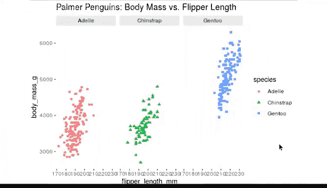

# 002：使用R编程进行数据分析 🐧📊


## 概述

在本节课中，我们将通过一个有趣的预览，初步了解R语言在数据可视化方面的强大能力。我们将使用一个关于企鹅的数据集，学习如何创建和定制图表，从而直观地探索数据中的模式与关系。

---

## R语言的可视化魅力

再次见面，很高兴见到你。我最初学习R语言时，正是其可视化功能深深吸引了我。

我至今仍认为，只需编写少量代码，按下一个按钮，就能生成出色的数据可视化图表，这非常酷。

在深入所有细节之前，我认为先给你一个快速的预览，展示R语言能做什么，会很有趣。

接下来的内容将是你在本课程结束时将要学习知识的一个预览。届时，你不仅能理解所有这些代码，还能自己编写和执行它们。

现在，请放松并享受这场展示。

---

## 加载数据与库

我们首先加载一个库并获取一个数据集进行处理。

我们可以使用**帕尔默企鹅数据集**，它包含了生活在南极洲帕尔默群岛上的三种企鹅的体型测量数据。这些数据包括体重、鳍状肢长度和喙长度等信息。

该数据集有**344行**信息，被分类到**8列**中。

帕尔默企鹅数据在分析师中很受欢迎，非常适合进行有趣的探索、可视化以及教学。我们将在课程后面更多地看到这个数据集。

---

## 创建散点图

假设我们想要可视化体重与鳍状肢长度之间的关系。

你可能会猜测，企鹅体型越大，鳍状肢就越长。我们可以通过创建一个图表来确认这一点。让我们来制作一个**散点图**。

散点图使用点来显示两个变量之间的关系。因此，我们要比较的两个变量是**体重**和**鳍状肢长度**。

现在无需记住所有这些细节，稍后你将有更多时间学习它们。

---

## 解析绘图代码

让我们看看这段代码的各个部分以及它们是如何组合在一起的。

第一个函数 `ggplot()` 用于启动绘图。

```r
ggplot(data = penguins)
```

如果我们在此时运行代码，只会得到一个空白的图表。

如果我们添加更多代码，R会在图表的每个轴上添加标签，并为数据添加辅助线。

```r
ggplot(data = penguins) +
  aes(x = flipper_length_mm, y = body_mass_g)
```

体重在Y轴上，鳍状肢长度在X轴上，但数据点还不可见。

为了得到完整的图表，我们可以添加更多代码，告诉R如何表示我们的数据。例如，我们可以使用点、条形或线。这里我们将使用点来创建散点图。

```r
ggplot(data = penguins) +
  aes(x = flipper_length_mm, y = body_mass_g) +
  geom_point()
```

---

## 自定义图表外观

我们可以进一步定制图表的外观。例如，让我们将所有点的颜色改为紫色。

你可以按向上箭头调出最后运行的代码片段，我们现在就这样做。

然后，我们在 `geom_point()` 中添加 `color = "purple"`。

```r
ggplot(data = penguins) +
  aes(x = flipper_length_mm, y = body_mass_g) +
  geom_point(color = "purple")
```

现在我们可以按回车键来运行它。

---

## 用颜色高亮分组信息

我们还可以向图表中添加新信息，并使用颜色来高亮显示。

让我们告诉R为每种企鹅分配不同的颜色。这样，我们可以将数据点与每种企鹅群体联系起来。

```r
ggplot(data = penguins) +
  aes(x = flipper_length_mm, y = body_mass_g, color = species) +
  geom_point()
```

帝企鹅是体型最大的。图表右侧的图例告诉我们，蓝色的点代表帝企鹅。

R会自动为图表创建图例，帮助我们理解颜色编码。

R会执行你告诉它做的所有事情，甚至做一些你没有要求的事情。它就是如此有用。

---

## 使用形状进行区分

我们也可以使用形状来区分不同的企鹅种类。

```r
ggplot(data = penguins) +
  aes(x = flipper_length_mm, y = body_mass_g, shape = species) +
  geom_point()
```

或者，我们可以同时使用颜色和形状。

```r
ggplot(data = penguins) +
  aes(x = flipper_length_mm, y = body_mass_g, color = species, shape = species) +
  geom_point()
```

---

## 分面绘图：按子集分解数据

除了高亮数据，我们还可以重组数据。我们可以将数据分解成更小的组或子集，并为每个子集创建一个图表。

假设我们想专注于每个物种的数据。`facet` 函数让我们可以为每个物种创建一个单独的图表。

看看这个。分面功能非常棒。

```r
ggplot(data = penguins) +
  aes(x = flipper_length_mm, y = body_mass_g, color = species) +
  geom_point() +
  facet_wrap(~species)
```

---

## 添加文本与标题

我们甚至可以在图表上添加文本来指向特定数据或传达信息。

让我们给图表添加一个标题，以明确其目的。

```r
ggplot(data = penguins) +
  aes(x = flipper_length_mm, y = body_mass_g, color = species) +
  geom_point() +
  facet_wrap(~species) +
  labs(title = "Penguin Size: Body Mass vs. Flipper Length")
```

---

## 保存图表



最后，我们可以保存图表，以便日后访问或分享。

```r
ggsave("penguin_plot.png")
```

现在，如果我们点击“文件”标签，我们会在列表中找到我们的文件。让我们打开它看看。


---

## 总结

展示到此结束。希望你和我一样享受这个过程。

我们能够获取一个大型数据集，并快速可视化一些重要的模式。这些只是R语言中的一些基本功能。换句话说，这仅仅是个开始。

想到R能帮助你实现数据分析的全部潜力，就令人兴奋。随着学习的深入，你将更深入地了解我们用来创建图表的每一个函数。

在本课程结束时，你将能够自己编写和执行所有这些代码。

接下来，我们将学习更多关于计算机编程的知识，以及它如何帮助你分析数据。

下次见。