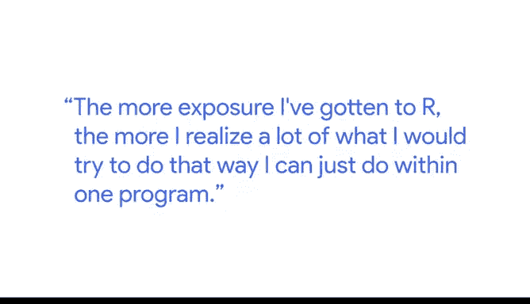
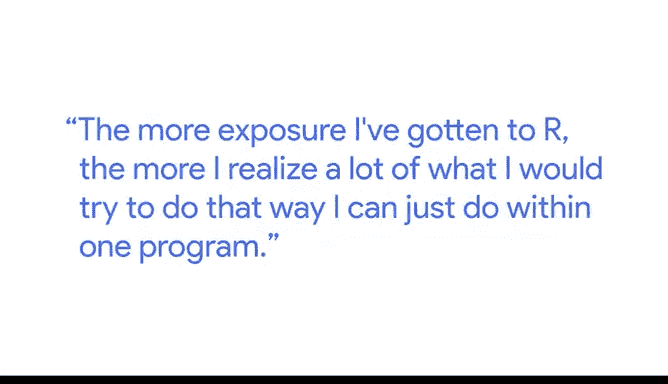

# 003：谷歌数据分析师课程第七课《使用R编程进行数据分析》📊


## 课程概述

在本节课中，我们将跟随谷歌研究经理Carrie的分享，学习R语言入门的心得与建议。课程将涵盖初学者常有的顾虑、学习过程中的关键心态，以及掌握R语言后带来的效率提升。

---

## 克服初学者的恐惧与错误心态 😨

上一节我们介绍了课程背景，本节中我们来看看初学者常有的心态。

Carrie给R语言初学者的首要建议是：犯错是学习过程的一部分。错误和错误信息是必经之路。

她观察到，那些比她更精通R的人，并不一定更聪明，但他们可能更具**持久性**，并且更愿意深入探究问题。与她刚开始学习时相比，她最初看到错误信息会认为“我做错了，游戏结束”。而现在她的心态是：“这只是游戏的一部分”。

---

## R语言的吸引力与优势 ✨

了解了正确的心态后，我们来看看R语言本身为何值得学习。

当Carrie最初接触R时，她觉得它看起来**过于复杂**，可能非常难学。但她遇到的R使用者都对它充满热情。他们认为，相比于其他用于运行分析的工具，R拥有许多优势。

在使用R之前，她经常使用电子表格或其他工具。有时她需要**“强行拼凑”**才能实现想要的分析，甚至因为单个工具功能有限而同时使用多个工具。她心里清楚分析逻辑，但执行起来并不流畅。

随着对R的接触增多，她意识到，许多她过去费力实现的操作，现在**在一个程序内**就能完成。

```r
# 例如，在R中，数据清洗、分析和可视化可以无缝衔接
# 而不需要在不同软件间切换
cleaned_data <- raw_data %>%
  filter(!is.na(value)) %>%
  group_by(category) %>%
  summarise(mean_value = mean(value))
```





并且所有步骤都能非常流畅地**相互衔接**。

---

## 从零开始的学习路径与资源 🛣️

那么，具体应该如何开始学习呢？以下是Carrie分享的个人学习经历。

起初，她非常不自信。她有几个脚本是请更懂R的朋友或同事帮忙检查和理解的。她曾觉得问一些简单的问题很傻，比如“为什么这里要加括号？”或“我们为什么要这样做？”。幸运的是，她的朋友们都非常耐心。

后来，她所在的整个部门决定统一使用R，以确保分析平台的**一致性**，并能进行**代码审查**。于是他们一起参加了一个在线课程。

这个课程帮助她建立了极大的信心，因为它**逐步讲解**了所有需要知道的知识，并提供了练习机会。这让她感觉：“即使还有不懂的东西，但我已经完成了入门部分，我确实学到了一些东西。”

---

## 在实践中成长与效率飞跃 🚀

理论学习之后，关键在于实践应用。本节我们看看如何在实际工作中提升。

当她开始在工作中应用R时，仍然会遇到卡点，会想：“等等，我不知道怎么解决这个问题。” 这时她会选择与朋友讨论或**谷歌搜索**。通常她会发现，自己懂得比想象中要多。

通过这个过程，她突然**解锁了**快速处理大型数据集进行分析的能力，并且能使用 **`ggplot2`** 包快速生成大量数据可视化图表。

```r
# 使用ggplot2快速创建可视化图表
library(ggplot2)
ggplot(cleaned_data, aes(x=category, y=mean_value)) +
  geom_col(fill="steelblue") +
  labs(title="各品类平均值", x="品类", y="平均值")
```

---

## 课程总结

本节课中，我们一起学习了Carrie的R语言入门指南。核心要点包括：**接受错误是学习的一部分**，利用在线课程和社区资源建立信心，以及通过**持续实践**来解锁R在数据分析和可视化方面的强大效率。记住，关键在于**持久性**而非天赋，从解决小问题开始，逐步积累，你就能熟练运用R来完成复杂的分析工作。

> Hi， my name is Carrie， and I‘m a research manager within people operations at Google. 😊