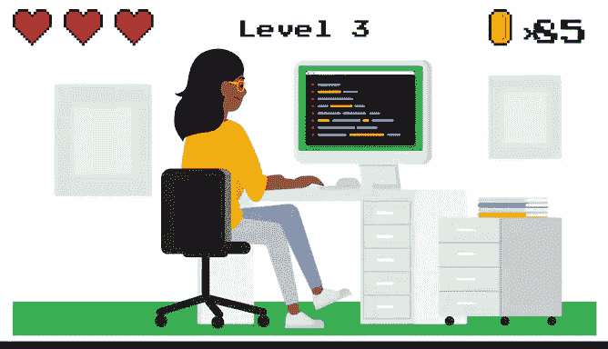

# 004：使用R编程进行数据分析 📊

## 第4课：编程语言概述

在本节课中，我们将学习编程语言的基础知识，以及它们如何帮助你处理数据。

编程语言是我们用来编写指令供计算机遵循的词语和符号。你可以将编程语言视为连接人类与计算机并允许它们沟通的桥梁。编程语言对于如何使用这些词语和符号有一套自己的规则，称为**语法**。语法向你展示了如何排列你输入的词语和符号，以便计算机能够理解。编码就是使用特定编程语言的语法向计算机编写指令。

就像世界上有多种人类语言一样，也有许多不同的编程语言可用于与计算机通信。从设计网站到开发电子游戏，再到处理数据，几乎任何你想做的事情都有对应的语言。例如，Python是一种通用语言，可用于从人工智能到创建虚拟现实体验等各种事情。JavaScript 则非常适合开发在线应用程序，并且是网络浏览器的重要组成部分。其他一些用于数据分析的流行编程语言包括 SAS、Scala 和 Julia。就我个人而言，R 是我最喜欢的数据分析语言。但你可能也想探索其他语言。

虽然编程语言在表面上看起来可能不同，但它们都共享相似的结构和编码概念。一旦你学会了第一门语言，你会发现学习其他语言会更容易。接下来，我们将更详细地探讨 R 的诸多功能。在此之前，让我们先谈谈使用任何编程语言处理数据的一些好处。

我将重点介绍三点：编程帮助你理清分析步骤、节省时间，并让你能够轻松地复现和分享你的工作。

让我们从清晰性开始。编程语言有向计算机发出指令的特定规则和指南。当你告诉计算机要做什么时，你的指令必须非常清晰。你编写代码的方式不能有任何不一致之处。如果有，代码将无法工作。

将你的想法转化为代码，迫使你确切地弄清楚如何编写分析的每一步，以及所有步骤如何组合在一起。这为你的分析提供了一种精确度，使其真正强大。

使用编程语言进行数据分析还能为你节省大量时间。例如，以清理和转换数据的过程为例。只需一行代码，你就可以创建一个没有任何缺失值的独立数据集。再用另一行代码，你就可以对数据应用多个过滤器。这让你可以花更少的时间准备数据，而将更多时间用于分析本身。

最后，编程语言使复现你的分析变得容易。当你能够复现你的工作并与他人分享时，数据分析才最有用。他们可以仔细检查并帮助你解决问题。代码会自动存储你分析的所有步骤，因此你可以在未来的任何时间（几周、几个月甚至几年后）复现和分享你的工作。

这里有一个例子。假设你正在做一个项目。你已经收集并清理了数据，并开始了分析，但结果对不上。你怀疑过程中出现了错误。你想与队友讨论这个问题并获得他们的反馈。如果你使用了电子表格，你们俩可能都必须重做整个分析才能发现错误。在电子表格中没有简单的方法来记录和复现你的步骤。但如果你使用编程语言，你所有的工作都可以在瞬间被复现和分享，从加载数据到创建可视化再到报告结果。此外，你只需更改代码就可以轻松更新分析和修复任何错误。

希望这能让你更好地理解编程语言是什么。接下来，我们将更详细地了解 R。