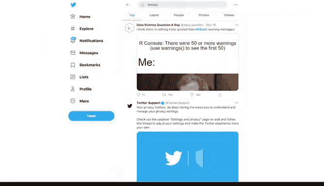

# 005：R语言简介 🚀

在本节课中，我们将要学习R语言的基础知识。R是一种常用于统计分析、数据可视化和数据处理的编程语言。我们将探讨R的主要特性、功能及其在数据分析中的优势。

上一节我们介绍了编程语言的通用概念，本节中我们来看看R语言本身。

## R是什么？ 📊

R是一种常用于统计分析、可视化和其他数据操作的编程语言。后续课程中，你将了解R Studio，这是一个流行的R语言软件环境。本视频将讨论R的主要特性、功能及其在数据分析中的优势。

## R的历史与起源 📜

R基于另一种名为S的编程语言。在20世纪70年代，约翰·钱伯斯在著名的科研机构贝尔实验室内部创建了S语言。到了20世纪90年代，罗斯·伊哈卡和罗伯特·绅士在新西兰奥克兰大学开发了R。名称“R”来源于其两位作者的名字首字母，同时也呼应了其前身S的单字母命名。自此，R成为全球科学家、统计学家和数据分析师首选的编程语言。

## 为什么数据工作者喜爱R？ ❤️

以下是人们喜爱使用R处理数据的四个主要原因：R易于入门、以数据为中心、开源且拥有活跃的用户社区。

**R易于初学者入门**。许多没有传统编程背景的人都在学习R。R特别吸引那些希望解决涉及数据问题的人。

**R是一种以数据为中心的编程语言**。它专门设计用于使数据分析更简单、更高效、更强大。

**R是开源的**。开源意味着代码可以自由获取，并且可以被使用者修改和共享。这带来了两个显著优势：首先，任何人都可以免费使用R；其次，任何人都可以修改代码、修复错误并改进它。事实上，多年来，许多优秀的程序员已经对R代码进行了改进和修复。例如，任何懂R语言的人都可以创建所谓的“附加包”。我们稍后会详细讨论R包。目前只需知道，存在成千上万个R包，它们都是由希望解决特定问题的人构建的，其中许多包对数据分析师非常有用。作为R用户，你现在可以享受这些共享知识带来的好处。

**R拥有最好的社区**。这个充满活力、多样且易于访问的社区对新学习者非常支持。你可以随时上网找到所有R问题的答案。可以查看如“R for Data Science”在线学习社区和R Studio社区等网站。此外，R用户遍布Twitter和其他社交媒体平台。你会发现大量用于专业社交、指导和学习的资源。

## R在数据分析中的具体应用场景 🛠️

现在我们对R的普遍优势有了更多了解，接下来讨论一些在数据分析中可能使用R的具体情况。

以下是三个典型场景：重现你的分析、处理大量数据以及创建数据可视化。

**R可以保存并重现你分析的每一步**。我们之前讨论过，当你能够轻松重现工作并与他人分享时，数据分析才最有用。在R中，重现你的分析就像按一下键盘上的按钮一样简单。你的代码会永久存储它，并且你可以随时与任何人分享。

**R非常擅长处理大量数据**，就像SQL一样。正如你之前所学，电子表格将项目组织在工作表或标签页中。如果你曾经处理过拥有大量工作表或每个工作表包含大量数据的电子表格文件，你就会知道事情会开始变得非常缓慢。在电子表格中处理过多数据甚至可能导致崩溃。R可以更快、更高效地处理大量数据。

**R可以创建强大的可视化效果并拥有先进的图形功能**。正如你在这个课程中所见，像电子表格和Tableau这样的工具为数据可视化提供了许多选项。R则处于另一个层次，只需少量代码，你就可以创建直方图、散点图、线图等等。而这仅仅是个开始。如果你使用更高级的包，你可以制作一些非常令人印象深刻的数据可视化作品。

## 学习R的好处 🎯

学习R对任何有兴趣成为数据分析师的人来说都是一个巨大的好处。正如前面提到的，掌握R知识将帮助你在求职者中脱颖而出。随着你不断进步，R将帮助你找到解决更复杂数据问题的方法。你可以在整个数据分析师职业生涯中持续学习R。在提升数据分析技能方面，潜力是无限的。

本节课中我们一起学习了R语言的历史、核心优势、主要应用场景以及对数据分析师职业发展的价值。接下来，我们将一起探索R Studio环境。在使用R Studio之前，你需要下载并安装基础的R界面。你将在后续的阅读材料中学习如何操作。大多数使用R语言的分析师都使用R Studio环境与R交互，而不是基础界面。这就是为什么本课程重点介绍R Studio。在本视频之后，如果你有兴趣了解更多，可以找到下载R和R Studio的资源。