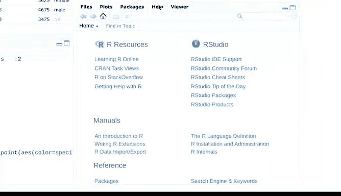

# 006：使用R编程进行数据分析 🐧📊


## 第六课：RStudio入门指南 🚀

在本节课中，我们将要学习RStudio集成开发环境的基础知识。RStudio是数据分析师使用R语言进行工作的核心工具，它能将代码编写、数据管理、结果可视化和帮助文档等功能集成在一个界面中，极大地提升工作效率。

上一节我们介绍了R语言的基础，本节中我们来看看如何利用RStudio这个强大的工具来驾驭R。

### R与RStudio的关系 🚗

数据分析可以类比为驾驶汽车。在这个比喻中：
*   **R** 就像是汽车的**引擎**，它提供了核心的计算和数据处理能力。
*   **RStudio** 则像是**油门、方向盘和仪表盘**的组合体。它让你能够指挥引擎（R）工作，并帮助你轻松抵达目的地（完成数据分析任务）。

正如速度表和导航系统让驾驶更轻松一样，RStudio的环境也让使用R变得更加简单高效。

### RStudio界面概览 🖥️

RStudio的界面主要由四个称为“窗格”的主要窗口构成。首次打开RStudio时，你会看到三个窗格。第四个窗格默认隐藏，但可以轻松打开：点击菜单栏的 **File**，然后选择 **New File** 和 **R Script**。

你可以通过点击每个窗格右上角的最小化或最大化按钮来调整窗格大小，也可以通过点击并拖动窗格的边框来手动调整。

以下是每个窗格的功能介绍，我们将从左下角开始，按顺时针方向依次探索。

#### 1. 控制台窗格 (Console)

控制台是你向R发出命令的地方。例如，我们可以让R显示之前视频中用于创建可视化的企鹅数据集的摘要。

```r
summary(penguins)
```

> **注意**：你需要先安装并加载`palmerpenguins`数据集（如果尚未完成）。

#### 2. 源代码编辑器窗格 (Source Editor)

源代码编辑器位于左上角，用于编写和编辑R脚本。在RStudio中编写代码主要有两种方式：使用控制台或使用源代码编辑器。

虽然可以直接在控制台中输入命令，但这些命令在当前会话关闭后会被遗忘。正如我们之前讨论的，能够复现和分享分析的所有步骤至关重要。如果将脚本保存在编辑器中，你就可以随时重新访问你的工作，并向他人展示你的分析过程。

在RStudio中，源代码编辑器和控制台协同工作。当你在编辑器中执行代码时，代码会自动出现在控制台中。这对于运行冗长的分析非常方便，你可以一次性执行整个代码，也可以逐步运行特定的代码段。

让我们在编辑器中运行一些代码来体验一下。

```r
View(penguins)
```

> **专业提示**：请始终记住，R语言是**区分大小写**的。这里我们使用了大写字母`V`来调用`View`函数。

#### 3. 环境/历史窗格 (Environment/History)

右上角的窗格包含“环境”和“历史”两个标签页。

*   **环境 (Environment)**：这里会显示你当前已加载的所有数据对象，方便你进行组织和管理。例如，如果你从电子表格导入了数据，它将在此处可见。你可以通过点击对象来查看其内容，并可以在列表视图和网格视图之间切换。
*   **历史 (History)**：你之前执行过的所有命令都会保存在这里，便于搜索和重新执行。列表底部是最新的一行代码。双击任何一行代码，可以将其复制到命令控制台中。

#### 4. 文件/绘图/包/帮助窗格 (Files/Plots/Packages/Help)

右下角的窗格包含多个标签页：

*   **文件 (Files)**：提供对文件目录的访问，显示当前工作文件夹的内容。你可以轻松查找和管理所有文件，并创建新的项目文件夹。
*   **绘图 (Plots)**：如果创建了图形，结果将显示在这里。例如，我们可以用之前用过的企鹅数据集创建一个散点图。

    ```r
    plot(penguins$flipper_length_mm, penguins$body_mass_g)
    ```

    后续课程中你将学习更多在RStudio中创建绘图的知识。
*   **包 (Packages)**：R包是R用户开发的、用于解决特定数据问题的自定义工具集。RStudio让你能够访问一个名为**tidyverse**的R包库。你可以在此窗格中升级、安装和管理你的包库。当前会话中已加载的包会带有勾选标记。我们将在后续课程中更详细地探索tidyverse。
*   **帮助 (Help)**：在这里可以找到关于R和RStudio的有用资源。有海量资源可以帮助你解答所有疑问，请务必善加利用。



### 总结与展望 🎯

本节课中我们一起学习了RStudio集成开发环境的基本布局和核心功能。我们只是初步了解了RStudio能做什么，后续你将有机会更详细地探索它。

作为一名数据专业人士，我非常喜欢在RStudio中工作，它让我的工作变得更轻松、更快速、更出色。


恭喜你完成了数据分析师学习之旅的又一步！接下来，我们将学习一些基本的编程概念，然后正式开始使用R进行编程。对于那些编程新手来说，你们即将编写自己的第一行代码。我们下节课见！