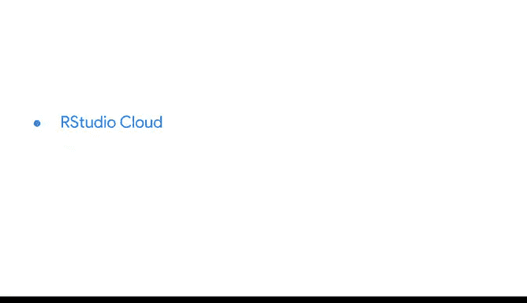

# 007：使用R编程进行数据分析 🚀


## 概述

在本节课中，我们将学习如何在RStudio中进行编程。我们将从R编程的基础知识开始，逐步介绍语法、编码规范、管道操作以及R包的使用，特别是名为`tidyverse`的包集合。这些知识将帮助你更高效地进行数据分析。

---

## R编程基础 🧠

上一节我们介绍了R和RStudio的基本概念。本节中，我们来看看R编程的核心基础。R可以被视为汽车的引擎，而RStudio则是集加速器、方向盘和仪表盘于一体的驾驶界面。掌握这些基础能帮助你更顺畅地使用R。

这些基础与你已熟悉的电子表格和SQL等分析平台既有相似之处，也有不同之处。

---

## 在RStudio中编码 💻

现在，我们将进入在RStudio中实际编码的部分。我们将讨论执行计算的语法，以及所有代码应遵循的标准和命名约定。

以下是编码时需注意的几个关键点：

*   **语法**：R语言有特定的语法规则，例如使用 `<-` 进行赋值。
*   **命名约定**：变量和函数名应清晰、具有描述性，通常使用小写字母和下划线。
*   **注释**：使用 `#` 符号添加注释，解释代码的目的。

我们还将探索R中的一个重要工具：**管道（pipe）**。管道操作符 `%>%`（在`tidyverse`中常用 `|>`）用于将一系列代码连接起来，使代码更易于编写和阅读。

例如，以下代码展示了管道的使用：
```r
# 不使用管道
result <- filter(data, column > 10)
result <- summarize(result, mean_value = mean(another_column))

# 使用管道
result <- data %>%
  filter(column > 10) %>%
  summarize(mean_value = mean(another_column))
```

---

## R包与Tidyverse 📦

接下来，我们将了解R包。这些包并非实物包裹，而是由R社区创建和分享的代码集合。它们包含可重复使用的函数、数据集等，通常由用户为像你一样的其他用户构建。

我们将重点认识一个名为 **`tidyverse`** 的包集合。`tidyverse` 是一套专门为数据科学设计的、协同工作的R包。

以下是安装和使用`tidyverse`的步骤：

1.  在RStudio控制台中，使用命令 `install.packages("tidyverse")` 进行安装。
2.  使用 `library(tidyverse)` 加载包到当前会话中。

我们还将使用一些流行的`tidyverse`包，例如用于数据可视化的 **`ggplot2`**。

---

## 环境与后续步骤 🌐

在本课程中，我们将使用浏览器版的RStudio（RStudio Cloud）。请注意，RStudio也提供可下载的桌面版本供本地使用。

你在RStudio中学到的技能将直接应用于本课程的后续部分，即开始实际处理数据的阶段。

---



## 总结

本节课中，我们一起学习了R编程的基础知识、在RStudio中的编码规范、管道操作符的便利性，以及如何利用`tidyverse`等R包来扩展R的功能。掌握这些核心技能是成为一名高效数据分析师的重要一步。现在，你已经准备好更深入地探索数据世界了。