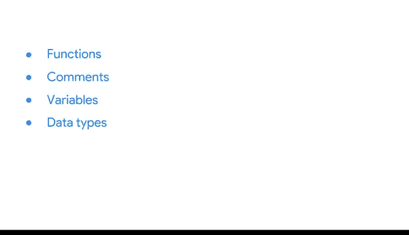

# 008：编程基础概念 🧱


在本节课中，我们将要学习R编程语言的基础概念。这些概念是构建数据分析技能的基石，包括函数、注释、变量、数据类型、向量和管道。掌握这些基础知识，将帮助你更高效地使用R进行数据处理和分析。

---

## 函数

上一节我们介绍了课程概述，本节中我们来看看第一个核心概念：函数。函数是R中用于执行特定任务的可重用代码块。在电子表格和SQL中，我们也曾遇到过函数。在R中，函数以函数名开头，通常后跟括号内的一个或多个参数。参数是函数运行所需的信息。

以下是一个简单的函数示例：

```r
print("coding in R")
```

此代码将返回文本“coding in R”。如果你想了解更多关于`print`函数或任何函数的信息，只需键入问号、函数名和一组括号即可。

```r
?print()
```

这将返回帮助窗口中的一个页面，帮助你了解更多关于正在使用的函数的信息。请注意，函数名是区分大小写的。

---

## 变量

函数很有用，但输入大量值可能非常耗时。为了节省时间，我们可以使用变量来代表这些值。这让我们在需要时只需使用变量名即可调用这些值。在SQL中，我们也学习过变量。在R中，变量是值的表示，可以在编程过程中存储以供后续使用。变量也可以被称为对象。

作为数据分析师，你会发现变量在编程中非常有用。例如，如果你想过滤一个数据集，只需将一个变量分配给你用于过滤数据的函数。这样，以后你只需使用该变量即可过滤数据。

在R中命名变量时，可以使用一个简短的短语。变量名应以字母开头，并且可以包含数字和下划线。例如，变量名`5_penguin`无效，因为它以数字开头。与函数一样，变量名也区分大小写。尽可能使用全小写字母是一个好习惯。

---

## 注释

在编写变量代码之前，我们先添加注释。当你想要描述或解释代码中正在发生的事情时，注释非常有用。尽可能多地使用注释，以便你和其他人都能理解其背后的逻辑。

注释应用于使R脚本更易读。注释不应被视为代码，因此我们会在其前面加上井号`#`。

以下是注释和变量的一个示例：

```r
# 这是一个变量示例
first_variable <- "This is my variable"
```

---

## 数据类型

现在，让我们将一个变量分配给不同的数据类型：数值型。

我们将命名第二个变量并键入赋值运算符。我们将赋予它数值12.5。

```r
second_variable <- 12.5
```

工作区右上角的环境窗格现在显示我们的两个变量及其值。R中还有其他数据类型，如逻辑型、日期型和日期时间型。R提供了几种处理这些数据类型的选项，我们将在后面探讨。

---

## 向量

有了函数、注释、变量和数据类型，你已经为使用R打下了良好的基础。我们将在本课程中重新讨论这些内容，并向你展示它们在分析过程中如何以不同方式使用。现在，让我们完成最后两个基本概念：向量和管道。

简单来说，向量是R中按顺序存储的同一类型的一组数据元素。你可以使用组合函数`c()`创建向量。

让我们创建一个向量。假设这个向量用于我们需要分析的测量数据。

```r
vec_1 <- c(1, 3, 5, 7, 9)
```

当我们键入变量名并按回车键时，它会返回我们的向量。我们可以在分析中的任何地方使用这个向量，只需使用其变量名`vec_1`。向量中的值将自动应用于我们的分析。

---

## 管道

最后一个基础概念是管道。管道是R中用于表达多个操作序列的工具。管道由百分号`%`、大于号`>`和另一个百分号`%`表示，写作`%>%`。它用于将一个函数的输出应用到另一个函数。

管道可以使你的代码更易于阅读和理解。例如，以下管道用于过滤和排序数据：

```r
data %>% filter(condition) %>% arrange(column)
```

稍后，我们将学习管道每个部分的工作原理。

---



## 总结


本节课中我们一起学习了R编程的六大基础概念：函数、注释、变量、数据类型、向量和管道。它们共同构成了使用R的基础。这些内容可能很多，如果需要复习，可以随时回看视频。当你准备好后，关于R和R Studio还有更多知识等待探索。让我们继续前进。