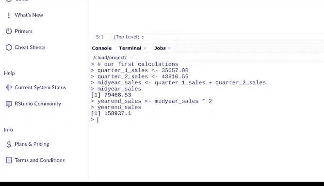

# 009：运算符与计算 🧮


在本节课中，我们将学习如何在R语言中使用运算符进行各种任务，特别是计算。运算符是构成计算的关键组成部分之一。

## 概述

上一节我们介绍了R语言的基本环境。本节中，我们来看看R中的运算符，并学习如何利用它们对数据进行分析和计算。

## 运算符简介

当我们最初讨论运算符时，我们将其定义为一种符号，用于命名公式中要执行的操作或计算类型。在代码中使用运算符时，这一点同样适用。

以下是R中一些常见的运算符类别。

### 赋值运算符

赋值运算符用于为变量和向量赋值。

想象我们获得了一些需要分析的电子商务销售数据。我们将使用变量来存储这些数据，以便在需要时随时引用。我们将使用之前接触过的赋值运算符来完成这个任务。

例如，如果我们有一组想要包含在向量中的销售数据，我们可以使用赋值运算符将它们分配给一个变量。

```r
sales_q1 <- c(15000, 18000, 22000)
sales_q2 <- c(19000, 21000, 23000)
```

现在，每当我们想使用这些销售数据时，只需输入我们分配的变量名即可。

### 算术运算符

接下来，让我们看看算术运算符。这些运算符用于完成数学计算，它们可能看起来很熟悉。

以下是基本的算术运算符：
*   **加号 (+)**：对变量执行加法。
*   **减号 (-)**：执行减法。
*   **星号 (*)**：执行乘法。
*   **斜杠 (/)**：执行除法。

还有其他算术运算符，但这些足以让你入门。

## 实践：在RStudio中进行销售数据计算

让我们为销售数据尝试一个计算。在我们逐步讲解这些步骤时，欢迎你跟随操作。

我们将在脚本中完成工作，以确保我们的计算被保存。作为在R中开发代码的分析师，你将大部分时间在脚本中工作。保存脚本后，你将拥有完整的工作记录。控制台主要用于显示编程结果。

首先，让我们添加一个注释。

```r
# 计算上半年销售总额
```

在井号后，我们将输入我们的第一个计算。我们首先将今年前两个季度的销售数据分配给变量。

```r
q1_sales <- 50000
q2_sales <- 75000
```

在进行第一个计算之前，我们将其分配给一个新变量 `midyear_sales`。然后，我们将使用加号作为加法运算符来汇总季度数据。

```r
midyear_sales <- q1_sales + q2_sales
```

让我们运行它并获取销售数据的总和。在脚本中运行代码时，结果会显示在控制台中。现在，这个总和已分配给 `midyear_sales` 变量。

我们可以通过在控制台中输入 `midyear_sales` 并按回车键来检查这一点。

你可能会注意到，R中的计算方式与电子表格和SQL中的计算方式相似。在你使用的工具之间建立联系是很有帮助的。

让我们使用前两个季度的销售总额（由 `midyear_sales` 表示）再做一次计算。我们将其乘以二，以大致了解全年的总销售额。我们将使用星号作为算术运算符。

```r
estimated_annual_sales <- midyear_sales * 2
```



你会发现还有其他方法可以执行这类计算，但这些是说明运算符如何用于计算和其他操作的绝佳示例。

现在，让我们保存脚本，以便如果需要对销售数据进行更多工作，可以再次使用这些相同的变量。就像在其他格式中一样，我们只需点击“另存为”，然后输入文件名。文件扩展名会自动添加到我们的文件名中。

```r
# 保存脚本为：sales_analysis.R
```

完成后，我们可以关闭脚本。当我们准备好进行更多销售数据分析时，可以使用文件菜单再次打开它。

## 总结

本节课中，我们一起学习了R语言中的运算符。我们介绍了赋值运算符如何为变量赋值，以及算术运算符如何执行基本的数学计算。通过一个销售数据分析的简单示例，我们实践了在RStudio脚本中编写、运行和保存代码的完整流程。

还有其他类别的运算符你将在以后学到，但了解赋值和算术运算符如何帮助你编程进行计算是一个很好的起点。我们在R和RStudio的学习道路上又前进了一步。让我们继续学习更多关于管道（另一个R中的强大工具）的知识。