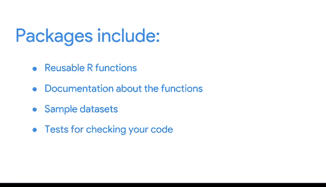
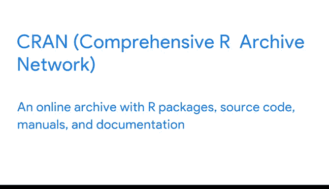

# 010：使用R编程进行数据分析 📊


## 第十课：持续赋能的数据工具 📦

在本节课中，我们将要学习R语言中一个核心概念——**包**。包是包含可重用R函数、文档和数据的单元，它们极大地扩展了R的功能，并帮助数据分析师更高效地组织和复用代码。

---

### 什么是R包？

R包类似于生活中收到的包裹，里面包含了有用的物品。在R中，包是由R社区成员创建的、包含可复用R代码的单元。它们使得跟踪和管理代码变得更加容易。

R包通常包含以下内容：
*   可重用的R函数
*   关于这些函数的文档和使用说明
*   用于测试的示例数据集
*   用于检查代码正确性的测试

---

### 基础包与推荐包

上一节我们介绍了R包的基本概念，本节中我们来看看R环境中默认包含的包。



默认情况下，R包含一组称为**基础R**的包。当你启动第一个R编程会话时，这些包在RStudio中即可使用。

此外，还有**推荐包**。这些包已经安装，但并未加载。在使用这些包中的函数之前，你需要使用`library()`命令来加载它们。

例如，加载名为“boot”的包：
```r
library(boot)
```

---

### 查看已安装的包


为了了解我们的RStudio中已经有哪些包，我们可以在控制台中运行命令。以下是如何操作：

在R控制台中，运行以下命令来查看所有已安装的包：
```r
installed.packages()
```

运行后，你会看到一个列表。请重点关注“Package”和“Priority”这两列：
*   **Package列**：显示包的名称，例如 `cluster` 或 `graphics`。
*   **Priority列**：告知使用该包中的函数需要什么条件。

以下是“Priority”列中可能出现的值及其含义：
*   **`base`**：表示该包已安装并已加载。你可以在打开RStudio后立即使用该包的所有函数。
*   **`recommended`**：表示该包已安装，但未加载。你需要使用`library()`函数手动加载。

在你的RStudio工作区的右下角面板，你也会看到一个包列表。这个列表包含了每个包的简要描述。

---

### 加载与使用包

要加载一个已安装但未加载的包（例如“class”包），你需要使用`library()`函数，后跟包的名称。

操作如下：
```r
library(class)
```

成功加载后，“class”包旁边会出现一个勾选标记。现在你就可以使用这个包里的函数了。

如果你想了解更多关于已加载包的信息，可以点击“Packages”选项卡中的包名称。这将打开“Help”选项卡，并显示与你所选包相关的主题。

你也可以在编程中使用`help()`函数来调用帮助选项卡。例如：
```r
help(package = “class”)
```

---

### 探索更多R包

虽然预安装的包为你提供了大量有用的函数，但还有更多的包可以进一步扩展你的编程能力。

你可以在网上搜索找到成千上万的R包。最常用的R包来源之一是**CRAN**。



**CRAN**代表**综合R档案网络**。它是一个在线的R包、源代码、手册和文档的存档库。

当你开始使用R时，你将能够在CRAN或其他地方搜索找到所需的包。不过，使用你常用的搜索引擎进行搜索几乎总是更简单的方法。

---

### 总结

本节课中我们一起学习了R语言中**包**的核心概念。我们了解到：
1.  R包是包含可复用代码、数据和文档的单元。
2.  R环境默认包含**基础包**和**推荐包**。
3.  可以使用`installed.packages()`查看已安装的包，使用`library()`加载包。
4.  可以通过**CRAN**等在线资源探索和安装成千上万的社区贡献包。


包是使用R进行数据分析的重要组成部分，它们为你提供了完成整个分析过程所需的大部分工具。未来，你甚至可能将自己的代码打包，供他人使用。