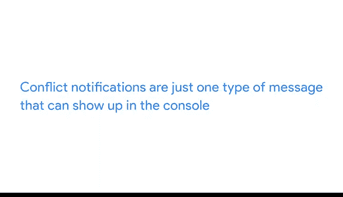

# 011：Tidyverse生态介绍

在本节课中，我们将要学习R语言中一个极其重要的工具集——Tidyverse。我们将了解它是什么、为什么它对数据分析师至关重要，以及如何安装和加载它。通过本课，你将掌握使用Tidyverse进行高效数据分析的起点。

## 概述

正如我们之前讨论的，扩展包是R语言如此强大的重要组成部分。😊

扩展包提供了代码、可复用的R函数、描述性文档、用于检查操作性的测试以及样本数据集的组合。对于许多数据分析师而言，在最有用的扩展包列表中，Tidyverse名列前茅。

Tidyverse实际上是R中一系列扩展包的集合，它们拥有共同的设计理念，用于数据操作、探索和可视化。使用Tidyverse可以帮助你完成几乎整个数据分析过程，因为其中的扩展包能够自然地协同工作。

## Tidyverse的核心价值

上一节我们介绍了扩展包的重要性，本节中我们来看看Tidyverse的具体价值。

当我开始在一个调查项目中学习Tidyverse时，感觉像是步入了R的一个更高级的领域。我理解了基础知识，但那时我才发现Tidyverse是如何在这些基础上进行改进的。这让我对使用R工作感到更加兴奋。😊

我意识到，投入越多精力学习Tidyverse，收获就越大。此外，Tidyverse的社区支持也非常强大。这也是为什么Tidyverse被认为是大多数R用户编程的关键部分的原因之一。与Tidyverse相关的原则，无论是在这里还是在你的工作中学习到的，都已被R社区广泛采纳。你可以在网上找到大量与Tidyverse相关的教程和示例，它们展示了这些原则以及如何将其应用于数据分析。

## 安装Tidyverse

了解了Tidyverse的价值后，接下来我们学习如何安装它。你可以使用自己的RStudio Cloud账户跟随操作。更多细节请查阅阅读材料。

之前，你学习了如何使用 `installed.packages()` 函数查找基础R包。要安装像Tidyverse这样不在基础R中的扩展包，我们将使用 `install.packages()` 函数。

正如我们之前讨论的，这个函数从CRAN调用Tidyverse和其他扩展包。我们来谈谈为什么创建了CRAN。由于不在基础R中的扩展包大多由R用户制作，人们需要一种可靠的方式来检查和验证提交的代码。CRAN确保任何向公众开放的R内容都符合要求的质量标准。因此，如果它是通过CRAN获取的，你可以放心该扩展包是真实有效的。另一个主要的扩展包和其他R内容来源是GitHub。

现在，我们回到安装Tidyverse。我们首先输入 `install.packages()`，然后在括号内输入带引号的“tidyverse”。引号并非总是必需，但最佳实践是使用引号以确保准确性。我们按回车键，等待RStudio安装Tidyverse。

## 加载Tidyverse

安装完成后，我们需要加载它才能使用。当我们点击“Packages”选项卡时，会在列表中看到很多新扩展包。那就是Tidyverse。你可能注意到没有一个扩展包被勾选。我们需要先加载它们才能使用。但这是一个相当长的列表。

所以，我们现在先使用 `library()` 函数加载名为“tidyverse”的扩展包。返回信息显示，不仅Tidyverse被加载了，还有其他八个扩展包也被加载了。它还显示了一个冲突列表。当扩展包中的函数与其他函数同名时，就会发生冲突。基本上，最后加载的扩展包中的函数将被使用。所以我们将坚持使用Tidyverse的函数，但需要注意的是，这些消息只出现一次。因此，随着你对R越来越熟悉，你将能够判断是否要优先使用某些函数。

以下是加载的核心扩展包列表：
*   **ggplot2**: 用于数据可视化。
*   **tibble**: 提供一种更现代的、增强型的数据框。
*   **tidyr**: 用于整理数据，使其变得“整洁”。
*   **readr**: 提供快速、友好的方式读取矩形数据（如CSV、TSV）。
*   **dplyr**: 提供一套用于数据操作的动词（如筛选、排序、汇总）。
*   **stringr**: 提供一套一致的工具来处理字符串。
*   **forcats**: 用于处理因子变量（分类数据）。

这些扩展包是Tidyverse的核心，因为你几乎在每次分析中都会用到它们。它们共同协作，使你的数据分析过程流畅高效。有了这些扩展包，Tidyverse可以帮助你完成从导入、转换数据到探索和可视化数据的全部工作。

## 维护与更新

我们将很快查看这些核心扩展包，并且随着我们在RStudio中继续工作，会更频繁地使用它们。如果你自己在R中工作，也可以查看其他一些扩展包。

Tidyverse中可用的扩展包变化很大，但你始终可以通过在控制台中运行 `tidyverse_update()` 来检查更新。然后，你可以通过几种方式更新扩展包。如果你使用 `update.packages()` 函数，它将更新你所有的扩展包。这可能需要一段时间。所以，如果你只想更新一个扩展包，可以再次使用 `install.packages()` 函数，并将扩展包名称作为括号内的参数。你应该定期更新扩展包，以确保你的代码中使用的是最新版本。

## 处理控制台消息

冲突通知只是控制台中可能出现的一种消息类型。你可能还会发现警告和错误信息。使用“Help”选项卡进行快速搜索通常可以告诉你该消息的含义，以及如果需要的话，你需要做什么来解决它。

## 总结

在本节课中，我们一起学习了R语言中强大的Tidyverse生态系统。我们了解了Tidyverse作为一系列协同工作的扩展包集合，如何为数据操作、探索和可视化提供统一的设计哲学。我们学习了如何通过 `install.packages(“tidyverse”)` 安装它，以及如何使用 `library(tidyverse)` 加载其核心扩展包，如dplyr、ggplot2等。我们还讨论了维护更新包的重要性以及如何解读控制台消息。接下来，我们将继续深入Tidyverse，你会发现更多关于它为何是R不可或缺部分的原因。再见。😊