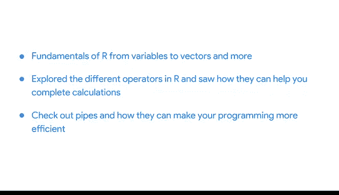

# 012：Tidyverse进阶应用 🧰

在本节课中，我们将深入探索Tidyverse的核心功能。Tidyverse是一系列专为数据科学设计的R包集合，能帮助数据分析师更高效地进行数据处理、可视化和分析。我们将重点介绍其核心包及其在数据分析工作流中的作用。

## Tidyverse核心包概览

上一节我们介绍了R编程的基础知识，本节中我们来看看Tidyverse的核心包。这些包是数据分析师日常工作中最常用的工具。

以下是Tidyverse中四个最核心的包，它们构成了数据分析的基本工作流：

*   **ggplot2**：用于数据可视化，特别是绘制各种图表。通过为数据变量应用不同的视觉属性，可以创建多样化的数据可视化图形。示例代码：`ggplot(data, aes(x=variable1, y=variable2)) + geom_point()`
*   **tidyr**：用于数据清洗，将数据整理为“整洁数据”（tidy data）。整洁数据是指数据表中的每个部分都具有正确的类型并处于正确的位置。tidyr能有效处理宽数据（wide data）和长数据（long data）的转换。
*   **readr**：用于导入数据。其最常用的函数是`read_csv()`，可以将CSV格式的文件导入R。为了准确读取数据集，通常会将此函数与列规范（column specification）结合使用，以描述每列应如何转换为最合适的数据类型。
*   **dplyr**：提供了一套连贯的函数，用于完成常见的数据操作任务。例如，`select()`函数根据列名选择变量，`filter()`函数筛选出符合特定条件的行。

这四个核心包将使你的R编程更加直接和高效。

## 其他实用包介绍

除了上述四个核心包，Tidyverse还包含其他一些非常有用的包，它们能在特定场景下简化你的工作。

以下是另外四个重要的Tidyverse包：

*   **tibble**：用于处理数据框（data frame），是一种现代、简化的数据框格式。
*   **purrr**：用于处理函数和向量，它能使你的代码更易于编写，表达性更强。
*   **stringr**：包含一系列函数，使字符串处理变得更加容易。
*   **forcats**：提供了解决因子（factor）常见问题的工具。因子用于在R中存储分类数据，其数据值通常是有限的，例如国家或年份。

使用Tidyverse及其系列包将帮助你微调分析过程，提升工作效率。

## 回顾与前瞻

到目前为止，我们已经从变量、向量等基础知识开始，学习了R编程的基础。我们探索了R中的不同运算符及其在计算中的应用，了解了管道（pipe）如何提升编程效率，并认识了包（package）在扩展R功能方面的重要作用。

在短短几个视频中我们涵盖了大量内容，因此现在可能是进行回顾的好时机。你可以重新观看视频或查阅其他资料，以更好地掌握R相关的术语、概念和流程。

展望接下来的学习，你将开始在R中实际操作数据，更深入地探索Tidyverse如何影响你的分析流程。你将看到tibble、readr等Tidyverse包的实际应用，并学习如何在R中清洗和组织数据。

本节课中我们一起学习了Tidyverse的核心包及其在数据分析中的角色，为后续的实际数据操作打下了坚实的基础。