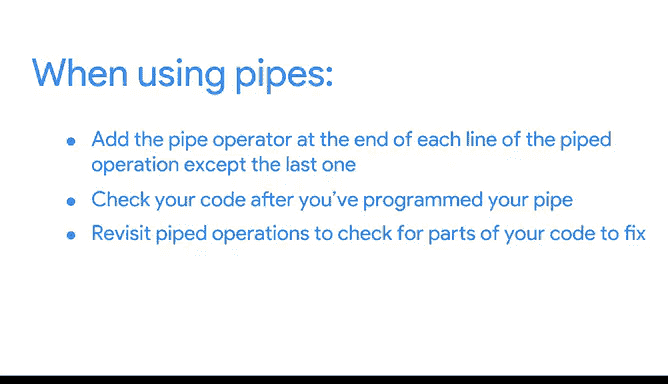

# 013：13_02_02_管道操作实现代码嵌套 🚀


在本节课中，我们将要学习R语言中一个强大的工具——管道操作符。管道可以帮助我们编写更高效、更易读的代码，通过将多个操作步骤串联起来，避免复杂的嵌套函数。我们将通过一个具体的例子，学习如何使用管道来过滤、排序和汇总数据。

## 管道操作简介

上一节我们介绍了R编程的基础知识，本节中我们来看看如何让代码更简洁。管道是R中用于表达多个操作序列的工具。它将一个语句的输出作为下一个语句的输入。

用公式可以表示为：`输出_A %>% 函数_B(输入 = .) -> 输出_B`

换句话说，管道操作符允许你避免编写层层嵌套的函数，而是以从左到右、从上到下的顺序清晰地表达数据处理流程。

## 准备工作和示例数据

为了演示管道操作，我们需要一个数据集。我们将使用R内置的 `ToothGrowth` 数据集，它记录了维生素C对豚鼠牙齿生长的影响。

首先，我们在RStudio中新建一个脚本并保存。然后加载并查看数据。

```r
# 加载内置数据集
data(ToothGrowth)
# 查看数据集
View(ToothGrowth)
```

运行 `View` 函数后，一个新标签页会打开，显示数据集的内容。这个数据集包含牙齿长度（`len`）、补充剂类型（`supp`）和剂量（`dose`）等列。

## 不使用管道的传统方法

假设我们需要筛选出剂量（`dose`）为0.5的数据，并按牙齿长度（`len`）进行升序排序。以下是两种传统方法。

### 方法一：创建中间数据框

这种方法通过创建一系列临时数据框来分步处理数据。

以下是实现步骤：

1.  首先，我们需要安装并加载 `dplyr` 包，它提供了强大的数据操作函数。
2.  使用 `filter` 函数筛选出 `dose == 0.5` 的行，并将结果保存到新变量。
3.  使用 `arrange` 函数对新变量中的数据按 `len` 列进行排序。

```r
# 安装并加载dplyr包（只需安装一次）
# install.packages("dplyr")
library(dplyr)

# 步骤1：筛选数据
filtered_data <- filter(ToothGrowth, dose == 0.5)
# 步骤2：排序数据
sorted_data <- arrange(filtered_data, len)
# 查看结果
sorted_data
```

### 方法二：使用嵌套函数

这种方法将函数调用嵌套在另一个函数内部，代码紧凑但可读性较差。

以下是嵌套函数的写法。我们需要从内向外阅读代码：先执行 `filter`，再执行 `arrange`。

```r
arrange(filter(ToothGrowth, dose == 0.5), len)
```

以上两种方法都能得到相同的结果，但它们要么需要创建中间变量，要么代码结构难以一目了然。

## 使用管道操作

现在，让我们使用管道操作符 `%>%` 来实现同样的功能。管道让代码流程变得清晰直观。

管道操作符的键盘快捷键是：
*   Windows/Chromebook: `Ctrl + Shift + M`
*   Mac: `Command + Shift + M`

以下是使用管道的代码：

```r
# 使用管道进行筛选和排序
result_pipe <- ToothGrowth %>%
  filter(dose == 0.5) %>%
  arrange(len)

# 查看结果
result_pipe
```

让我们解读这段代码：
1.  我们从 `ToothGrowth` 数据集开始。
2.  `%>%` 将 `ToothGrowth` 传递给 `filter(dose == 0.5)` 函数。
3.  筛选后的结果再通过 `%>%` 传递给 `arrange(len)` 函数。
4.  最终结果被赋值给 `result_pipe`。

管道就像在说“先做这个，然后做那个”，逻辑顺序与代码的书写顺序完全一致，大大提升了代码的可读性和可维护性。

## 管道的扩展应用

管道的优势在于易于扩展和修改。基于上面的例子，假设我们还想计算在剂量为0.5时，两种补充剂（OJ和VC）各自的平均牙齿长度。

我们只需在管道链中替换或添加函数即可，无需重写整个逻辑。

以下是修改后的管道代码，我们使用 `group_by` 和 `summarize` 函数进行分组汇总：

```r
# 使用管道进行筛选、分组和汇总
summary_result <- ToothGrowth %>%
  filter(dose == 0.5) %>%
  group_by(supp) %>% # 按补充剂类型分组
  summarise(avg_length = mean(len)) # 计算每组的平均长度

# 查看汇总结果
summary_result
```

这段代码清晰地展示了数据处理的完整流程：先筛选、再分组、最后汇总。如果使用嵌套函数，代码将变得难以理解和调试。

## 使用管道的注意事项

为了确保管道正确运行，请记住以下要点。

以下是几个关键的使用规则：



*   **管道操作符的位置**：在管道操作的每一行末尾（除了最后一行）都需要添加 `%>%`。
*   **利用自动缩进**：RStudio会自动对管道中的代码行进行缩进。如果某行代码没有正确缩进，很可能意味着它没有被包含在管道中，这可能导致错误。
*   **调试便利性**：由于管道代码结构清晰，如果出现错误，定位问题所在要比在复杂的嵌套代码中容易得多。

## 总结

本节课中我们一起学习了R语言中的管道操作。我们了解到，管道操作符 `%>%` 通过将数据从左向右传递，能够将多个数据处理步骤串联成清晰、易读的代码链。与创建中间变量或使用嵌套函数相比，管道大大提高了代码的编写效率和可维护性。

管道及其相关的数据操作函数（如 `filter`, `arrange`, `group_by`, `summarise`）是使用R进行数据分析的核心构建模块。在接下来的课程中，你将学习如何运用这些模块来清洗、转换和分析你的数据。


