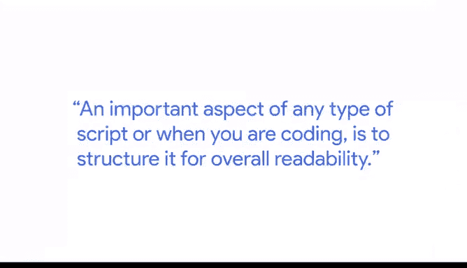
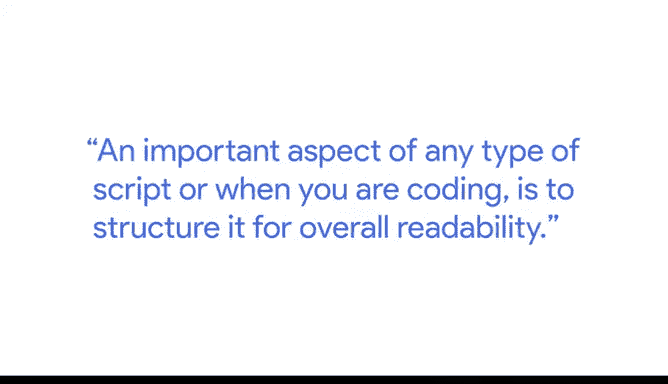
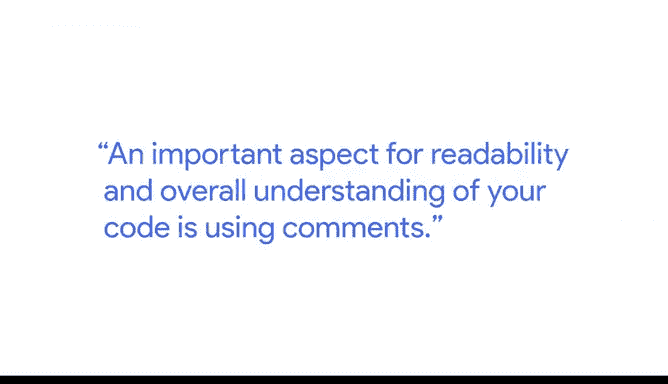
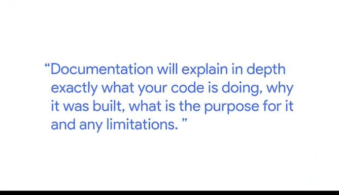
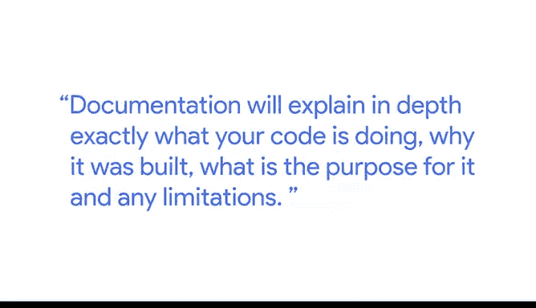
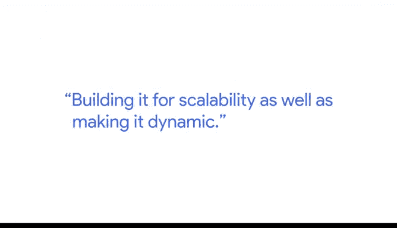

# 014：康纳的编程技巧分享 🧑‍💻

在本节课中，我们将跟随谷歌云的营销分析经理康纳，学习他分享的关于编程的核心技巧与最佳实践。这些经验将帮助你编写更高效、更易读、更专业的代码。

---

## 概述：编程如何改变我的工作

我是康纳，谷歌云的营销分析经理。我最初在工作中遇到了瓶颈，由于技术知识有限，许多分析任务耗时过长，无法完成。因此，我开始自学SQL等工具，以便通过公司数据库获取数据，并对其进行操作以加深理解。

学习编程起初非常令人沮丧，因为需要花费大量时间和精力去完成一些在电子表格中看似简单的事情。然而，这也是我做过最有成就感的事情之一，因为一旦你掌握了它，它将为你打开一个全新的领域。学习编程彻底改变了我的工作方式。

我记得刚开始做分析师时，我使用的所有数据都在电子表格里。我必须运行分析并创建公式来操作、理解和分析数据。随着数据量越来越大，我运行的公式需要数小时才能完成。有一次，我花了几小时创建了一个公式，执行后它运行了超过10个小时。我不得不让电脑整夜运行，醒来时它仍在计算。

一年后，在我学习了SQL和Python之后，我能够在毫秒内运行相同类型的分析。因此，真正理解你的目标至关重要。

**编程能帮助你以前所未有的速度操作和分析数据，这在没有编程知识的情况下是难以实现的。**

---

## 核心技巧一：编写可读性强的代码

任何脚本或代码编写的一个重要方面是**为整体可读性而构建结构**。

在团队中工作时，这一点尤为重要。你编写的脚本不仅要自己能理解其工作原理，还要确保与你合作的同事也能看懂你试图在脚本中实现什么。

代码不仅要有效和高效，而且不能过于冗长或复杂。可读性的一个重要方面是：当你浏览代码时，如果发现多次编写了相同的内容，或者多次使用了相同的逻辑或算法，那么这就是一个可以**整合代码、使其更简洁**的关键时刻。

这极大地有助于提高可读性，也极大地帮助了任何阅读你代码的人——包括两周后的你自己。我可以向你保证，当你开始编程时，你会意识到现在对你来说有意义的东西，三周后可能就不再清晰了。

---

## 核心技巧二：善用注释

提高代码可读性和整体理解的一个重要方面是**使用注释**。

注释是一种用标准化语言（如英语）写出某些内容的方式，以便他人理解，但计算机不会将其视为实际代码。为你编写的每一行代码或整个代码段添加注释，可以让其他人逐步理解你的代码，并准确读出你试图通过所写代码实现的目标。

如果没有注释，你就把理解代码的任务完全留给了读者，这对他们来说可能并不容易，因为他们可能用与你不同的方式编写相同的功能。

---

## 核心技巧三：重视文档记录

**记录你的工作是一个重要方面。**

文档会深入解释你的代码具体在做什么、为什么构建它、它的目的以及任何限制。

---

## 核心技巧四：构建可扩展且动态的代码

最后一个概念在你初次深入学习编程语言时可能较难理解，那就是**为可扩展性构建代码，并使其动态化**。

所谓“为可扩展性构建”，意思是：如果你正在构建一个特定的脚本来解决当前的任务，你需要确定并回答：**这段代码将来是否可能用于其他用途？**

如果是，那么确保你的代码具有可扩展性就很重要。这意味着代码要高效运行，以便当它操作的数据量增加时，不会严重拖慢你的代码，并且它既能处理大数据量也能处理小数据量。

另一个方面是使你的代码**动态化**。这意味着**不要硬编码那些在需要时本应改变的值**。

---

## 总结

本节课中，我们一起学习了康纳分享的四个核心编程技巧：

1.  **编写可读性强的代码**：注重结构，避免重复，保持简洁。
2.  **善用注释**：用自然语言解释代码逻辑，方便他人和自己日后理解。
3.  **重视文档记录**：详细说明代码的功能、目的和限制。
4.  **构建可扩展且动态的代码**：考虑未来复用性，避免硬编码，确保能处理不同规模的数据。

这些只是众多最佳实践中的一部分。随着你在数据分析师道路上的不断前进，你会学到更多。学无止境，但这些技巧将帮助你开启理解编程之路。