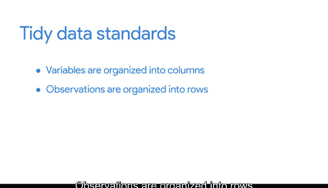

# 016：R数据框详解 📊


在本节课中，我们将要学习R语言中一个核心的数据结构——数据框。我们将了解数据框是什么、它的基本特性，以及它与另一种称为“tibble”的数据结构有何不同。掌握数据框是进行数据清洗、组织和分析的基础。

## 什么是数据框？ 🤔

上一节我们介绍了课程目标，本节中我们来看看数据框的具体定义。

数据框是列的集合。它非常类似于电子表格或SQL表。以下是R中一个数据框的例子：

```r
# 示例：一个关于钻石的数据框
diamonds
```

它类似于我们在这个项目中处理过的其他表格。数据框包含列名、行以及存储数据的单元格。每一列包含一个变量，而每一行则包含与每一列匹配的一组值。

我们使用数据框的原因与使用表格类似。它们有助于汇总数据，并将其转换为易于阅读和使用的格式。

## 数据框的特性 📝

在开始使用数据框之前，有一些重要特性需要了解。我们将在整个项目中深入学习数据框，但这里是一个很好的起点。

以下是数据框的几个关键特性：

*   **列应有名称**：使用空的列名可能会在后续结果中引发问题。回顾我们的例子，每一列都根据其代表的变量命名，例如 `carat`、`cut`、`color`、`clarity`、`depth`。所有这些列都代表了钻石的相关数据。
*   **数据类型多样**：数据框中存储的数据可以是许多不同的类型，例如数值型、因子型或字符型。数据框通常也包含日期、时间戳和逻辑向量。
*   **列长度一致**：每一列应包含相同数量的数据项，即使其中一些数据项是缺失的。

数据框是数据分析的基础。

## Tibble：更简洁的数据框 🆚

了解了标准数据框后，我们来看看在Tidyverse生态中一种更流行的变体——Tibble。

Tibbles是类似精简版的数据框。它们使数据处理更容易，但与标准数据框有一些不同。

以下是Tibble的几个主要特点：

*   **不改变输入数据类型**：Tibbles不会将你的字符串更改为因子或其他类型。你可以对基础数据框做更多更改，但Tibbles更易于使用。这节省了时间，因为你不需要在Tibble中进行那么多的数据清洗或类型转换。
*   **不更改变量名和行名**：Tibbles永远不会更改你的变量名称，也永远不会创建行名。
*   **打印输出更友好**：Tibbles使在R中的打印变得更容易。它们不会意外地使你的控制台过载，因为它们自动设置为只显示前10行和适合屏幕的列数。这在处理大型数据集时非常有用。

## 为什么数据框结构很重要？ 🌟

数据框和Tibbles是R中分析的基石，因此为它们的构建和处理方式设定标准非常重要。

如果我们对数据框是什么有共同的理解，我们就能更有效地沟通。这就像我们都在说同一种语言。这也更加实用。我们需要能够在R中轻松地定义列和审查代码。

这些特性使得共享数据和复现分析变得更加容易。像数据框这样一致的数据结构，使得对整个数据集进行操作变得更加简单。

**整洁数据**指的是使数据结构有意义且易于理解的原则。它是在R中标准化数据组织的一种方式。

这些标准非常直接：
*   变量被组织到列中。
*   观测值被组织到行中。
*   每个值必须拥有自己的单元格。

## 总结与预告 📚



本节课中我们一起学习了R数据框的核心概念。我们了解了数据框是一个类似表格的列集合，是数据分析的基础结构。我们还探讨了Tibble——一种在Tidyverse中更友好、更不易出错的数据框变体。最后，我们明白了为什么一致、整洁的数据结构对于有效沟通和可复现的分析至关重要。

现在你对数据框有了更多了解，让我们开始使用它们。在接下来的内容中，我将教你如何创建数据框、向其中添加数据以及扩展它们。下次见。