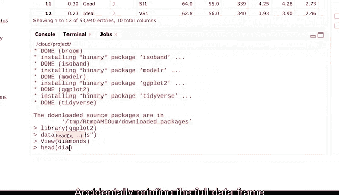

# 017：数据框操作实践 📊

在本节课中，我们将学习如何在R中实际操作数据框。数据框是数据分析的核心结构，掌握其创建和操作方法至关重要。

上一节我们介绍了数据框及其关键特性，本节中我们来看看如何具体使用它们。

## 开始实践

作为数据分析师，你的大部分工作都依赖于数据框。如果不创建数据框，处理数据的能力将受到限制。试想电子表格，其基本的行列结构在R中延续了下来。数据框基本上是数据分析师与数据交互的默认方式。因此，了解如何创建和使用数据框非常重要。

让我们看一个例子。这里我们将使用R内置的数据框。R及其包的一个优点是内置了许多有趣且易于访问的数据集。这些数据集让你可以练习我们一直在学习的工具。

让我们打开RStudio并开始操作。我们将使用一个包含钻石信息的预加载数据集。这个数据集是tidyverse中`ggplot2`包的一部分。因此，请确保首先加载`ggplot2`。

我们稍后也会学习如何加载自己的数据集。但`diamonds`是一个很好的练习数据集。我们现在可以通过使用`data()`函数加载这个数据。你可能会注意到，当我们开始输入`diamonds`时，RStudio会从其下拉菜单中给出选择它的选项。这是因为这个数据集已经存在于我们的库中。

现在，让我们将这个数据框添加到数据查看器中。这个数据框有10列和100行，但我们可能不想看到全部内容。我们可以使用`head`函数来只查看前六行。这是对整个数据集的一个很好的预览。

意外地将整个数据框打印到控制台会很烦人，并且可能需要很长时间来计算。你可以通过使用像`head`这样的函数来获取快速预览，从而避免打印整个数据框。

我们还可以使用像`str`和`colnames`这样的函数来获取数据框的结构。这些只是你可以用来查看数据的两个函数。我们稍后将探索其他函数，例如`glimpse`。

例如，我们可以使用`str`函数来突出显示这个数据框的结构。这为我们提供了一些高级信息，例如列名以及这些列中包含的数据类型。

但如果我们只想知道列名，我们可以改用`colnames`。这里我们有`carat`、`cut`、`color`、`clarity`、`depth`，以及这个数据集中包含的所有列。

我们还可以使用`mutate`函数来更改我们的数据框。`mutate`函数是`dplyr`包的一部分，而`dplyr`包在tidyverse中。因此，在测试`mutate`之前，你需要加载Tidyverse库。

让我们先添加一个新列。我们需要做的就是输入`mutate`，然后告诉R，我们想向`diamonds`数据框添加一个新列。我们首先调用`mutate`，后面跟上我们想要更改的数据框的名称。然后我们将添加一个列，以及我们想要创建的新列的名称。接着我们想要计算这个新列。在本例中，为了使`carat`列更易于阅读，我们将其乘以100以创建一个新列`carat_2`。

当我们运行这个时，瞧，我们的数据框有了一个新列。创建新列时，你不会丢失任何列。数据框的其余部分将保持不变。

数据框通常是R中分析数据的起点。因此，理解数据框的特性以及如何创建它们非常重要。

## 总结

本节课中我们一起学习了R中数据框的基本操作。我们了解了如何加载内置数据集、使用`head`和`str`等函数预览和检查数据结构、使用`colnames`获取列名，以及使用`mutate`函数向数据框添加新列。掌握这些操作是进行有效数据分析的基础。