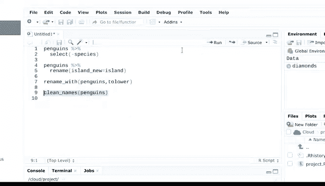

# 018：基础数据清洗方法 🧹


在本节课中，我们将学习如何使用R语言进行基础的数据清洗。数据清洗是数据分析的关键步骤，它涉及清理、标准化、操作和准备数据，以便进行后续的分析和可视化。我们将介绍一些常用的R包和函数，帮助你高效地完成这些任务。

---

## 安装与加载必要的R包

上一节我们介绍了数据框的基本概念，本节中我们来看看如何为数据清洗准备环境。首先，我们需要安装并加载几个非常有用的R包。

以下是完成本教程所需的R包及其简要说明：

*   **`here`**: 此包使文件路径的引用变得更加简单和可靠。
*   **`skimr`**: 此包可以快速生成数据摘要，让你能“浏览”数据概况。
*   **`janitor`**: 此包提供了一系列专门用于数据清洗的函数。

我们将在R控制台中执行安装和加载命令。

首先，安装`here`包：
```r
install.packages("here")
```
安装完成后，使用`library`函数加载它：
```r
library(here)
```

接下来，安装`skimr`和`janitor`包：
```r
install.packages("skimr")
install.packages("janitor")
```
同样，安装后需要加载它们：
```r
library(skimr)
library(janitor)
```

最后，确保`dplyr`包也已加载，因为我们将使用它的一些功能。
```r
library(dplyr)
```

现在，我们已经准备好了所有用于基础数据清洗的R包。

---

## 加载示例数据

了解了所需的工具后，我们需要一些数据来练习。在实际工作中，你可以使用`read_csv()`等函数加载自己的数据文件。`here`包在这里会非常有用。

为了便于练习，我们将使用一个有趣的内置数据集：`palmerpenguins`。这个数据集包含了帕尔默群岛三种企鹅的多种信息，如体型测量值、产卵数量和血液同位素比率。

首先，安装`palmerpenguins`包：
```r
install.packages("palmerpenguins")
```
然后加载它：
```r
library(palmerpenguins)
```
数据加载到环境后，我们就可以开始对数据列尝试各种清洗函数了。

---

## 查看与理解数据结构

在清洗数据之前，我们需要先了解数据的结构。有多个函数可以帮助我们快速获取数据框的摘要信息。

以下是几个常用的数据概览函数：

*   **`skim_without_charts()`**: 提供数据集的全面摘要，包括行列数、列类型和各类数据的统计概要。
*   **`glimpse()`**: 快速浏览数据结构和前几行数据，能立即了解数据框的维度（例如344行，8列）及各列名称。
*   **`head()`**: 预览数据框的前几行及其列名，这有助于后续的列名清理工作。

例如，运行`glimpse(penguins)`会显示数据包含物种、岛屿、喙长、喙深、脚蹼长度、体重、性别和年份等列。

---

## 选择特定的数据列

有时我们只需要处理数据集中的部分列。`select()`函数可以让我们轻松地指定需要或排除的列。

假设我们只想查看`species`列：
```r
penguins %>% select(species)
```

或者，我们想要除`species`列之外的所有列：
```r
penguins %>% select(-species)
```
`select`语句对于从大型数据集中提取特定变量子集非常有用，能让你专注于特定的变量组。后续课程还会介绍更多基于此功能的`select`辅助函数。

---

## 重命名数据列

了解了列名之后，我们可能需要对某些列名进行修改。`rename()`函数可以轻松更改列名。

例如，将`island`列重命名为`island_new`：
```r
penguins %>% rename(island_new = island)
```
运行后查看列名，可以看到相应的改变。

在电子表格程序中，只要列名有意义即可。但在R中，由于需要反复键入列名，保持其格式一致非常重要。`rename_with()`函数可以批量、一致地修改列名格式。

例如，将所有列名改为大写：
```r
penguins %>% rename_with(toupper)
```
这会将所有列名自动转为大写。但由于变量名通常使用小写，我们可以再用`tolower`选项改回来。

---

## 自动清理列名

`janitor`包中的`clean_names()`函数能自动确保列名唯一且格式一致。它会移除特殊字符，将空格转换为下划线，并统一为小写等。

在`penguins`数据上尝试这个函数：
```r
penguins %>% clean_names()
```
这能确保名称中只包含字符、数字和下划线，符合良好的命名规范。



---

## 总结

本节课中我们一起学习了R语言基础数据清洗的核心方法。我们首先安装了`here`、`skimr`和`janitor`等实用工具包，然后使用`palmerpenguins`数据集进行练习。我们掌握了如何查看数据结构（`skim`， `glimpse`），如何选择特定列（`select`），以及如何重命名（`rename`， `rename_with`）和标准化列名（`clean_names`）。


现在你已经了解了一些清洗数据列的函数，请尝试在`palmerpenguins`数据上自行练习。熟悉这些函数后，我们将在后续课程中深入学习R的更多数据清洗技巧。