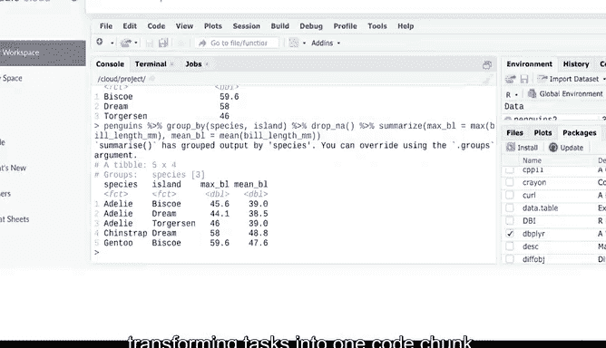

# 019：数据整理与组织 📊


在本节课中，我们将学习如何在R中整理和组织数据。我们将重点介绍如何使用 `arrange`、`group_by` 和 `filter` 函数来排序、分组和筛选数据，这是将原始信息转化为有用知识的关键步骤。

---

## 排序数据：`arrange` 函数

上一节我们介绍了数据框的创建和基本清洗。本节中，我们来看看如何对数据进行排序。

我们可以使用 `arrange` 函数来选择要按哪个变量排序。例如，假设我们想按企鹅的喙长（Bill length）对数据进行排序。

以下是排序的代码示例：

```r
arrange(penguins, bill_length_mm)
```

执行此命令将返回一个按喙长升序排列的 tibble。如果想按降序排列，只需在列名前添加一个减号。

```r
arrange(penguins, -bill_length_mm)
```

现在，喙最长的企鹅排在最前面。需要记住，这些数据目前仅显示在控制台中。要将其保存为新的数据框，我们需要为其命名。

```r
penguins_sorted <- arrange(penguins, -bill_length_mm)
```

执行此操作将保存一个新的数据框。我们可以使用 `View(penguins_sorted)` 来查看它。这使您可以在不丢失原始数据集信息的情况下保存整理后的数据。

---

## 分组数据：`group_by` 与 `summarize` 函数

排序之后，我们常常需要对数据进行分组汇总。`group_by` 函数通常与其他函数结合使用。

例如，我们可能希望按某个列分组，然后对这些组执行操作。使用我们的企鹅数据，我们可以按岛屿（island）分组，然后使用 `summarize` 函数获取平均喙长。

`summarize` 函数让我们可以获取数据的高级摘要信息。首先构建 `group_by` 语句。我们对 NA 值不感兴趣，因此可以使用 `drop_na` 参数将其排除。

```r
penguins %>%
  drop_na() %>%
  group_by(island) %>%
  summarize(mean_bill_length_mm = mean(bill_length_mm))
```

这解决了数据集中的任何缺失值。使用 `drop_na` 时需要小心，虽然在进行分组汇总统计时很有用，但它会从数据中删除包含 NA 的行。

运行此代码后，我们得到一个包含三个岛屿及各岛上企鹅平均喙长的数据框。

我们也可以获取其他摘要。例如，如果我们想知道最大喙长，可以编写一个类似的函数，将 `mean` 替换为 `max`。

```r
penguins %>%
  drop_na() %>%
  group_by(island) %>%
  summarize(max_bill_length_mm = max(bill_length_mm))
```

现在我们知道了喙最长的企鹅生活在 Biscoe 岛。`group_by` 和 `summarize` 都可以执行多个任务。

例如，我们可以按岛屿和物种分组，然后同时计算平均值和最大值。

```r
penguins %>%
  drop_na() %>%
  group_by(species, island) %>%
  summarize(
    max_bill = max(bill_length_mm),
    mean_bill = mean(bill_length_mm)
  )
```

运行此代码后，我们得到了按物种和岛屿的分组，以及最大值和平均值。得益于管道操作符 `%>%`，我们可以将所有清洗和转换任务组合到一个代码块中。

---

## 筛选数据：`filter` 函数

最后，我们可以使用 `filter` 函数来筛选结果。

假设我们只想要阿德利企鹅（Adelie）的数据。我们从使用的数据集开始，然后添加筛选条件。



```r
penguins %>%
  filter(species == "Adelie")
```

您可能注意到这里使用了两个等号。这是故意的，在 R 中，双等号 `==` 表示“完全等于”。

现在我们得到一个仅包含阿德利企鹅数据的数据框。这让我们能够在需要时缩小分析范围。

---

## 总结与展望 🎯

本节课中我们一起学习了在 R 中整理和组织数据的关键函数。

*   我们使用 **`arrange`** 对数据进行排序。
*   我们使用 **`group_by`** 和 **`summarize`** 对数据进行分组和汇总。
*   我们使用 **`filter`** 根据条件筛选数据。

能够清洗和组织数据是数据分析过程中的关键步骤，而知道使用正确的工具是数据分析师的一项重要技能。R 使数据整理变得更加容易，并在数据分析过程的不同阶段提供了丰富的功能。


现在我们已经清洗了数据，接下来可以准备对其进行转换。在接下来的课程中，我们将学习如何使用 `separate`、`unite` 和 `mutate` 函数，以及如何利用它们在 R 中转换数据。下次见！