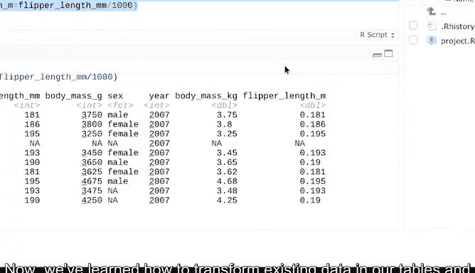

# 020：使用R编程进行数据分析 - 数据转换技术 🛠️


在本节课中，我们将要学习如何使用R语言中的`separate`、`unite`和`mutate`函数来转换数据。这些技术能帮助我们拆分列、合并列以及创建新的计算列，从而更有效地组织和分析数据。

---

## 数据转换概述

上一节我们介绍了数据清洗的基础操作，本节中我们来看看如何对数据进行转换。数据转换包括拆分变量到多个列、合并现有列，甚至为数据框添加新的计算值。

我们将使用`separate`、`unite`和`mutate`这三个函数来完成这些任务。幸运的是，我们已经下载到库中的包提供了这些工具。

---

## 创建示例数据框

首先，我们创建一个数据框来演示这些函数。虽然可以手动输入数据创建tibble，但为了简单起见，这里我们使用标准数据框。

以下是创建数据框的代码：

```r
employee <- data.frame(
  ID = c(1, 2, 3),
  name = c("John Doe", "Jane Smith", "Bob Johnson"),
  job_title = c("Analyst", "Manager", "Developer")
)
print(employee)
```

该数据框包含员工信息，其中姓名目前合并在一个列中。

---

## 使用`separate`拆分列

`separate`函数可以将一个列拆分成多个列。在我们的例子中，我们将把“name”列拆分为“first_name”和“last_name”两列。

以下是拆分列的步骤：

```r
library(tidyr)
employee_separated <- separate(employee, name, into = c("first_name", "last_name"), sep = " ")
print(employee_separated)
```

这段代码会在第一个空格处拆分“name”列，并创建两个新列。

---

## 使用`unite`合并列

`unite`函数是`separate`的逆操作，它可以将多个列合并成一个列。假设我们有一个包含“first_name”和“last_name”列的数据框，现在想将它们合并。

以下是合并列的代码：

```r
employee_united <- unite(employee_separated, "full_name", first_name, last_name, sep = " ")
print(employee_united)
```

这段代码将“first_name”和“last_name”列合并为一个名为“full_name”的新列，中间用空格分隔。

---

## 使用`mutate`创建新变量

除了拆分和合并列，我们还可以使用`mutate`函数在数据框中创建新的计算列。之前我们曾用`mutate`来清洗和组织数据，现在用它来添加基于计算的新列。

让我们回到企鹅数据集，假设我们想将体重从克转换为千克，并添加一个列来记录鳍肢长度的厘米值。

以下是添加新列的代码：

```r
library(palmerpenguins)
penguins_transformed <- penguins %>%
  mutate(
    body_mass_kg = body_mass_g / 1000,
    flipper_length_cm = flipper_length_mm / 10
  )
print(penguins_transformed)
```

通过添加逗号，我们可以在一次`mutate`操作中创建多个新变量。

---

## 总结

本节课中我们一起学习了如何使用R语言中的`separate`、`unite`和`mutate`函数来转换数据。我们掌握了拆分列、合并列以及创建新计算列的基本技巧。这些函数是数据分析中的基础工具，随着练习的深入，你可能会发现它们更多的应用场景。



接下来，我们将探讨如何汇总数据框以及如何处理数据中的偏差。