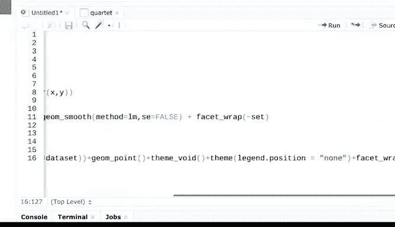

# 021：使用R编程进行数据分析 📊
## 第21课：同源数据的差异化处理 🔍


在本节课中，我们将学习如何使用R对数据进行汇总和可视化，并理解为何仅依赖统计摘要有时会产生误导。我们将通过一个著名的数据集——安斯库姆四重奏——来探索这一概念。

---

上一节我们介绍了在R中汇总数据的方法。本节中，我们来看看当面对看似统计特征相同的数据集时，可视化如何揭示其内在的差异。

首先，我们需要加载必要的R包和数据。安斯库姆四重奏数据集包含四个数据集，每个都包含x和y变量。

以下是加载和查看数据的步骤：

1.  安装并加载 `datasauRus` 包，它包含了安斯库姆四重奏数据。
2.  使用 `data(“anscombe”)` 命令加载数据。
3.  使用 `View(anscombe)` 查看数据结构，你会发现四个成对的x和y变量列。

数据可以通过不同的统计指标进行汇总。

我们将通过计算每个数据集的均值、标准差和相关系数来获取摘要信息。

以下是计算统计摘要的代码：

```r
library(dplyr)
anscombe_summary <- anscombe %>%
  group_by(set) %>%
  summarise(
    mean_x = mean(x),
    mean_y = mean(y),
    sd_x = sd(x),
    sd_y = sd(y),
    correlation = cor(x, y)
  )
print(anscombe_summary)
```

运行这段代码后，我们得到每个数据集的统计摘要。在摘要表中，我们可以看到：

*   **均值**：每个数据集的x均值都是9，y均值都是7.5。
*   **标准差**：它帮助我们理解数据集中数值的离散程度。四组数据中x和y的标准差也完全相同，分别为3.32和2.03。
*   **相关系数**：它显示两个变量之间关系的强度。这里，所有四组数据中x和y的相关系数都约为0.816。

因此，基于我们计算的统计指标，这些数据集在摘要层面看起来是相同的。但有时仅查看汇总数据会产生误导。

让我们绘制一些简单的图形来可视化这些数据，以检查数据集是否真的相同。你将在后续课程中深入学习绘图，现在我们先快速了解这些数据的分布情况。

以下是创建基础散点图的代码：

```r
library(ggplot2)
ggplot(anscombe, aes(x = x, y = y)) +
  geom_point() +
  facet_wrap(~ set, ncol = 2) +
  geom_smooth(method = “lm”, se = FALSE)
```

查看生成的图表，这四组数据在可视化后呈现出截然不同的模式。如果我们仅仅依赖统计摘要，就永远不会发现这些数据实际上大不相同。

我想再展示一个非常酷的功能，那就是 `datasauRus` 包。它能用安斯库姆数据生成不同形状的图表。

让我们运行它来亲眼看看。首先，你需要安装并加载这个包。

以下是生成趣味形状图表的代码：

```r
# 安装并加载包
# install.packages(“datasauRus”)
library(datasauRus)
library(ggplot2)



# 绘制恐龙形状的数据点
ggplot(datasaurus_dozen, aes(x = x, y = y, colour = dataset)) +
  geom_point() +
  theme_void() +
  theme(legend.position = “none”) +
  facet_wrap(~dataset, ncol = 3)
```

运行后，它会显示多个不同形状的图表，比如著名的恐龙、靶心、星星等。R是一个非常强大的可视化工具。你可以利用数据点之间的关系创造出许多其他形状。

正如你所见，用R可以做很多事情。像我们刚才探索的数据可视化，能帮助你发现所处理数据的更多信息。通过多种方式探索数据，对于更深入地理解数据背后的故事至关重要。

---

本节课中我们一起学习了如何用R计算数据的统计摘要（均值、标准差、相关系数），并通过安斯库姆四重奏的例子认识到，**仅凭统计摘要可能无法反映数据的全貌，甚至会产生误导**。我们实践了用 `ggplot2` 进行基础数据可视化，并体验了 `datasauRus` 包如何创造性地展示数据关系，从而强调了可视化在数据分析中的关键作用。


接下来，我们将学习如何使用R函数来检查数据中的偏见。