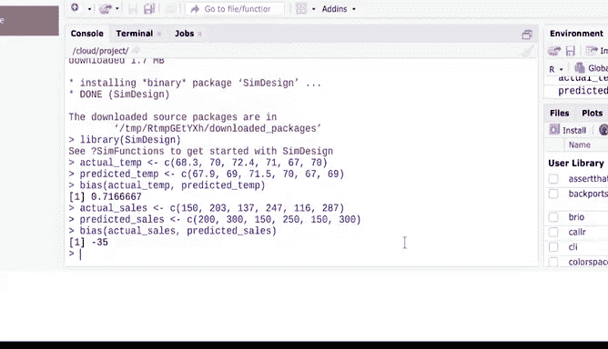

# 022：偏倚函数应用解析 📊


在本节课中，我们将学习如何在R语言中使用偏倚函数来量化数据分析中的偏差。我们将通过两个实际案例，演示如何计算和解读偏倚值，以评估预测模型的准确性。

## 概述

在数据分析中，确保数据的公平性和无偏性至关重要。R语言提供了一个便捷的工具——`bias`函数，它可以帮助我们量化数据中的偏差。该函数通过比较数据的实际结果与预测结果，计算出平均偏差值。虽然其背后有复杂的统计学原理，但R的`bias`函数使我们无需手动进行这些计算。

## 偏倚函数简介

`bias`函数的基本功能是计算实际结果大于预测结果的平均量。它包含在`SimDesign`包中，因此我们需要先安装并加载这个包。如果模型是无偏的，计算结果应接近0。较高的结果则意味着数据可能存在偏差，这是在分析前需要了解的重要信息。

## 案例一：天气预报准确性评估 🌤️

假设我们正在与一家本地气象频道合作，评估其天气预报是否存在偏差。

以下是操作步骤：

1.  首先，安装并加载`SimDesign`包。
    ```r
    install.packages("SimDesign")
    library(SimDesign)
    ```

2.  使用`bias`函数比较预测温度与实际温度。我们取一小部分天气数据作为示例。
    ```r
    # 输入实际温度数据
    actual_temp <- c(22, 25, 19, 30)
    # 输入预测温度数据
    predicted_temp <- c(21, 24, 18, 29)
    # 计算偏倚
    bias(actual_temp, predicted_temp)
    ```

运行代码后，得到结果0.71。这个值虽然接近0，但表明预测倾向于较低的温度，意味着预测不如预期准确。气象频道可以据此发现导致预测偏差的系统问题，从而提高整体预测精度。

## 案例二：游戏商店库存管理 🎮

在这个场景中，我们为一家游戏商店工作。商店记录了新游戏发售日的销量，并希望将其与实际销量进行比较，以判断库存订购是否符合实际需求。

以下是操作步骤：



1.  输入销售数据。
    ```r
    # 输入实际销量数据
    actual_sales <- c(150, 200, 180)
    # 输入预测销量（即订购量）数据
    predicted_sales <- c(190, 220, 205)
    ```

2.  对销售数据运行`bias`函数。
    ```r
    bias(actual_sales, predicted_sales)
    ```

运行代码后，得到结果-35。这个值远小于0，表明预测结果大于实际结果，意味着商店可能在发售日订购了过多的库存。通过使用`bias`函数，商店可以重新评估其库存策略，避免一次性购入过量库存。

## 总结


本节课我们一起学习了R语言中`bias`函数的使用。我们了解到，该函数通过公式 **`bias = mean(actual - predicted)`** 来计算偏差，是评估模型预测准确性的有力工具。接近0的值表示模型无偏，正值表示预测偏低，负值表示预测偏高。掌握这一工具，能帮助我们在数据分析的早期识别潜在偏差，从而做出更准确的决策。