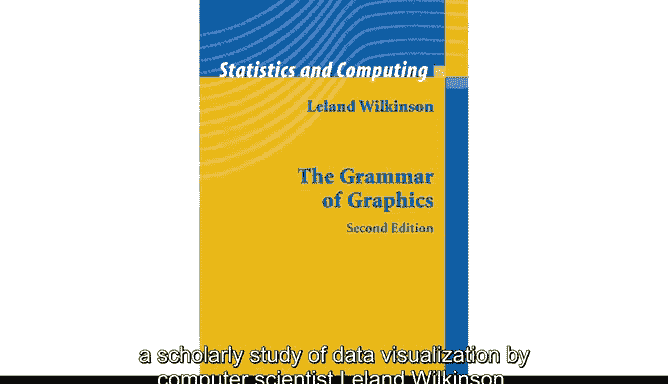
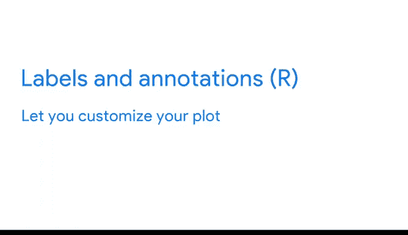

# 024：使用R编程进行数据分析 🎨📊

## P24：R与Tidyverse可视化基础

在本节课中，我们将重点学习`ggplot2`。我们将了解它的主要特性、功能，以及它如何帮助你实现数据可视化。

首先，我们来谈谈R中一些不同的可视化包。

基础R自带了自己的绘图包，同时你也可以添加其他有用的包。这些包能帮助你用数据完成几乎所有事情，从制作简单的饼图到创建更复杂的可视化图形，如交互式图表和地图。

像`plotly`这样的通用包，提供了广泛的可视化功能。其他如`RGL`，则专注于特定的解决方案，比如3D可视化。

一些最受欢迎的包包括`ggplot2`、`plotly`、`lattice`、`RGL`、`dygraphs`、`leaflet`、`highcharter`、`patchwork`、`gganimate`和`ggiraph`。就我个人而言，`ggplot2`是我进行数据分析时的最爱。它既强大又灵活。

只需少量代码，你就可以创建各种不同的图形。你可以单独使用`ggplot2`，也可以通过其他包来扩展其功能。此外，它是R中最流行的可视化包。许多数据分析师更喜欢使用`ggplot2`，这也是我们在这里使用它的原因。

`ggplot2`最初由统计学家兼开发者Hadley Wickham于2005年创建。Wickham创建`ggplot2`的灵感来源于1999年出版的书籍《图形语法》，这是计算机科学家Leland Wilkinson关于数据可视化的学术研究。

`ggplot2`的前两个字母实际上就代表“图形语法”。就像人类语言的语法为我们提供了构建任何句子的规则一样，图形语法也为我们提供了构建任何视觉图形的规则。因此，`ggplot2`有一些你可以用来创建图形的基本构建块。

换句话说，当你学会了在`ggplot2`中创建图形的基本步骤后，你就可以重复使用这些步骤来创建许多不同类型的图形。此外，你可以在不改变图形基本结构或底层数据的情况下，为图形添加或移除细节层。

这使得`ggplot2`非常强大。在下一个视频中，我们将逐一讲解这些步骤。

`ggplot2`还有许多其他优点。你可以创建所有不同类型的图形，包括散点图、条形图、折线图等等。你可以更改图形的颜色、布局和尺寸，并添加文本元素，如标题、副标题和标签。

只需少量代码，你就可以创建高质量的视觉图形。此外，`ggplot2`允许你使用管道操作符`%>%`来组合数据操作和可视化。

`ggplot2`还拥有大量函数，涵盖你所有的数据可视化需求。为了让你有个概念，可以查看`ggplot2`速查表，这是一个流行的参考指南。你可以在接下来的阅读材料中找到更多关于速查表的信息。

现在不需要立即学习所有这些函数，甚至不需要知道它们是什么。随着时间的推移，当你进行更高级的数据分析时，可以根据需要学习新的函数。只需知道，如果你需要为某个功能找到函数，`ggplot2`很可能已经提供了。

正如我们讨论过的，即使是`ggplot2`的基本功能也能让你做很多事情。

我们将重点介绍`ggplot2`中的一些核心概念：**美学映射**、**几何对象**、**分面**、**标签和注释**。这些对你来说可能是新概念，这没关系。我们将一起学习，并很快详细探讨每一个概念。

现在，让我们快速预览一下。

在`ggplot2`中，**美学映射** 是图形中对象的视觉属性。例如，在散点图中，美学映射包括数据点的大小、形状或颜色。可以将美学映射视为图形中的视觉特征与数据中的变量之间的连接或映射。我们稍后会详细讨论映射。

**几何对象** 指的是用于表示数据的几何对象。例如，你可以使用点来创建散点图，使用条形来创建条形图，或者使用线条来创建折线图。你可以根据拥有的数据类型选择合适的几何对象。点用于显示两个定量变量之间的关系，条形用于显示一个定量变量在不同类别间的变化。

接下来，我们将讨论**分面**功能。分面允许你显示数据中较小的组或子集。通过分面，你可以为数据中的所有变量创建单独的图形。

最后，**标签和注释** 函数允许你自定义图形。你可以添加文本，如标题、副标题和说明，以传达图形的目的或突出重要数据。

本节课的内容就到这里。接下来，我们将使用代码在`ggplot2`中创建我们的第一个图形。

---

**本节课总结**

在本节课中，我们一起学习了R中强大的可视化包`ggplot2`。我们了解到它基于“图形语法”理论，具有模块化和灵活的特点。我们预览了其核心概念：**美学映射**、**几何对象**、**分面**以及**标签和注释**，这些是构建各种图形的基础。掌握这些基础后，你将能够使用简洁的代码创建出高质量、信息丰富的可视化图形。