# 025：ggplot2绘图入门


在本节课中，我们将学习如何使用R语言中的`ggplot2`包来创建数据可视化图表。我们将以帕尔默企鹅数据集为例，逐步讲解构建一个图表的基本步骤、核心概念以及编写代码时的实用技巧。

---

## 🎬 欢迎回来

在上一节中，我们预览了`ggplot2`的强大功能。本节中，我们将使用帕尔默企鹅数据集，通过代码来实际创建图表。

帕尔默企鹅数据集包含了生活在南极洲帕尔默群岛的三种企鹅的体型测量数据，例如体重、鳍状肢长度和喙的长度。

现在，我们将学习如何使用代码来创建那些可视化图表。我们将逐步讲解创建图表的过程，并分享一些在`ggplot2`中编写代码的通用技巧和有用的帮助资源。

---

## 🚀 开始之前

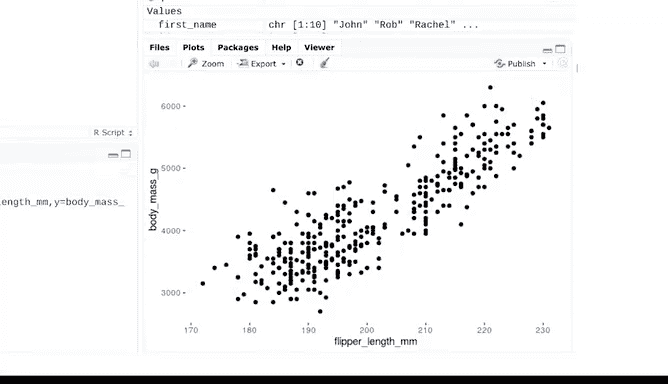

首先，请登录您的RStudio Cloud环境。我们鼓励您跟随课程，在RStudio中尝试运行所有代码。如有需要，您可以随时暂停视频。

我们假设您已经安装了`tidyverse`系列包。如果尚未安装，请参考之前的视频或运行以下代码：
```r
install.packages("tidyverse")
```

让我们从加载`ggplot2`包和企鹅数据集开始。
```r
library(ggplot2)
library(palmerpenguins)
data("penguins")
```

---

## 📈 创建第一个图表

让我们先查看一个展示三种企鹅体重与鳍状肢长度关系的图表。该图表显示这两个变量之间存在正相关关系，即企鹅体型越大，其鳍状肢越长。

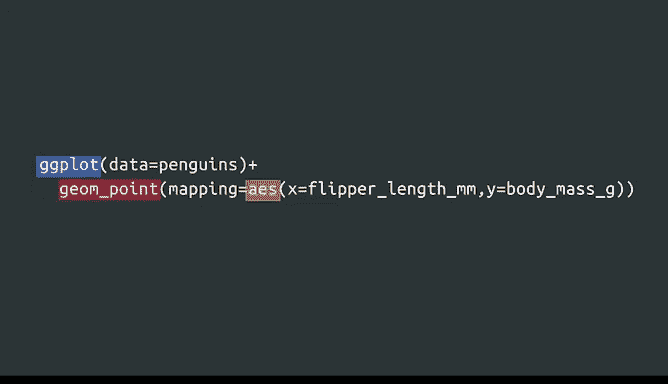

现在，让我们查看创建这个图表的代码。代码使用了`ggplot2`中的函数来绘制体重与鳍状肢长度的关系。在R中，函数是名称后跟一对括号。许多函数需要特定信息（称为参数）来完成其工作，这些信息写在括号内。

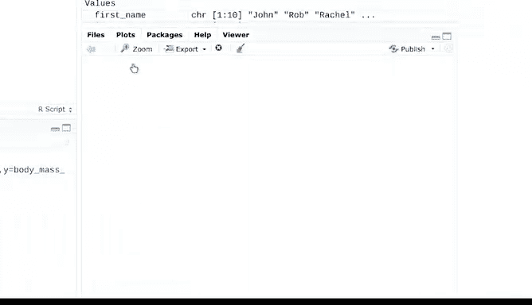

以下是代码中涉及的三个函数：
*   `ggplot()` 函数
*   `geom_point()` 函数
*   `aes()` 函数

---

### 第一步：初始化图表

每个`ggplot2`图表都始于`ggplot()`函数。该函数的参数告诉R使用哪个数据框来绘图。

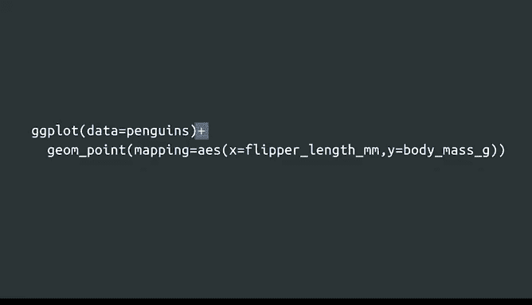

因此，第一步是选择一个要处理的数据框。您可以在函数括号内这样设置代码：
```r
ggplot(data = penguins)
```
这段代码**初始化**或启动了绘图过程。

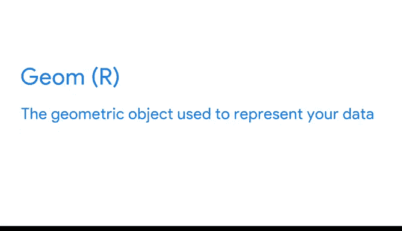

如果我们现在就停止并运行这段代码，结果将是一个空白的画布。让我们试试看。
```r
ggplot(data = penguins)
```
这只是创建图表的第一步。

---

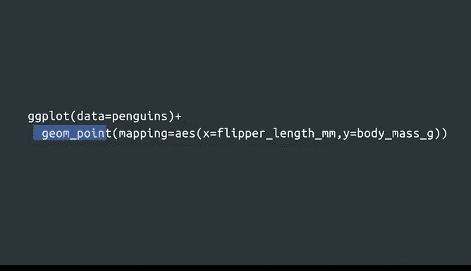

### 第二步：添加几何对象层

您可能注意到这段代码第一行的末尾有一个加号（`+`）。您使用加号来向图表**添加图层**。在`ggplot2`中，图表是通过图层的组合构建的。

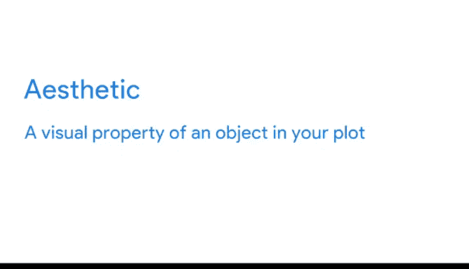

首先，我们从数据开始。然后，我们通过选择一个**几何对象**来代表我们的数据，从而为图表添加一个图层。函数`geom_point()`告诉R使用点来表示我们的数据。

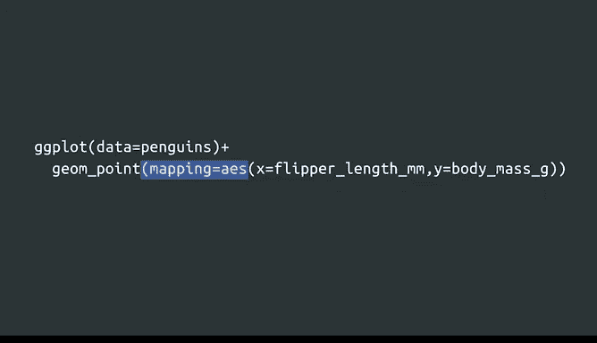

请记住，加号（`+`）必须放在每行的末尾以添加图层。
```r
ggplot(data = penguins) +
  geom_point()
```
添加几何对象函数是创建图表的第二步。几何对象是用于表示数据的几何图形，包括点、条形、线等。

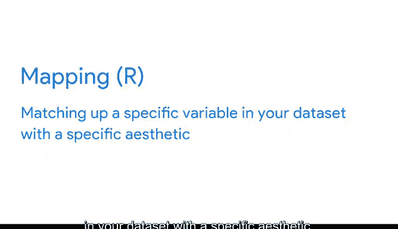

在我们的代码中，`geom_point()`函数告诉R使用点来创建散点图。我们将在后续课程中了解更多关于几何对象的内容。

---

### 第三步：映射美学属性

接下来，我们需要从数据集中选择特定的变量，并告诉R我们希望这些变量在图表中如何呈现。在`ggplot2`中，变量的呈现方式称为其**美学属性**。美学属性是图表中对象的视觉属性，如其位置、颜色、形状或大小。

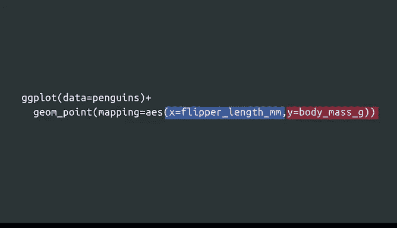

代码中`mapping = aes()`部分告诉R在图表中使用哪些美学属性。您使用`aes()`函数来定义数据与图表之间的**映射**关系。

映射意味着将数据集中的特定变量与特定的美学属性匹配起来。例如，您可以将一个变量映射到图表的X轴，或将另一个变量映射到Y轴。在散点图中，您还可以将变量映射到数据点的颜色、大小和形状。

将美学属性映射到变量是创建图表的第三步。

在我们的代码中，我们将变量`flipper_length_mm`映射到X轴，将变量`body_mass_g`映射到Y轴。在`aes()`函数的括号内，我们写入美学属性的名称，然后是等号，接着是变量名。
```r
ggplot(data = penguins) +
  geom_point(mapping = aes(x = flipper_length_mm, y = body_mass_g))
```
我们编写代码，R负责其余的工作。使用企鹅数据，R创建了一个散点图，将变量`body_mass_g`放在Y轴，变量`flipper_length_mm`放在X轴。

---

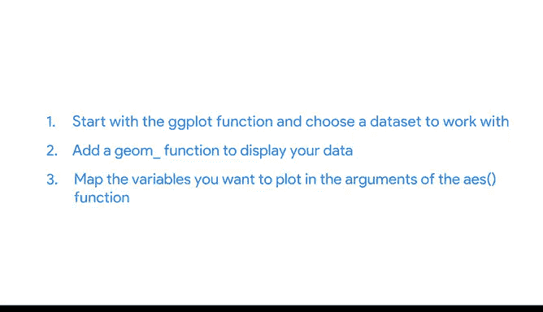

## 📝 通用绘图模板

我们的代码遵循`ggplot2`中创建图表的通用序列。之前我们讨论过“图形语法”，这是一套用于制作各种不同图表的步骤。您也可以将此序列视为在`ggplot2`中制作图表的基本语法。

要创建一个图表，请遵循以下三个步骤：
1.  从`ggplot()`函数开始，并选择要处理的数据。
2.  添加一个`geom_*()`函数来显示您的数据。
3.  在`aes()`函数的参数中映射您想要绘图的变量。

我们还可以将代码转化为在`ggplot2`中创建图表的可重用模板：
```r
ggplot(data = <DATA>) +
  <GEOM_FUNCTION>(mapping = aes(<MAPPINGS>))
```
要制作图表，请用数据集、几何对象函数或一组美学映射替换代码中的尖括号部分。

我们可以使用这个模板制作各种不同的图表。例如，我们可以使用企鹅数据集中的两个不同变量，比如喙的长度和喙的深度。我们可以将`bill_length_mm`放在X轴，将`bill_depth_mm`放在Y轴。
```r
ggplot(data = penguins) +
  geom_point(mapping = aes(x = bill_length_mm, y = bill_depth_mm))
```
让我们运行代码并查看这个新的散点图。

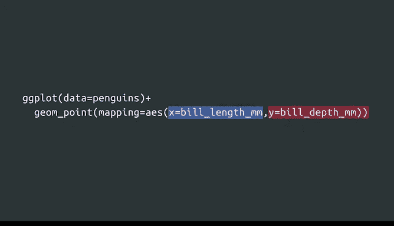

---

## ⚠️ 常见问题与帮助资源

当您学习用R或任何其他编程语言编写代码时，会遇到问题。这发生在每个人身上。我在R领域工作多年，仍然会编写出有错误的代码。很多时候，这些都是容易修复的小错误。如果您注意细节，会很有帮助。

例如，R是区分大小写的。如果您不小心将某个函数的首字母大写，可能会影响您的代码。同时，请确保函数中的每个左括号都有对应的右括号。

请注意以下代码无法正确运行：
```r
ggplot(data = penguins
  geom_point(mapping = aes(x = flipper_length_mm, y = body_mass_g))
```
但这段代码可以：
```r
ggplot(data = penguins) +
  geom_point(mapping = aes(x = flipper_length_mm, y = body_mass_g))
```

使用`ggplot2`时的一个常见问题是，在向图表添加图层时，记住将加号（`+`）放在正确的位置。**始终将加号放在一行代码的末尾**。很容易忘记并将其放在行首，或者不小心使用了管道运算符（`%>%`）而不是加号。

我们都会犯错，这是学习过程的一部分。好消息是，我们有很多机会来纠正它，并且有大量资源可以帮助您。

要了解更多关于任何R函数的信息，只需运行代码`?函数名`。例如，如果您想了解更多关于`geom_point()`函数的信息，请输入：
```r
?geom_point
```
作为初学者，您可能无法理解帮助页面中的所有概念，但在页面底部，您可以找到具体的代码示例，这些示例可能会向您展示如何解决问题。

如果仍然找不到您需要的内容，请随时向在线的R社区寻求帮助。正如我们之前提到的，网上有大量优秀的R资源。很可能其他人也遇到过同样的问题。

---

## 🎯 总结


本节课中，我们一起学习了使用`ggplot2`创建图表的核心三步法：使用`ggplot()`初始化并指定数据，使用`geom_*()`函数添加几何图形层，以及使用`aes()`函数将数据变量映射到视觉属性上。我们还介绍了一个通用的绘图模板和调试代码的实用技巧。


接下来，我们将更深入地学习美学属性的应用。下次见！