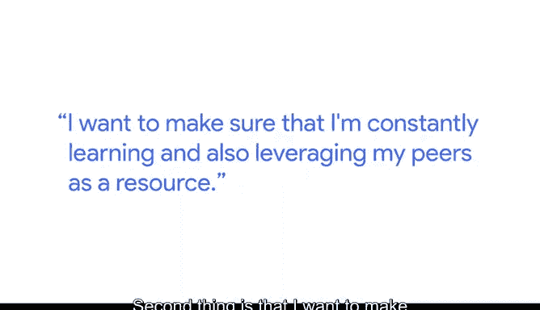
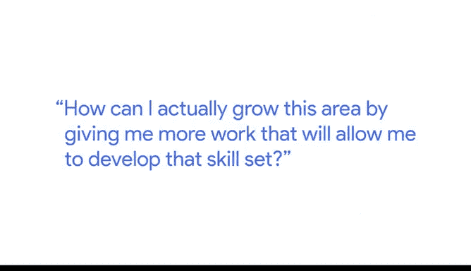
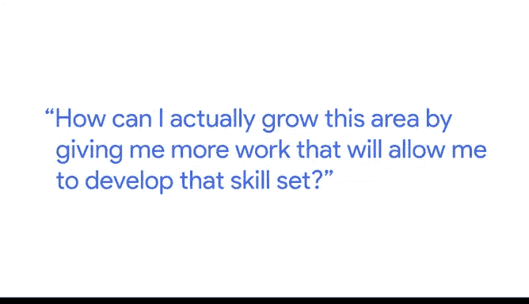

# 026：约瑟夫的人力分析职业路径

在本节课中，我们将跟随谷歌人力分析师约瑟夫的分享，了解他独特的职业发展历程，并学习他克服挑战、实现职业成长的关键策略。

---

我叫约瑟夫，是谷歌的一名人力分析师。作为一名人力分析师，我的工作是与高管和人力资源业务伙伴合作，利用数据做出明智的人力决策。

我的职业道路非常独特。我从纽约的一所公立学校毕业，然后去了雪城大学，那是一所私立学校。在学术严谨性和社交层面上的转变都非常不同。坦诚地说，我确实感到自己不属于那里。我每天都感受到冒名顶替综合症。

在我的第一学期，由于缺乏扎实的基础，我在学业上遇到了困难。每次上完课，我都会寻找辅导机会。因此，我付出的努力是同龄人的三到四倍。但从长远来看，这最终让我做得比同龄人好得多，我甚至开始辅导他们做作业。

当我进入大学时，我本想主修计算机工程。但不幸的是，我来自一个移民家庭，他们不知道计算机工程是什么，也没有看到我们社区里有人在这个领域真正成功。因此，他们劝阻我走这条路。由于不想冒险，我无奈地将专业从计算机工程转为了未定专业。

幸运的是，两年后，我遇到了另一位黑人朋友，他也是非洲移民，主修信息技术。通过了解他的经历和他所上的课程，我对这个领域产生了浓厚的兴趣。我选了一门入门课，并且在那门课上取得了成功。

在加入谷歌之前，我曾在一家名为埃森哲的公司工作，担任顾问，从事客户分析工作。在公司工作的第二年年底，我参加了一场招聘会，谷歌正在那里招聘。我和一位招聘人员交谈，她向我提到了一个名为“人力分析”的新领域，这与我当时所做的本质工作非常相似。我回家后做了研究，从那时起，我对这个领域产生了浓厚的兴趣，并希望在此发展我的职业生涯。

自从加入谷歌以来，我必须诚实地说，工作的严谨性和难度都极具挑战性。我做的第一件事是寻找导师。我寻找那些对我的职业发展感兴趣并能为我发声的人。通过与他们交谈并学习经验，我找到了在这个领域更好前进的方法。这首先让我获得了许多勇气，并激励我在工作环境之外也持续学习。

第二件事是，我确保自己不断学习，并将同事视为一种资源。每当我完成一项分析需要征求第二意见时，我都会转向我的团队成员。他们会确保给我所需的鼓励或提供第二意见，以帮助我更好地完善分析。

我相信我一直在做的第三件事是寻找拓展机会。例如，我知道自己在某个领域存在不足，需要提升。我会确保向我的经理提出：“我知道我在这方面有困难，如何通过给我更多相关工作来帮助我发展这项技能？”

我认为，这混合了承认个人发展存在差距，以及利用周围资源努力改进，并朝着每年、每一天提升自己的目标前进。

---

本节课中，我们一起学习了约瑟夫从克服学业挑战、转换专业到在人力分析领域找到职业热情的经历。他分享了三个关键策略：**主动寻找导师**、**将同事视为学习资源**以及**积极寻求拓展机会以弥补技能差距**。这些策略强调了自我认知、主动学习和利用支持系统对于职业成长的重要性。