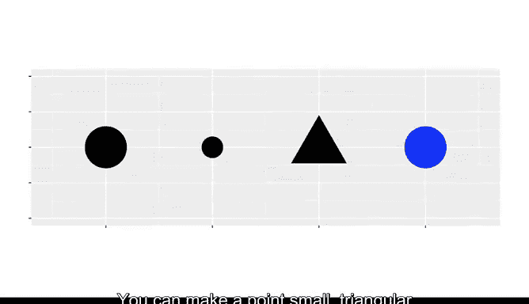
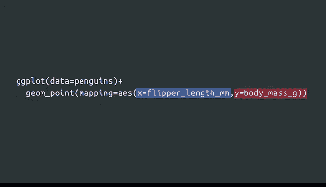
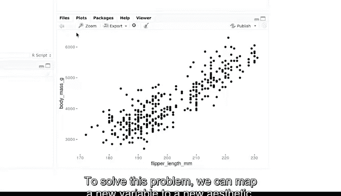
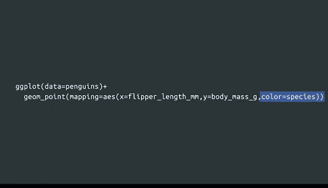
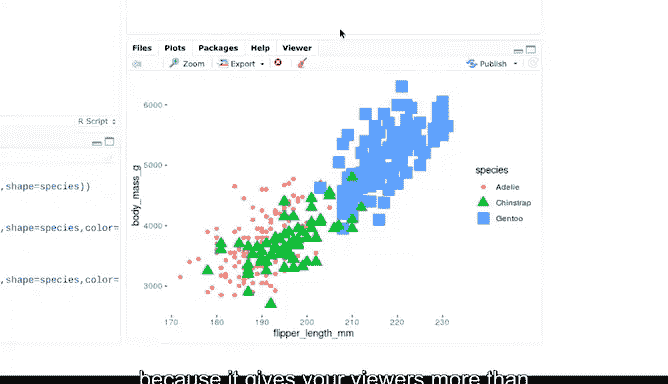
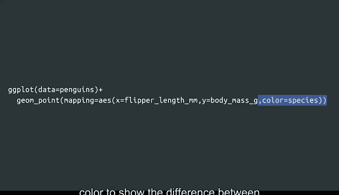
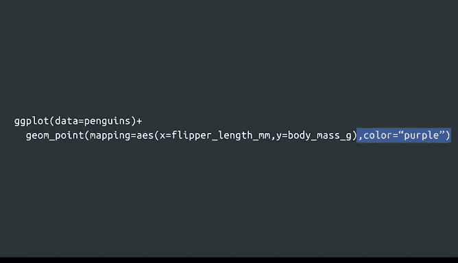
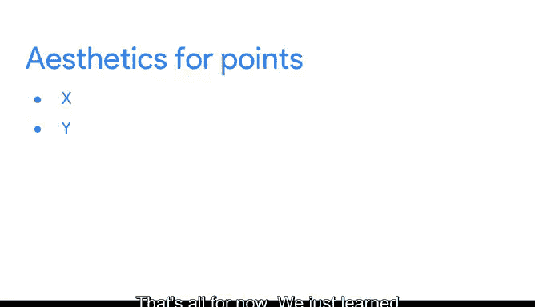

# 027：使用R编程进行数据分析 🐧📊
## P27：R语言可视化增强技巧


在本节课中，我们将学习如何改变图表的美学属性，这有助于你以更具吸引力的方式呈现数据。通过调整美学属性，你可以突出数据中的关键点，并与利益相关者进行更清晰、更有效的沟通。


上一节我们介绍了R中绘图的基本概念，本节中我们来看看如何通过调整美学属性来增强图表的视觉效果。

美学属性是图表中对象的视觉属性。例如，在散点图中，美学属性包括数据点的大小、形状或颜色。通过改变数据点的美学属性或其外观，你可以用不同的方式展示数据点。你可以让一个点变小、呈三角形或变成蓝色，或者组合这些属性。




让我们回到企鹅数据集，并回顾展示体重与鳍肢长度关系的绘图代码。

作为快速回顾，代码中的 `mapping = aes()` 部分告诉R在绘图中使用哪些美学属性。你使用 `aes()` 函数来定义数据与绘图之间的映射关系。映射意味着将数据集中的特定变量与特定的美学属性匹配起来。例如，你可以将一个变量映射到图表的X轴，或将另一个变量映射到Y轴。

要将美学属性映射到变量，需要在 `aes()` 函数的括号内，将美学属性的名称设置为等于变量的名称。以下R代码告诉R将鳍肢长度映射到X轴，将体重映射到Y轴。

```r
ggplot(data = penguins) +
  geom_point(mapping = aes(x = flipper_length_mm, y = body_mass_g))
```


让我们登录RStudio Cloud并运行代码。首先，加载 `ggplot2` 包和企鹅数据集。

```r
library(ggplot2)
library(palmerpenguins)
```



R会自动在我们的散点图的每个轴上放置适当的标签。在你将变量映射到美学属性后，R会处理其余的事情。

你也可以将数据映射到其他美学属性，如颜色、大小和形状。目前我们的图表是黑白的，它清楚地显示了两个变量之间的正相关关系：随着X轴上的值增加，Y轴上的值也增加。但它也有一些局限性。例如，我们无法分辨哪些数据点对应三种企鹅物种中的哪一种。

为了解决这个问题，我们可以将一个新变量映射到一个新的美学属性上。


让我们通过将一个新变量映射到新的美学属性，向散点图添加第三个变量。

我们将通过 `aes()` 函数括号内添加代码，将变量 `species` 映射到美学属性 `color`。



```r
ggplot(data = penguins) +
  geom_point(mapping = aes(x = flipper_length_mm, y = body_mass_g, color = species))
```

我们的代码告诉R为每种企鹅分配不同的颜色。




让我们查看结果。图表右侧的图例显示，蓝色点代表Gentoo企鹅，它是三种企鹅中体型最大的。

R不仅自动为每个数据点应用不同的颜色，还提供了一个图例来显示颜色编码。这正是我喜欢R的地方：只需一点点代码，它就会额外努力帮助你。

我们也可以使用形状来突出不同的企鹅物种。让我们将变量 `species` 映射到美学属性 `shape`。为此，我们可以将代码从 `color = species` 改为 `shape = species`。

```r
ggplot(data = penguins) +
  geom_point(mapping = aes(x = flipper_length_mm, y = body_mass_g, shape = species))
```

现在，图例为Adelie物种显示圆形，为Chinstrap显示三角形，为Gentoo显示正方形。你可能会注意到我们的图表又变成了黑白，因为我们删除了颜色的代码。

让我们为图表恢复一些颜色。如果需要，我们可以将多个美学属性映射到同一个变量。让我们将颜色和形状都映射到物种。

```r
ggplot(data = penguins) +
  geom_point(mapping = aes(x = flipper_length_mm, y = body_mass_g, color = species, shape = species))
```

现在，我们的图表为每个物种显示了不同的颜色和形状。我们还可以继续添加，将大小也映射到物种。

```r
ggplot(data = penguins) +
  geom_point(mapping = aes(x = flipper_length_mm, y = body_mass_g, color = species, shape = species, size = species))
```

每个彩色形状现在也将具有不同的大小。使用多个美学属性也可以使你的可视化更具可访问性，因为它为你的观众提供了不止一种理解数据的方式。

我们还可以将物种映射到 `alpha` 美学属性，它控制点的透明度。




我们的第一个图表以黑白方式显示了体重与鳍肢长度的关系。然后，我们将变量 `species` 映射到美学属性 `color`，以显示三种企鹅物种之间的差异。


如果我们希望保持图表为黑白，可以将 `alpha` 美学属性映射到物种。这会使一些点比其他点更透明或更“通透”，为我们提供了另一种表示每种企鹅物种的方式。



```r
ggplot(data = penguins) +
  geom_point(mapping = aes(x = flipper_length_mm, y = body_mass_g, alpha = species))
```

当你有一个包含大量数据点的密集图表时，`alpha` 是一个很好的选择。


你也可以设置美学属性，而不将其与特定变量关联。

假设我们想将所有点的颜色改为紫色。这里，我们不想将颜色映射到像物种这样的特定变量，我们只是希望散点图中的每个点都是紫色的。

因此，我们需要将新代码写在 `aes()` 函数之外，并为我们的颜色值使用引号。这是因为 `aes()` 函数内的所有代码都告诉R如何将美学属性映射到变量，例如将颜色美学映射到物种变量。


如果我们想在不考虑特定变量的情况下改变整个图表的外观，就在 `aes()` 函数之外编写代码。



```r
ggplot(data = penguins) +
  geom_point(mapping = aes(x = flipper_length_mm, y = body_mass_g), color = "purple")
```

让我们编写并运行这段代码。




本节课中我们一起学习了关于点的最常见的美学属性：X轴、Y轴、颜色、形状、大小和透明度。我们还发现了美学属性如何改变图表的外观并突出重要数据。

到目前为止，我们已经涵盖了很多内容，学习了许多新概念。处理新信息和学习新技能需要时间，因此如果需要复习或想在RStudio中练习，请随时再次观看这些视频。

接下来，我们将学习更多关于几何对象的知识。下次见。