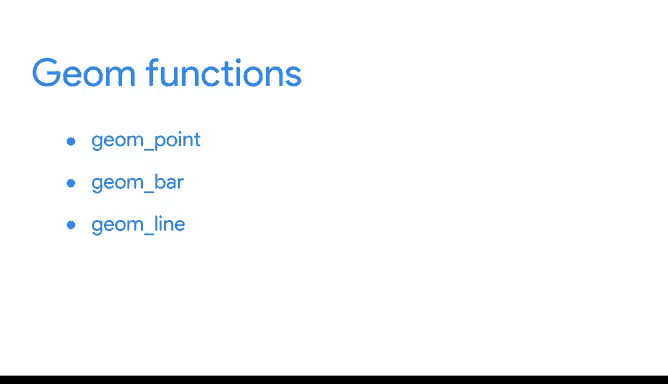
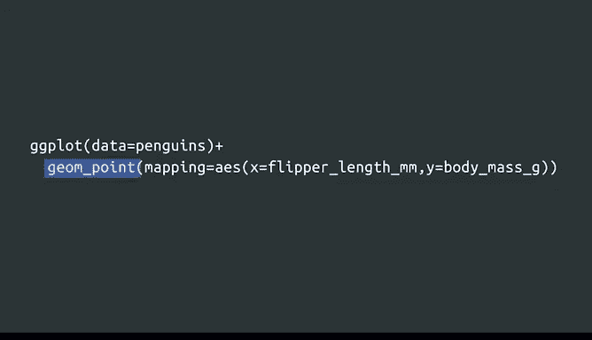
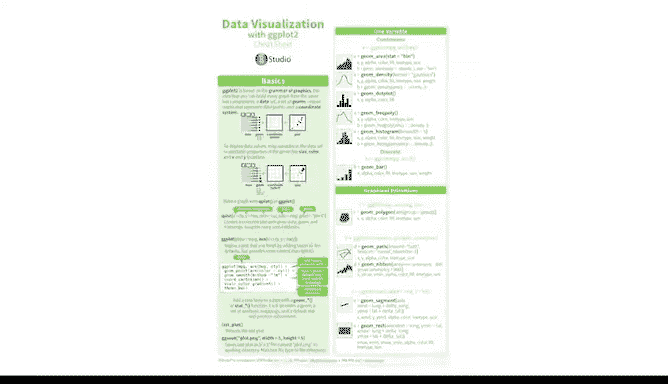

# 028：ggplot2进阶应用 🎨📊


在本节课中，我们将学习如何使用ggplot2包中的不同几何对象（Geom）函数来创建多种类型的图表，例如散点图和条形图。通过选择不同的几何对象，你可以根据数据呈现方式和沟通目标，以不同形式讲述数据故事，从而有效地向不同受众传达信息。

---

## 从散点图到平滑曲线 🔄

上一节我们介绍了ggplot2的基础结构，本节中我们来看看如何通过更换几何对象来改变图表类型。

首先，我们观察两个可视化图表。它们使用相同的X变量、Y变量和数据，但一个使用点来表示数据（散点图），另一个使用平滑的曲线。在ggplot2中，**几何对象（Geom）** 指的是用于表示数据的几何图形，例如点、条形、线等。



*   `geom_point()` 函数使用点来创建散点图。
*   `geom_bar()` 函数使用条形来创建条形图。

要改变图表中的几何对象，我们需要在代码中更改对应的Geom函数。



例如，展示企鹅体重与鳍肢长度关系的图表，其代码使用 `geom_point()` 来创建散点图：

```r
ggplot(data = penguins) +
  geom_point(mapping = aes(x = body_mass_g, y = flipper_length_mm))
```

现在，让我们将 `geom_point()` 替换为 `geom_smooth()`。数据虽然相同，但视觉呈现变为了一条拟合数据的平滑曲线。`geom_smooth()` 函数有助于显示数据的总体趋势，这条线清晰地表明了体重与鳍肢长度之间的正相关关系：企鹅体型越大，鳍肢越长。

我们甚至可以在同一张图表中组合使用多个几何对象。如果我们想更清晰地展示趋势线与数据点之间的关系，可以在 `geom_smooth()` 后通过加号 (`+`) 添加 `geom_point()` 的代码：

```r
ggplot(data = penguins) +
  geom_smooth(mapping = aes(x = body_mass_g, y = flipper_length_mm)) +
  geom_point(mapping = aes(x = body_mass_g, y = flipper_length_mm))
```

如果我们希望为每种企鹅物种绘制独立的趋势线，可以在 `geom_smooth()` 的映射中添加线条类型 (`linetype`) 美学，并将其映射到物种 (`species`) 变量。这样，函数会为每个物种绘制一条不同线型的曲线，并通过图例进行匹配，使每种物种的趋势一目了然。

最后，让我们了解一下 `geom_jitter()` 函数。该函数会创建一个散点图，并为图中的每个点添加少量随机噪声。**抖动（Jittering）** 有助于处理**过度绘制（Overplotting）**，即图表中的数据点彼此重叠的情况，从而使点更容易被识别。只需将代码中的 `geom_point()` 替换为 `geom_jitter()` 即可。

---

## 探索条形图 📊

了解了ggplot2处理散点图的能力后，让我们来探索条形图。我们将使用您已熟悉的 `diamonds` 数据集，其中包含了超过5万颗钻石的质量、净度和切工等数据。该数据集随ggplot2包一同加载。

以下是创建条形图所需的步骤和要点。

要制作条形图，我们使用 `geom_bar()` 函数。例如，绘制 `diamonds` 数据集中 `cut` 变量的条形图：

```r
ggplot(data = diamonds) +
  geom_bar(mapping = aes(x = cut))
```

请注意，我们并未为Y轴提供变量。当使用 `geom_bar()` 时，R会自动计算每个X值在数据中出现的次数，然后将计数显示在Y轴上。`geom_bar()` 的默认行为是统计行数。

在我们的图表中，X轴显示了切工质量的五个类别：一般、良好、很好、优质、理想。Y轴则显示了每个类别中的钻石数量。例如，有超过2万颗钻石的切工为“理想”，这是最常见的切工类型。

`geom_bar()` 可以使用您已经熟悉的多种美学属性，如颜色 (`color`)、大小 (`size`) 和透明度 (`alpha`)。以下是如何为图表添加颜色美学的示例。

我们可以将颜色 (`color`) 美学映射到 `cut` 变量，这会为每个条形添加轮廓色，并提供一个显示颜色编码的图例：

```r
ggplot(data = diamonds) +
  geom_bar(mapping = aes(x = cut, color = cut))
```

如果我们希望更清晰地突出不同切工之间的差异，使图表更易于理解，可以使用填充 (`fill`) 美学来为每个条形的内部添加颜色。在代码中，用 `fill = cut` 替换 `color = cut`：

```r
ggplot(data = diamonds) +
  geom_bar(mapping = aes(x = cut, fill = cut))
```

R会自动选择颜色并提供图例。

如果我们将填充 (`fill`) 美学映射到一个新的变量（例如 `clarity`，而不是 `cut`），`geom_bar()` 将显示所谓的**堆叠条形图（Stacked Bar Chart）**。现在，图表展示了切工和净度的40种不同组合，每个组合都有自己颜色的矩形。具有相同切工值的矩形在每条柱上堆叠在一起。这样的图表组织方式，让我们既能了解不同切工之间的数量差异，也能看出每种切工内部净度的分布情况。

---

## 总结与展望 🚀

本节课中我们一起学习了ggplot2中几何对象（Geom）的核心应用。我们掌握了如何通过更换 `geom_point()`, `geom_smooth()`, `geom_jitter()`, `geom_bar()` 等函数来创建散点图、趋势线、抖动散点图和条形图。我们还学习了如何通过映射 `color` 和 `fill` 等美学属性来增强图表的表达力。

这只是使用几何对象的开始。ggplot2拥有超过30种几何函数可供制作图表，扩展包还提供了更多选择。ggplot2速查表是学习更多几何对象的重要资源。



在您进行更高级的数据分析时，将会发现许多新的几何对象可供使用。目前，我们刚刚回顾的这些几何对象已足以让您处理大量数据并完成许多任务。

接下来，我们将学习如何使用分面（facet）函数以不同的方式展示数据。